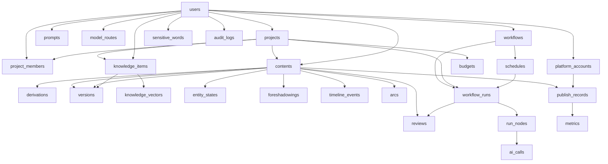

# NovelCraft Personal Studio 数据库设计文档（V2.1 定案）

> 文档版本：V2.1
> 适用范围：单 VPS、离线优先、1~5 人小团队 AI 内容创作平台
> 技术栈：React + FastAPI + PostgreSQL(含 pgvector) + Redis + Celery + Docker Compose
> 配套文档：架构评审报告（02）、技术实施方案（05）、MVP 方案（04）
> 术语基线：本文件所有表名、字段、枚举取值，以架构评审报告 §2~§13 与技术方案 §3 为唯一权威来源，扩展部分以「扩展」标注。

---

## 目录

1. [概述](#1-概述)
   1.1 [数据库选型理由](#11-数据库选型理由)
   1.2 [命名规范](#12-命名规范)
   1.3 [通用字段约定与 id 类型结论](#13-通用字段约定与-id-类型结论)
   1.4 [软删除策略](#14-软删除策略)
   1.5 [JSONB 使用红线](#15-jsonb-使用红线)
2. [建表拓扑顺序](#2-建表拓扑顺序)
3. [逐表完整 DDL](#3-逐表完整-ddl)
4. [核心表数据字典](#4-核心表数据字典)
5. [索引设计](#5-索引设计)
6. [枚举与状态机](#6-枚举与状态机)
7. [迁移策略](#7-迁移策略)
8. [初始化 Seed 数据清单](#8-初始化-seed-数据清单)
9. [备份与保留策略](#9-备份与保留策略)

---

## 1. 概述

### 1.0 V2.2 扫榜成书与统一书库扩展

新增P0事实表：

| 表 | 事实职责 |
|---|---|
| `ranking_sources` | 平台adapter配置、合规说明、健康状态与最后成功时间 |
| `ranking_snapshots` | 某平台/榜单/时间点不可变快照，支持趋势比较和重放 |
| `ranking_items` | 榜单公开元数据、名次、题材、标签、简介摘要和指标，不存未授权全文 |
| `market_analyses` | 题材、开篇、爽点、节奏、篇幅、更新策略等分析及Prompt/模型版本 |
| `topic_candidates` | 原创选题候选、差异化约束、相似度风险、采用状态 |

首批实装迁移为 `b73d14f0c2a1`：已落以上五张事实表，并以 `topic_candidates.novel_id` 关联统一内容模型。adapter 详细配置、排名变化窗口和更细筛选字段属于后续增量；不得因表已存在就把完整扫榜能力标记完成。

增量迁移 `c84e2a91d5b7` 增加 `ranking_items.external_id/dedupe_key/fetched_at`、来源 `last_attempt_at/consecutive_failures` 和 `ranking_snapshots.retry_of_snapshot_id`。去重范围为“同一快照内同一来源作品”，不得跨榜单全局删除同一本书。

增量迁移 `d95f31a6e8c2` 为市场分析增加状态、模式、Prompt版本、输入哈希、错误和完成时间，并扩展候选受众、差异点、市场证据、风险及原创说明。只有 `market_analyses.status='succeeded'` 的 AI 分析可以创建候选；失败记录必须保留用于重放与审计。

`contents(type='novel')`即统一书库事实，不另建重复books正文表；扩展 `source_type`（ranking/inspiration/import/derivation/manual）、`source_ref_id`、`workflow_run_id`。任何入口必须先创建novel再异步生成，确保失败项目仍在书库可恢复。

### 1.1 数据库选型理由

| 维度 | 选型 | 理由 |
|---|---|---|
| 唯一事实源 | PostgreSQL 16+ | 单 VPS、1~5 人规模，强一致关系型即可；无需分库分表。ACID 保证版本树、血缘、预算计数不丢。 |
| 向量检索 | pgvector 扩展 | 叙事一致性引擎（C6）、知识库（C4）、仿写相似度检测复用同一库，避免额外向量服务运维成本（架构评审 §1 铁律：不引入新基础设施）。 |
| 半结构化 | JSONB | 统一内容模型（C1：`contents.meta`）、工作流 DAG（`workflows.definition`）、追踪上下文（`ai_calls.input/output`）。 |
| 全文检索 | tsvector 生成列 + GIN | 内容检索走原生，不引 Elastic。 |
| 缓存/队列/限流 | Redis（非持久事实源） | Celery broker、预算计数、限流令牌桶、SSE 发布、缓存；丢失可重建，不承载事实。 |
| 异步任务 | Celery + beat | 五队列 + 定时自动化（cron 存 `schedules`），进程内模块，维护成本恒定。 |

**结论**：PostgreSQL 作为唯一事实源，Redis 仅作缓存/队列，二者职责严格分离。任何"事实"必须落 Postgres，Redis 数据可被随时丢弃重建。

### 1.2 命名规范

1. **大小写**：全部小写 `snake_case`；不使用驼峰、不使用大写（避免大小写敏感问题）。
2. **表名复数名词**：`users`、`contents`、`versions`、`workflow_runs`。统一复数，便于 ORM 映射与直觉一致。
3. **列名语义化**：外键统一 `{关系}_id` 形式（`project_id`、`parent_id`、`source_content_id`）；时间统一 `created_at` / `updated_at`（见 1.3）。
4. **布尔列**：`is_` 前缀（`is_preset`、`is_deleted`、`enabled`）。
5. **JSONB 列**：统一 `meta` / `definition` / `context` / `input` / `output` / `snapshot` / `error` 等语义名，不叫 `data`、`info`。
6. **索引命名**：`{表}_{列}_idx`（普通）、`{表}_{列}_uq`（唯一）、`{表}_{列}_gin`（GIN）、`{表}_{列}_hnsw`（向量）、`{表}_{列}_pk`（主键，通常省略由约束自动生成）。
7. **注释**：每个表、每个"非显然"列必须有 `COMMENT`，用中文；枚举列在注释中列出取值。
8. **SQL 字面量引号**：所有 SQL 字符串、枚举值、注释一律使用 ASCII 直引号 `'`，禁止中文引号 `'`/`"`。

### 1.3 通用字段约定与 id 类型结论

**主键 id 类型结论：`UUIDv7`（uuid-ossp 的 `uuid_generate_v7()` 或 PG≥18 内置 `uuidv7()`），全库统一。**

理由（逐项对比 BIGINT 自增）：

| 考量 | BIGINT 自增 | UUIDv7 | 结论 |
|---|---|---|---|
| 离线优先 L2/L3 | 需服务端回写 id，离线创建草稿/出站 AI 任务无法预知主键 | 客户端可离线生成有序 UUID，提交即带 id | UUID 胜（架构评审 §9 L2/L3 明确要求离线创建内容、出站队列） |
| 分布式冲突 | 多客户端易撞 id | 全局唯一，永不冲突 | UUID 胜 |
| 索引局部性 | 严格递增，B-tree 局部性好 | UUIDv7 时间有序，局部性接近 BIGINT | 基本持平 |
| 存储/性能 | 8 字节，较小 | 16 字节，较大 | BIGINT 略优，但 1~5 人规模成本可忽略 |
| 可读性/调试 | 短整数，便于口述 | 较长，但可用前缀分组 | BIGINT 略优 |
| 外键统一 | — | 全库外键类型一致，迁移/联表简单 | UUID 胜 |

> 鉴于本项目"离线优先"是核心设计理念（C1/C2 的离线编辑与出站队列），**客户端需要先行生成稳定主键**，因此放弃 BIGINT 自增，统一采用 UUIDv7。UUIDv7 兼具"时间有序（写入局部性接近自增）"与"全局唯一（支持离线生成）"两大优点，是最佳折中。
>
> **例外**：纯服务端追加型、高频、且绝不离线创建的账目表（`ai_calls`、`audit_logs`、`metrics`）仍为 UUIDv7 以保外键类型统一——不引入第二种主键类型，ORM 与联表成本低于 8 字节节省。

**全库通用字段约定（每张表默认包含）：**

```sql
-- 主键：UUIDv7，客户端或服务端生成均可
id          UUID PRIMARY KEY DEFAULT uuid_generate_v7(),

-- 时间戳：统一 timestamptz（带时区），禁止 plain timestamp
created_at  TIMESTAMPTZ NOT NULL DEFAULT now(),
updated_at  TIMESTAMPTZ NOT NULL DEFAULT now(),

-- 软删除标记（见 1.4；纯追加账本表 ai_calls/audit_logs/metrics 不软删，仅物理留痕）
is_deleted  BOOLEAN NOT NULL DEFAULT FALSE
```

`updated_at` 由应用层或触发器维护（推荐数据库触发器统一刷新，避免遗漏）：

```sql
-- 统一 updated_at 触发器（全库复用）
CREATE OR REPLACE FUNCTION set_updated_at()
RETURNS TRIGGER AS $$
BEGIN
    NEW.updated_at = now();
    RETURN NEW;
END;
$$ LANGUAGE plpgsql;

-- 用法示例：
CREATE TRIGGER trg_users_updated_at
BEFORE UPDATE ON users
FOR EACH ROW EXECUTE FUNCTION set_updated_at();
```

**时区约定**：所有时间字段一律 `TIMESTAMPTZ`（UTC 存储）。应用层按用户本地时区展示；Cron 表达式统一以服务器时区（建议 UTC）解释，前端展示时换算。

### 1.4 软删除策略

- **策略**：逻辑删除。除纯追加账本（`ai_calls`、`audit_logs`、`metrics`、`publish_records` 视情况保留物理行）外，所有业务表含 `is_deleted BOOLEAN DEFAULT FALSE`。
- **查询约束**：所有 Repository 读取默认 `WHERE is_deleted = FALSE`（`ProjectScopedRepository` 基类强制追加，避免漏写）。
- **不可物理 DELETE**：业务数据禁止 `DELETE`，仅置 `is_deleted = TRUE`；唯一例外是定时清理任务对明确可弃数据（如 7 天 auto_save 版本、已过期分区）的 `VACUUM` 级物理清理，且需经迁移/任务登记。
- **唯一约束与软删**：唯一索引需包含 `is_deleted`（或使用部分唯一索引 `WHERE is_deleted = FALSE`），避免"删除后重名冲突"。
- **审计**：软删动作本身必须写 `audit_logs`（谁/何时/删了什么）。

### 1.5 JSONB 使用红线

JSONB 是灵活性来源，也是失控来源（架构评审 §2 警示）。红线如下：

1. **每类 JSONB 必须有 Pydantic Schema 注册表**：`contents.meta` 按 `type` 分 schema；`workflows.definition` 按节点规范；`ai_calls.input/output` 按 `task_type` 分；`knowledge_items.meta` 按 `kind` 分。写入前强制校验，**禁止自由写 JSONB**。
2. **禁止在 JSONB 内放需高频查询/聚合的字段**：如状态、归属、价格等应提升为独立列 + 索引。JSONB 仅放"类型专属、无需联表、偶发查询"的字段（如章节 `seq`、平台标签、SEO 标题）。
3. **JSONB 查询索引化**：高频路径键用生成列 + 索引（如 `(meta ->> 'seq')`），不在热路径上跑 `meta @>` 全表扫描。
4. **体积红线**：单 JSONB 字段建议 < 1 MB（TOAST 默认处理）。正文（`contents.body`）为 Tiptap JSON，单章通常 < 200 KB，安全；若单实体 > 1 MB，评估外部对象（lo）或拆表，不在本版范围。
5. **不可变原则**：落 `ai_calls` / `versions.snapshot` 的 JSONB 为事实快照，**写入后禁止 UPDATE**（仅追加/新版本），保证可回放（C8 追踪）。

---

## 2. 建表拓扑顺序

依赖关系（父 → 子）：`users` 与 `projects` 为根；其余表沿归属链、`project_id` 外键、血缘、`workflow` 链逐级依赖。

### 2.1 拓扑顺序清单（M1 全建骨架）

```
L0  users
L1  projects
L2  project_members            (依赖 users, projects)
L2  platform_accounts          (依赖 users)            [扩展：提前，因 publish 依赖]
L3  contents                   (依赖 projects, users)
L3  knowledge_items            (依赖 projects, users)  [scope=project 时]
L4  derivations                (依赖 contents ×2)
L4  versions                   (依赖 contents/knowledge_items/prompts/workflows)
L4  knowledge_vectors          (依赖 knowledge_items)   [pgvector]
L4  prompts                    (依赖 users)             [内置 seed]
L4  model_routes               (依赖 users)             [内置 seed]
L4  workflows                  (依赖 users)             [内置 seed]
L5  schedules                  (依赖 workflows)
L5  sensitive_words            (依赖 users)             [内置 seed]
L5  entity_states              (依赖 contents[chapter])
L5  foreshadowings             (依赖 contents[chapter])
L5  timeline_events            (依赖 contents[chapter])
L5  arcs                       (依赖 contents[novel])
L5  reviews                    (依赖 contents, workflow_runs)
L6  workflow_runs              (依赖 workflows, projects, schedules?)
L7  run_nodes                  (依赖 workflow_runs)
L8  ai_calls                   (依赖 run_nodes)         [按月分区]
L8  budgets                    (依赖 projects)           [对账落库]
L9  publish_records            (依赖 contents, platform_accounts)
L9  metrics                    (依赖 publish_records)
L9  audit_logs                 (依赖 users, 任意实体)    [全库最后，记录一切]
```

### 2.2 依赖关系图（mermaid）



> 注释：实际执行时按月分区表 `ai_calls` 的父表与子分区需在 DDL 段单独处理（见 §3）。`audit_logs` 无外键强约束到业务表（仅存 `entity_type`/`entity_id` 字符串），以避免循环依赖，故列于末位。

---

## 3. 逐表完整 DDL

> 约定：`UUID` 默认 `uuid_generate_v7()`；所有时间 `TIMESTAMPTZ`；每张表均带 `COMMENT`；外键 `ON DELETE` 行为按"归属即删/账本保留"区分。
> 扩展点以 `-- [扩展]` 标注；其余严格对齐架构评审 §2~§9 与技术方案 §3。

### 3.1 users（用户，根表）

```sql
CREATE TABLE users (
    id           UUID PRIMARY KEY DEFAULT uuid_generate_v7(),
    email        VARCHAR(255) NOT NULL,
    display_name VARCHAR(120) NOT NULL DEFAULT '',
    password_hash TEXT NOT NULL,                 -- 仅存哈希(Fernet/argon2)，明文绝不入库
    avatar_url   TEXT,
    role         VARCHAR(20) NOT NULL DEFAULT 'owner'
                 CHECK (role IN ('owner','editor','viewer')),  -- [扩展] 全局兜底角色
    is_active    BOOLEAN NOT NULL DEFAULT TRUE,
    created_at   TIMESTAMPTZ NOT NULL DEFAULT now(),
    updated_at   TIMESTAMPTZ NOT NULL DEFAULT now(),
    is_deleted   BOOLEAN NOT NULL DEFAULT FALSE,
    CONSTRAINT users_email_uq UNIQUE (email)
);
COMMENT ON TABLE users IS '平台用户（个人创作者 / 小团队成员），所有归属链根';
COMMENT ON COLUMN users.role IS '全局兜底角色：owner/editor/viewer；项目内权限以 project_members.role 为准';
COMMENT ON COLUMN users.password_hash IS '仅存哈希；API Key 与平台账号另存于 platform_accounts 并 Fernet 加密';
```

### 3.2 projects（项目，租户根）

```sql
CREATE TABLE projects (
    id            UUID PRIMARY KEY DEFAULT uuid_generate_v7(),
    owner_id      UUID NOT NULL REFERENCES users(id) ON DELETE CASCADE,
    name          VARCHAR(200) NOT NULL,
    description   TEXT,
    settings_json JSONB NOT NULL DEFAULT '{}'::jsonb,
    created_at    TIMESTAMPTZ NOT NULL DEFAULT now(),
    updated_at    TIMESTAMPTZ NOT NULL DEFAULT now(),
    is_deleted    BOOLEAN NOT NULL DEFAULT FALSE
);
COMMENT ON TABLE projects IS '创作项目，作为一切内容的租户边界（ProjectScopedRepository 强制 project_id 过滤）';
COMMENT ON COLUMN projects.settings_json IS '项目级设置：默认模型偏好、离线开关、发布模式开关等，受 Pydantic schema 校验';
```

### 3.3 project_members（项目成员与角色）

```sql
CREATE TABLE project_members (
    id         UUID PRIMARY KEY DEFAULT uuid_generate_v7(),
    project_id UUID NOT NULL REFERENCES projects(id) ON DELETE CASCADE,
    user_id    UUID NOT NULL REFERENCES users(id) ON DELETE CASCADE,
    role       VARCHAR(20) NOT NULL DEFAULT 'editor'
               CHECK (role IN ('owner','editor','viewer')),
    created_at TIMESTAMPTZ NOT NULL DEFAULT now(),
    updated_at TIMESTAMPTZ NOT NULL DEFAULT now(),
    is_deleted BOOLEAN NOT NULL DEFAULT FALSE,
    CONSTRAINT project_members_project_user_uq UNIQUE (project_id, user_id)
);
COMMENT ON TABLE project_members IS '项目成员与三档权限：owner 全权 / editor 读写+跑流不可删项目管成员改预算 / viewer 只读（架构评审 §10）';
COMMENT ON COLUMN project_members.role IS 'owner | editor | viewer；修改记录由 versions/C5 自然提供';
```

### 3.4 contents（统一内容模型 C1，Everything is Content）

```sql
CREATE TABLE contents (
    id         UUID PRIMARY KEY DEFAULT uuid_generate_v7(),
    project_id UUID NOT NULL REFERENCES projects(id) ON DELETE CASCADE,
    parent_id  UUID REFERENCES contents(id) ON DELETE CASCADE,  -- 书→卷→章 树；派生稿指向源稿
    type       VARCHAR(40) NOT NULL
               CHECK (type IN (
                   'novel','volume','chapter','short_story','flash_fiction',
                   'wechat_article','toutiao','xhs_note','zhihu_answer','video_script',
                   'medium_post','substack_post','wordpress_post','royalroad_chapter',
                   'kdp_ebook','webpage','note')),
    title      TEXT NOT NULL DEFAULT '',
    body       JSONB NOT NULL DEFAULT '{}'::jsonb,    -- Tiptap JSON，统一编辑格式
    meta       JSONB NOT NULL DEFAULT '{}'::jsonb,    -- 类型专属字段，受 Pydantic 按 type 校验
    status     VARCHAR(20) NOT NULL DEFAULT 'draft'
               CHECK (status IN ('draft','in_progress','pending_review','approved','published','archived')),
    owner_id   UUID NOT NULL REFERENCES users(id) ON DELETE RESTRICT,
    version_head UUID,                                -- [扩展] 指向 versions 当前头，编辑器恢复点
    created_at TIMESTAMPTZ NOT NULL DEFAULT now(),
    updated_at TIMESTAMPTZ NOT NULL DEFAULT now(),
    is_deleted BOOLEAN NOT NULL DEFAULT FALSE
);
COMMENT ON TABLE contents IS '统一内容模型：小说=content(type=novel)+子树(volume/chapter 都是 content)；一稿多平台=对同一 source 的 fan-out 派生；新平台=加 type 枚举+meta schema+prompt 模板，零表变更（C1）';
COMMENT ON COLUMN contents.body IS 'Tiptap JSON；派生输出按平台序列化 MD/HTML/纯文本';
COMMENT ON COLUMN contents.meta IS '章节序号/平台标签/SEO标题/封面文案/分镜… 按 type 走 Pydantic 注册表校验，禁止自由写入';
COMMENT ON COLUMN contents.type IS '全量枚举见 §6.1';
COMMENT ON COLUMN contents.status IS 'draft|in_progress|pending_review|approved|published|archived';
```

### 3.5 derivations（内容血缘，复用）

```sql
CREATE TABLE derivations (
    id                  UUID PRIMARY KEY DEFAULT uuid_generate_v7(),
    project_id          UUID NOT NULL REFERENCES projects(id) ON DELETE CASCADE,
    source_content_id   UUID NOT NULL REFERENCES contents(id) ON DELETE CASCADE,
    derived_content_id  UUID NOT NULL REFERENCES contents(id) ON DELETE CASCADE,
    workflow_run_id     UUID,                          -- [扩展] 允许非工作流产生的派生
    relation            VARCHAR(40) NOT NULL DEFAULT 'platform_fanout'
                        CHECK (relation IN ('platform_fanout','rewrite','translation','summary','extract')),
    created_at          TIMESTAMPTZ NOT NULL DEFAULT now(),
    is_deleted          BOOLEAN NOT NULL DEFAULT FALSE,
    CONSTRAINT derivations_uniq UNIQUE (source_content_id, derived_content_id, relation)
);
COMMENT ON TABLE derivations IS '内容血缘：一稿多平台 fan-out、AI 重写、翻译、摘要、拆书提取均记此表，可追溯（C1）';
COMMENT ON COLUMN derivations.relation IS 'platform_fanout|rewrite|translation|summary|extract';
```

### 3.6 versions（通用版本系统 C5，Everything is Versioned）

```sql
CREATE TABLE versions (
    id                UUID PRIMARY KEY DEFAULT uuid_generate_v7(),
    project_id        UUID NOT NULL REFERENCES projects(id) ON DELETE CASCADE,
    entity_type       VARCHAR(20) NOT NULL
                      CHECK (entity_type IN ('content','knowledge_item','prompt','workflow')),
    entity_id         UUID NOT NULL,                 -- 指向对应表 id（无强外键，避免循环依赖）
    version_no        INTEGER NOT NULL,
    parent_version_id UUID REFERENCES versions(id) ON DELETE SET NULL,  -- 形成版本树
    snapshot          JSONB NOT NULL,               -- 实体当时完整快照（不可变）
    reason            VARCHAR(20) NOT NULL DEFAULT 'manual'
                      CHECK (reason IN ('manual','ai_rewrite','auto_save','restore')),
    author_id         UUID NOT NULL REFERENCES users(id) ON DELETE RESTRICT,
    created_at        TIMESTAMPTZ NOT NULL DEFAULT now(),
    is_deleted        BOOLEAN NOT NULL DEFAULT FALSE,
    CONSTRAINT versions_entity_version_uq UNIQUE (entity_type, entity_id, version_no)
);
COMMENT ON TABLE versions IS '通用版本：任何实体经 VersionedRepository.save() 先快照后更新；AI 重写产生分支而非覆盖；正文 diff 用 diff-match-patch，结构化实体字段级 diff（C5）';
COMMENT ON COLUMN versions.reason IS 'manual|ai_rewrite|auto_save|restore；auto_save 7 天滚动清理，manual/ai_rewrite 永久';
COMMENT ON COLUMN versions.snapshot IS '写入后不可变，保证可回放';
```

### 3.7 knowledge_items（Knowledge Hub C4，Everything is Knowledge）

```sql
CREATE TABLE knowledge_items (
    id           UUID PRIMARY KEY DEFAULT uuid_generate_v7(),
    project_id   UUID REFERENCES projects(id) ON DELETE CASCADE,  -- NULL=global 全局知识
    scope        VARCHAR(20) NOT NULL DEFAULT 'project'
                 CHECK (scope IN ('global','project')),
    kind         VARCHAR(30) NOT NULL
                 CHECK (kind IN (
                     'character','worldview','setting','hotspot','article','golden_line',
                     'title','platform_rule','brand_style','style_card','prompt_ref',
                     'webpage','file','analysis')),
    title        TEXT NOT NULL DEFAULT '',
    content      TEXT NOT NULL DEFAULT '',
    meta         JSONB NOT NULL DEFAULT '{}'::jsonb,   -- 按 kind 校验；含 source_type 授权标注（§5.1 入库闸）
    source_url   TEXT,
    file_ref     TEXT,                                -- 指向对象存储/外部文件
    version_head UUID,
    embedding_ready BOOLEAN NOT NULL DEFAULT FALSE,   -- [扩展] 是否已切片入库向量
    created_at   TIMESTAMPTZ NOT NULL DEFAULT now(),
    updated_at   TIMESTAMPTZ NOT NULL DEFAULT now(),
    is_deleted   BOOLEAN NOT NULL DEFAULT FALSE
);
COMMENT ON TABLE knowledge_items IS '知识条目：人物/世界观/设定/热点/文章/金句/标题/平台规则/品牌风格/风格卡/提示词引用/网页/文件/拆书分析；入库通道含手动/抓取/解析/原文切片/热点/拆书产物（C4）';
COMMENT ON COLUMN knowledge_items.meta IS '必含 source_type(原创/授权/公共领域/第三方) 与授权声明（§5.1 防侵权第一闸）；第三方样本仅抽统计特征';
COMMENT ON COLUMN knowledge_items.kind IS '全量枚举见 §6.5';
```

### 3.8 knowledge_vectors（向量切片，pgvector）

```sql
CREATE TABLE knowledge_vectors (
    id          UUID PRIMARY KEY DEFAULT uuid_generate_v7(),
    item_id     UUID NOT NULL REFERENCES knowledge_items(id) ON DELETE CASCADE,
    project_id  UUID NOT NULL REFERENCES projects(id) ON DELETE CASCADE,
    chunk_no    INTEGER NOT NULL DEFAULT 0,
    chunk_text  TEXT NOT NULL,
    embedding   VECTOR(1536) NOT NULL,               -- 维度固化，见 §7 embedding 维度说明
    created_at  TIMESTAMPTZ NOT NULL DEFAULT now(),
    is_deleted  BOOLEAN NOT NULL DEFAULT FALSE,
    CONSTRAINT knowledge_vectors_item_chunk_uq UNIQUE (item_id, chunk_no)
);
COMMENT ON TABLE knowledge_vectors IS '知识切片向量，供 RAG 检索 kb.search(query,scope,kinds,k)；HNSW 索引见 §5；维度固化 1536，换模型需迁移';
COMMENT ON COLUMN knowledge_vectors.embedding IS 'VECTOR(1536)；当前嵌入模型固定维度，变更须显式迁移';
```

### 3.9 prompts（Prompt 实验室与 A/B，C3.3）

```sql
CREATE TABLE prompts (
    id            UUID PRIMARY KEY DEFAULT uuid_generate_v7(),
    project_id    UUID REFERENCES projects(id) ON DELETE CASCADE,  -- NULL=内置全局
    name          VARCHAR(120) NOT NULL,
    version       INTEGER NOT NULL DEFAULT 1,
    model         VARCHAR(60) NOT NULL DEFAULT 'any',   -- 模型分支；'any' 表示通用
    template      TEXT NOT NULL,                         -- Jinja2 模板
    output_schema JSONB NOT NULL DEFAULT '{}'::jsonb,    -- 输出 Schema 定义
    changelog     TEXT,
    golden_cases  JSONB NOT NULL DEFAULT '[]'::jsonb,    -- ≥3 条 golden case（CI 校验）
    is_active     BOOLEAN NOT NULL DEFAULT TRUE,
    created_at    TIMESTAMPTZ NOT NULL DEFAULT now(),
    updated_at    TIMESTAMPTZ NOT NULL DEFAULT now(),
    is_deleted    BOOLEAN NOT NULL DEFAULT FALSE,
    CONSTRAINT prompts_name_version_uq UNIQUE (name, version, model)
);
COMMENT ON TABLE prompts IS 'Prompt 以 DB 为准：name+version+model 三键；改动即新版本；≥3 条 golden case 进 CI；实验室=同 input×{prompt/模型}矩阵批跑（C3.3）';
COMMENT ON COLUMN prompts.model IS '绑定的目标模型；任意模型通用填 any';
```

### 3.10 model_routes（模型路由与降级，C3.1 / §4.1）

```sql
CREATE TABLE model_routes (
    id            UUID PRIMARY KEY DEFAULT uuid_generate_v7(),
    task_type     VARCHAR(60) NOT NULL,                -- 任务类型键（见枚举）
    provider      VARCHAR(40) NOT NULL,                -- deepseek|claude|openai|gemini
    model         VARCHAR(80) NOT NULL,
    priority      INTEGER NOT NULL DEFAULT 0,          -- 0=主，越大越靠后降级
    params_json   JSONB NOT NULL DEFAULT '{}'::jsonb,  -- temperature/max_tokens/超时等
    weight        INTEGER NOT NULL DEFAULT 100,        -- [扩展] A/B 分流权重（百分比）
    is_active     BOOLEAN NOT NULL DEFAULT TRUE,
    created_at    TIMESTAMPTZ NOT NULL DEFAULT now(),
    updated_at    TIMESTAMPTZ NOT NULL DEFAULT now(),
    is_deleted    BOOLEAN NOT NULL DEFAULT FALSE,
    CONSTRAINT model_routes_task_priority_uq UNIQUE (task_type, priority)
);
COMMENT ON TABLE model_routes IS 'task_type→[primary, fallbacks[]] 路由；Redis 缓存热更新；降级链主模型429/5xx/超时→备胎→全败置 PENDING_PROVIDER（C3.1/§4.1）';
COMMENT ON COLUMN model_routes.task_type IS 'draft|summary|field_gen|key_chapter|rewrite|style|review|translation|hotspot 等';
COMMENT ON COLUMN model_routes.weight IS '同 task_type 多 active 路由按权重分流，支撑 A/B';
```

### 3.11 workflows（工作流引擎 C2，DAG 定义）

```sql
CREATE TABLE workflows (
    id          UUID PRIMARY KEY DEFAULT uuid_generate_v7(),
    project_id  UUID REFERENCES projects(id) ON DELETE CASCADE,  -- NULL=内置预设
    name        VARCHAR(120) NOT NULL,
    is_preset   BOOLEAN NOT NULL DEFAULT FALSE,
    description TEXT,
    definition  JSONB NOT NULL,                         -- 节点数组(DAG)，受节点规范校验
    created_at  TIMESTAMPTZ NOT NULL DEFAULT now(),
    updated_at  TIMESTAMPTZ NOT NULL DEFAULT now(),
    is_deleted  BOOLEAN NOT NULL DEFAULT FALSE
);
COMMENT ON TABLE workflows IS '工作流定义：节点数组 DAG；四类节点 agent/human/tool/branch（C2）；预设首批八条见 §8';
COMMENT ON COLUMN workflows.definition IS '节点 type∈{agent,human,tool,branch}；branch 按条件分流(如质量分<80→返工)；受 Pydantic 强校验';
```

### 3.12 schedules（定时自动化，Celery beat 驱动）

```sql
CREATE TABLE schedules (
    id          UUID PRIMARY KEY DEFAULT uuid_generate_v7(),
    workflow_id UUID NOT NULL REFERENCES workflows(id) ON DELETE CASCADE,
    project_id  UUID NOT NULL REFERENCES projects(id) ON DELETE CASCADE,
    name        VARCHAR(120) NOT NULL,
    cron        VARCHAR(60) NOT NULL,                  -- 标准 5 段 cron，服务器时区解释
    enabled     BOOLEAN NOT NULL DEFAULT TRUE,
    last_run_at TIMESTAMPTZ,
    created_at  TIMESTAMPTZ NOT NULL DEFAULT now(),
    updated_at  TIMESTAMPTZ NOT NULL DEFAULT now(),
    is_deleted  BOOLEAN NOT NULL DEFAULT FALSE
);
COMMENT ON TABLE schedules IS '定时自动化；Celery beat 读取启用项按 cron 触发 workflow_runs（C2 自动连载/自动发布/每日热点晨报）';
```

### 3.13 workflow_runs（运行实例）

```sql
CREATE TABLE workflow_runs (
    id           UUID PRIMARY KEY DEFAULT uuid_generate_v7(),
    workflow_id  UUID NOT NULL REFERENCES workflows(id) ON DELETE RESTRICT,
    project_id   UUID NOT NULL REFERENCES projects(id) ON DELETE CASCADE,
    schedule_id  UUID REFERENCES schedules(id) ON DELETE SET NULL,
    status       VARCHAR(20) NOT NULL DEFAULT 'pending'
                 CHECK (status IN ('pending','running','waiting_human','succeeded','failed','cancelled','paused','pending_provider','pending_budget')),
    context      JSONB NOT NULL DEFAULT '{}'::jsonb,    -- 运行上下文（输入参数/变量）
    producer_plan JSONB,                               -- [扩展] Producer 输出的 WorkflowPlan（可回放）
    started_at   TIMESTAMPTZ,
    finished_at  TIMESTAMPTZ,
    created_at   TIMESTAMPTZ NOT NULL DEFAULT now(),
    updated_at   TIMESTAMPTZ NOT NULL DEFAULT now(),
    is_deleted   BOOLEAN NOT NULL DEFAULT FALSE
);
COMMENT ON TABLE workflows IS '运行实例：run 级断点续跑、节点级幂等、human 挂起不占 worker、失败节点单点重试（C2 执行语义）';
COMMENT ON COLUMN workflow_runs.status IS 'pending|running|waiting_human|succeeded|failed|cancelled|paused|pending_provider|pending_budget';
COMMENT ON COLUMN workflow_runs.producer_plan IS 'Producer Agent 仅产出 WorkflowPlan 数据，交于引擎执行，不参与运行期（§4.2）';
```

### 3.14 run_nodes（节点执行记录，打通 C8）

```sql
CREATE TABLE run_nodes (
    id              UUID PRIMARY KEY DEFAULT uuid_generate_v7(),
    run_id          UUID NOT NULL REFERENCES workflow_runs(id) ON DELETE CASCADE,
    node_key        VARCHAR(80) NOT NULL,              -- DAG 内节点唯一键
    node_type       VARCHAR(20) NOT NULL
                    CHECK (node_type IN ('agent','human','tool','branch')),
    agent           VARCHAR(60),                       -- agent 节点对应 Agent 名
    status          VARCHAR(20) NOT NULL DEFAULT 'pending'
                    CHECK (status IN ('pending','running','waiting_human','succeeded','failed','skipped','pending_provider','pending_budget')),
    input           JSONB,
    output          JSONB,
    ai_call_ids     UUID[],                            -- [扩展] 关联 ai_calls.id 数组，打通追踪
    attempt         INTEGER NOT NULL DEFAULT 0,        -- 重试计数
    started_at      TIMESTAMPTZ,
    finished_at     TIMESTAMPTZ,
    created_at      TIMESTAMPTZ NOT NULL DEFAULT now(),
    updated_at      TIMESTAMPTZ NOT NULL DEFAULT now(),
    is_deleted      BOOLEAN NOT NULL DEFAULT FALSE,
    CONSTRAINT run_nodes_run_key_uq UNIQUE (run_id, node_key)
);
COMMENT ON TABLE run_nodes IS '节点级执行记录：全部输入输出落此表并与 ai_calls 打通（C8 追踪）；状态机见 §6.3';
COMMENT ON COLUMN run_nodes.ai_call_ids IS '指向 ai_calls.id 的数组，支持单节点多 LLM 调用的成本/质量聚合';
```

### 3.15 ai_calls（AI 调用追踪账本，C3 / C8 核心，按月分区）

> 本表为全系统增长最快表，采用**声明式分区（按 `created_at` 月_range）**。父表为 `ai_calls`，每月一个子分区 `ai_calls_y2026m07` 等。迁移见 §7。

```sql
-- 父表（不存数据，仅定义结构）
CREATE TABLE ai_calls (
    id              UUID NOT NULL DEFAULT uuid_generate_v7(),
    project_id      UUID NOT NULL,
    run_node_id     UUID REFERENCES run_nodes(id) ON DELETE SET NULL,
    agent           VARCHAR(60),
    task_type       VARCHAR(60) NOT NULL,
    provider        VARCHAR(40) NOT NULL,
    model           VARCHAR(80) NOT NULL,
    prompt_name     VARCHAR(120),
    prompt_version  INTEGER,
    input           JSONB NOT NULL,                    -- 含 7 层上下文装配结果与丢弃日志（§4.2）
    output          JSONB NOT NULL,
    prompt_tokens   INTEGER NOT NULL DEFAULT 0,
    completion_tokens INTEGER NOT NULL DEFAULT 0,
    cost            NUMERIC(12,6) NOT NULL DEFAULT 0,  -- 单位：元（CNY）
    latency_ms      INTEGER NOT NULL DEFAULT 0,
    status          VARCHAR(20) NOT NULL DEFAULT 'success'
                    CHECK (status IN ('success','error','timeout','rate_limited')),
    error           JSONB,                             -- 错误信息/降级链记录
    created_at      TIMESTAMPTZ NOT NULL DEFAULT now(),
    -- 分区键：必须含于主键
    CONSTRAINT ai_calls_pkey PRIMARY KEY (id, created_at)
) PARTITION BY RANGE (created_at);
COMMENT ON TABLE ai_calls IS 'Traceable 不是独立系统，是这张表：Agent 输入输出/成本/模型质量对比/A-B/回放全在此（C3/C8）';
COMMENT ON COLUMN ai_calls.input IS '必含 7 层上下文装配结果与丢弃日志，回放定位"当时模型看到了什么"';
COMMENT ON COLUMN ai_calls.cost IS '单位 CNY（元），精度 12,6';
COMMENT ON COLUMN ai_calls.status IS 'success|error|timeout|rate_limited';

-- 示例：首月子分区（后续由迁移/定时任务自动建）
CREATE TABLE ai_calls_y2026m07 PARTITION OF ai_calls
    FOR VALUES FROM ('2026-07-01') TO ('2026-08-01');
```

### 3.16 budgets（三级预算对账落库，C3.4 / §4.4）

```sql
CREATE TABLE budgets (
    id              UUID PRIMARY KEY DEFAULT uuid_generate_v7(),
    project_id      UUID NOT NULL REFERENCES projects(id) ON DELETE CASCADE,
    scope           VARCHAR(20) NOT NULL
                    CHECK (scope IN ('task','project','daily')),
    scope_key       VARCHAR(120) NOT NULL DEFAULT 'global',  -- task=run_node_id; daily=YYYY-MM-DD
    limit_amount   NUMERIC(12,6) NOT NULL,           -- CNY 上限
    used_amount    NUMERIC(12,6) NOT NULL DEFAULT 0,  -- 落库对账（实时计数在 Redis）
    period_start   TIMESTAMPTZ,
    period_end     TIMESTAMPTZ,
    created_at     TIMESTAMPTZ NOT NULL DEFAULT now(),
    updated_at     TIMESTAMPTZ NOT NULL DEFAULT now(),
    is_deleted     BOOLEAN NOT NULL DEFAULT FALSE,
    CONSTRAINT budgets_scope_key_uq UNIQUE (project_id, scope, scope_key)
);
COMMENT ON TABLE budgets IS '三级预算(单任务/单项目/单日)对账落库；实时计数在 Redis，此表用于持久对账与超限审计（C3.4）';
```

### 3.17 entity_states（实体状态表，C6 护城河）

```sql
CREATE TABLE entity_states (
    id              UUID PRIMARY KEY DEFAULT uuid_generate_v7(),
    project_id      UUID NOT NULL REFERENCES projects(id) ON DELETE CASCADE,
    content_id      UUID NOT NULL REFERENCES contents(id) ON DELETE CASCADE,  -- 所属章节
    entity_name     VARCHAR(200) NOT NULL,                -- 人物/地点/组织名
    entity_type     VARCHAR(40) NOT NULL DEFAULT 'character'
                    CHECK (entity_type IN ('character','location','organization','item','concept')),
    state_json      JSONB NOT NULL DEFAULT '{}'::jsonb,   -- 位置/关系/持有物/已知信息
    last_seen_chapter UUID REFERENCES contents(id) ON DELETE SET NULL,
    created_at      TIMESTAMPTZ NOT NULL DEFAULT now(),
    updated_at      TIMESTAMPTZ NOT NULL DEFAULT now(),
    is_deleted      BOOLEAN NOT NULL DEFAULT FALSE,
    CONSTRAINT entity_states_uniq UNIQUE (content_id, entity_name, entity_type)
);
COMMENT ON TABLE entity_states IS '叙事一致性引擎：人物位置/关系/持有物/已知信息，随章更新，硬约束注入（C6）；供 7 层上下文④切片';
COMMENT ON COLUMN entity_states.state_json IS '结构化状态；受 Pydantic 强校验，禁止自由写入';
```

### 3.18 foreshadowings（伏笔，C6）

```sql
CREATE TABLE foreshadowings (
    id                UUID PRIMARY KEY DEFAULT uuid_generate_v7(),
    project_id        UUID NOT NULL REFERENCES projects(id) ON DELETE CASCADE,
    novel_id          UUID NOT NULL REFERENCES contents(id) ON DELETE CASCADE,   -- 所属书
    planted_chapter_id UUID REFERENCES contents(id) ON DELETE SET NULL,          -- 埋设章
    plan_payoff_chapter_id UUID REFERENCES contents(id) ON DELETE SET NULL,      -- 计划回收章
    description       TEXT NOT NULL,
    status            VARCHAR(20) NOT NULL DEFAULT 'planted'
                      CHECK (status IN ('planted','pending','paid_off','abandoned')),
    created_at        TIMESTAMPTZ NOT NULL DEFAULT now(),
    updated_at        TIMESTAMPTZ NOT NULL DEFAULT now(),
    is_deleted        BOOLEAN NOT NULL DEFAULT FALSE
);
COMMENT ON TABLE foreshadowings IS '伏笔：埋设章/内容/计划回收章/状态；到期强制提醒 + Reviewer 校验回收（C6）';
COMMENT ON COLUMN foreshadowings.status IS 'planted|pending|paid_off|abandoned';
```

### 3.19 timeline_events（时间线事件，C6）

```sql
CREATE TABLE timeline_events (
    id              UUID PRIMARY KEY DEFAULT uuid_generate_v7(),
    project_id      UUID NOT NULL REFERENCES projects(id) ON DELETE CASCADE,
    content_id      UUID NOT NULL REFERENCES contents(id) ON DELETE CASCADE,  -- 发生章
    event_time      VARCHAR(60),                          -- 书中时间标识（可相对，如"第二章第三日"）
    title           TEXT NOT NULL,
    description     TEXT,
    order_no        INTEGER NOT NULL DEFAULT 0,           -- 时间线排序
    created_at      TIMESTAMPTZ NOT NULL DEFAULT now(),
    updated_at      TIMESTAMPTZ NOT NULL DEFAULT now(),
    is_deleted      BOOLEAN NOT NULL DEFAULT FALSE
);
COMMENT ON TABLE timeline_events IS '章内事件抽取入表，跨章矛盾检测（C6）；与 entity_states 联动校验前文一致性';
```

### 3.20 arcs（人物弧线，C6）

```sql
CREATE TABLE arcs (
    id              UUID PRIMARY KEY DEFAULT uuid_generate_v7(),
    project_id      UUID NOT NULL REFERENCES projects(id) ON DELETE CASCADE,
    novel_id        UUID NOT NULL REFERENCES contents(id) ON DELETE CASCADE,
    entity_name     VARCHAR(200) NOT NULL,
    stage           VARCHAR(40) NOT NULL DEFAULT 'setup'
                    CHECK (stage IN ('setup','rising','crisis','climax','resolution')),
    goal            TEXT NOT NULL,                       -- 阶段目标
    current_state   TEXT,
    offset_flag     BOOLEAN NOT NULL DEFAULT FALSE,      -- [扩展] Reviewer 标记偏移
    created_at      TIMESTAMPTZ NOT NULL DEFAULT now(),
    updated_at      TIMESTAMPTZ NOT NULL DEFAULT now(),
    is_deleted      BOOLEAN NOT NULL DEFAULT FALSE
);
COMMENT ON TABLE arcs IS '人物弧线：阶段目标 → Reviewer 按卷校验偏移（C6）；offset_flag 供卷级人工复盘门禁';
COMMENT ON COLUMN arcs.stage IS 'setup|rising|crisis|climax|resolution';
```

### 3.21 reviews（审核 / 7 维质量分，C6 检测族）

```sql
CREATE TABLE reviews (
    id              UUID PRIMARY KEY DEFAULT uuid_generate_v7(),
    project_id      UUID NOT NULL REFERENCES projects(id) ON DELETE CASCADE,
    content_id      UUID NOT NULL REFERENCES contents(id) ON DELETE CASCADE,
    run_node_id     UUID REFERENCES run_nodes(id) ON DELETE SET NULL,
    score_7dim      JSONB NOT NULL DEFAULT '{}'::jsonb,  -- 7 维质量分 + OOC/设定冲突/前文一致性/节奏
    overall_score   INTEGER CHECK (overall_score BETWEEN 0 AND 100),
    issues          JSONB NOT NULL DEFAULT '[]'::jsonb,  -- 问题清单
    passed          BOOLEAN NOT NULL DEFAULT FALSE,
    created_at      TIMESTAMPTZ NOT NULL DEFAULT now(),
    is_deleted      BOOLEAN NOT NULL DEFAULT FALSE
);
COMMENT ON TABLE reviews IS '7 维质量分(OOC/设定冲突/前文一致性/节奏等)与问题清单；章纲先审便宜20倍→成稿交叉模型审（C6）';
COMMENT ON COLUMN reviews.score_7dim IS '7 维 + 检测族维度；与 run_nodes.output 合并展示于审阅页';
```

### 3.22 platform_accounts（平台账号，C7 适配器凭据）

```sql
CREATE TABLE platform_accounts (
    id              UUID PRIMARY KEY DEFAULT uuid_generate_v7(),
    project_id      UUID NOT NULL REFERENCES projects(id) ON DELETE CASCADE,
    platform        VARCHAR(40) NOT NULL,              -- wechat|toutiao|xhs|zhihu|medium|substack|...
    account_name    VARCHAR(120) NOT NULL,
    credentials_enc TEXT NOT NULL,                      -- Fernet 加密存储（V1 持久化修复保留）
    auto_publish    BOOLEAN NOT NULL DEFAULT FALSE,    -- 全自动开关（国内默认关，见 §8.1）
    enabled         BOOLEAN NOT NULL DEFAULT TRUE,
    created_at      TIMESTAMPTZ NOT NULL DEFAULT now(),
    updated_at      TIMESTAMPTZ NOT NULL DEFAULT now(),
    is_deleted      BOOLEAN NOT NULL DEFAULT FALSE,
    CONSTRAINT platform_accounts_uniq UNIQUE (project_id, platform, account_name)
);
COMMENT ON TABLE platform_accounts IS '各平台发布凭据，Fernet 加密；国内平台 auto_publish 默认 FALSE，开启需二次确认+audit_logs（§8.1）';
COMMENT ON COLUMN platform_accounts.credentials_enc IS 'V1 修复保留：明文绝不入库，统一 Fernet 加解密';
```

### 3.23 publish_records（发布记录，C7）

```sql
CREATE TABLE publish_records (
    id              UUID PRIMARY KEY DEFAULT uuid_generate_v7(),
    project_id      UUID NOT NULL REFERENCES projects(id) ON DELETE CASCADE,
    content_id      UUID NOT NULL REFERENCES contents(id) ON DELETE CASCADE,
    account_id      UUID NOT NULL REFERENCES platform_accounts(id) ON DELETE RESTRICT,
    mode            VARCHAR(20) NOT NULL DEFAULT 'semiauto'
                    CHECK (mode IN ('manual','semiauto','auto')),
    status          VARCHAR(20) NOT NULL DEFAULT 'pending'
                    CHECK (status IN ('pending','filling','waiting_confirm','published','failed','degraded')),
    platform_url    TEXT,
    risk_note       TEXT,                               -- [扩展] 全自动发布附风险提示副本
    similarity_passed BOOLEAN,                          -- [扩展] 仿写相似度检测通过标记（§5.1 产物闸）
    published_at    TIMESTAMPTZ,
    created_at      TIMESTAMPTZ NOT NULL DEFAULT now(),
    updated_at      TIMESTAMPTZ NOT NULL DEFAULT now(),
    is_deleted      BOOLEAN NOT NULL DEFAULT FALSE
);
COMMENT ON TABLE publish_records IS '发布网关记录：三模式 manual/semiauto/auto；发布前强制过内容安全过滤+相似度标记（§8.1）';
COMMENT ON COLUMN publish_records.status IS 'pending|filling|waiting_confirm|published|failed|degraded（连续失败自动降级）';
COMMENT ON COLUMN publish_records.similarity_passed IS '仿写产物须携带通过标记，否则发布网关拒绝（§5.1 产物闸）';
```

### 3.24 metrics（数据回流，C7）

```sql
CREATE TABLE metrics (
    id              UUID PRIMARY KEY DEFAULT uuid_generate_v7(),
    project_id      UUID NOT NULL REFERENCES projects(id) ON DELETE CASCADE,
    publish_record_id UUID NOT NULL REFERENCES publish_records(id) ON DELETE CASCADE,
    content_id      UUID NOT NULL REFERENCES contents(id) ON DELETE CASCADE,
    platform        VARCHAR(40) NOT NULL,
    metric_date     DATE NOT NULL,
    views           INTEGER NOT NULL DEFAULT 0,
    likes           INTEGER NOT NULL DEFAULT 0,
    comments        INTEGER NOT NULL DEFAULT 0,
    shares          INTEGER NOT NULL DEFAULT 0,
    favorites       INTEGER NOT NULL DEFAULT 0,
    revenue         NUMERIC(12,6) NOT NULL DEFAULT 0,
    raw_json        JSONB NOT NULL DEFAULT '{}'::jsonb,  -- 平台原始回流，供审计
    created_at      TIMESTAMPTZ NOT NULL DEFAULT now(),
    updated_at      TIMESTAMPTZ NOT NULL DEFAULT now(),
    is_deleted      BOOLEAN NOT NULL DEFAULT FALSE,
    CONSTRAINT metrics_unique UNIQUE (publish_record_id, metric_date)
);
COMMENT ON TABLE metrics IS '数据回流按 content×platform×date 聚合，供表现分析与 ROI 面板（C7）；API 自动拉取/半自动 OCR/手动兜底三级';
```

### 3.25 sensitive_words（敏感词基础词表，C7 安全过滤）

```sql
CREATE TABLE sensitive_words (
    id          UUID PRIMARY KEY DEFAULT uuid_generate_v7(),
    word        VARCHAR(120) NOT NULL,
    category    VARCHAR(40) NOT NULL DEFAULT 'general'
                CHECK (category IN ('general','politics','porn','violence','spam','platform_specific')),
    level       INTEGER NOT NULL DEFAULT 1 CHECK (level BETWEEN 1 AND 3),  -- 1弱 3强
    replacement VARCHAR(120),                       -- 建议替换词（可空）
    is_active   BOOLEAN NOT NULL DEFAULT TRUE,
    created_at  TIMESTAMPTZ NOT NULL DEFAULT now(),
    is_deleted  BOOLEAN NOT NULL DEFAULT FALSE,
    CONSTRAINT sensitive_words_word_uq UNIQUE (word)
);
COMMENT ON TABLE sensitive_words IS '内容安全过滤基础词表；发布网关前置校验；seed 注入基础词（§8）';
COMMENT ON COLUMN sensitive_words.level IS '1 弱 / 2 中 / 3 强；强敏感词命中即拦截';
COMMENT ON COLUMN sensitive_words.category IS 'general|politics|porn|violence|spam|platform_specific';
```

### 3.26 audit_logs（全量审计，C8 Everything is Traceable）

```sql
CREATE TABLE audit_logs (
    id           UUID PRIMARY KEY DEFAULT uuid_generate_v7(),
    actor_id     UUID REFERENCES users(id) ON DELETE SET NULL,   -- 操作人（系统动作可 NULL）
    project_id   UUID REFERENCES projects(id) ON DELETE SET NULL,
    action       VARCHAR(60) NOT NULL,                -- create|update|delete|publish|config_auto_publish|login|...
    entity_type  VARCHAR(40) NOT NULL,
    entity_id    UUID,                                -- 仅字符串关联，避免循环外键
    detail_json  JSONB NOT NULL DEFAULT '{}'::jsonb,
    ip           VARCHAR(64),
    created_at   TIMESTAMPTZ NOT NULL DEFAULT now()
);
COMMENT ON TABLE audit_logs IS '谁/何时/对什么/做了什么（§10）；含国内平台全自动开启的二次确认、软删动作等；纯追加，不软删';
COMMENT ON COLUMN audit_logs.entity_type IS 'users|projects|contents|workflows|platform_accounts|budgets|... 自由字符串';
```

---

## 4. 核心表数据字典

> 仅列出"非显然"核心表；通用字段（id/created_at/updated_at/is_deleted）已统一约定，下表省略重复说明，仅对特殊字段展开。

### 4.1 contents

| 字段 | 类型 | 允许空 | 默认 | 说明 / 枚举取值 |
|---|---|---|---|---|
| id | UUID | 否 | uuid_generate_v7() | 主键 |
| project_id | UUID | 否 | — | 归属项目（租户边界） |
| parent_id | UUID | 是 | NULL | 父内容；书→卷→章树；派生稿指向源稿 |
| type | VARCHAR(40) | 否 | — | 见 §6.1 全量枚举 |
| title | TEXT | 否 | '' | 标题 |
| body | JSONB | 否 | '{}' | Tiptap JSON 正文 |
| meta | JSONB | 否 | '{}' | 类型专属字段，Pydantic 按 type 校验 |
| status | VARCHAR(20) | 否 | 'draft' | draft / in_progress / pending_review / approved / published / archived |
| owner_id | UUID | 否 | — | 内容 owner |
| version_head | UUID | 是 | NULL | 指向 versions 当前头 |

### 4.2 versions

| 字段 | 类型 | 允许空 | 默认 | 说明 / 枚举取值 |
|---|---|---|---|---|
| entity_type | VARCHAR(20) | 否 | — | content / knowledge_item / prompt / workflow |
| entity_id | UUID | 否 | — | 对应实体 id（字符串关联，无强外键） |
| version_no | INTEGER | 否 | — | 同实体内递增版本号 |
| parent_version_id | UUID | 是 | NULL | 父版本，形成版本树 |
| snapshot | JSONB | 否 | — | 实体当时完整快照（写入后不可变） |
| reason | VARCHAR(20) | 否 | 'manual' | manual / ai_rewrite / auto_save / restore |
| author_id | UUID | 否 | — | 版本作者 |

### 4.3 workflow_runs

| 字段 | 类型 | 允许空 | 默认 | 说明 / 枚举取值 |
|---|---|---|---|---|
| workflow_id | UUID | 否 | — | 关联工作流定义 |
| schedule_id | UUID | 是 | NULL | 定时触发来源 |
| status | VARCHAR(20) | 否 | 'pending' | pending / running / waiting_human / succeeded / failed / cancelled / paused / pending_provider / pending_budget |
| context | JSONB | 否 | '{}' | 运行上下文（输入参数/变量） |
| producer_plan | JSONB | 是 | NULL | Producer 输出的 WorkflowPlan（数据，非控制流） |
| started_at | TIMESTAMPTZ | 是 | NULL | 实际开始 |
| finished_at | TIMESTAMPTZ | 是 | NULL | 实际结束 |

### 4.4 run_nodes

| 字段 | 类型 | 允许空 | 默认 | 说明 / 枚举取值 |
|---|---|---|---|---|
| run_id | UUID | 否 | — | 关联运行 |
| node_key | VARCHAR(80) | 否 | — | DAG 内节点唯一键 |
| node_type | VARCHAR(20) | 否 | — | agent / human / tool / branch |
| agent | VARCHAR(60) | 是 | NULL | agent 节点对应的 Agent 名 |
| status | VARCHAR(20) | 否 | 'pending' | 同 workflow_runs.status 集合 |
| input / output | JSONB | 是 | NULL | 节点输入输出（落库打通 C8） |
| ai_call_ids | UUID[] | 是 | NULL | 关联 ai_calls.id 数组 |
| attempt | INTEGER | 否 | 0 | 重试计数（默认重试 2 次） |
| started_at / finished_at | TIMESTAMPTZ | 是 | NULL | 执行时间窗 |

### 4.5 ai_calls

| 字段 | 类型 | 允许空 | 默认 | 说明 / 枚举取值 |
|---|---|---|---|---|
| run_node_id | UUID | 是 | NULL | 来源节点 |
| agent | VARCHAR(60) | 是 | NULL | 调用方 Agent |
| task_type | VARCHAR(60) | 否 | — | draft / summary / field_gen / key_chapter / rewrite / style / review / translation / hotspot |
| provider | VARCHAR(40) | 否 | — | deepseek / claude / openai / gemini |
| model | VARCHAR(80) | 否 | — | 具体模型名 |
| prompt_name / prompt_version | VARCHAR / INT | 是 | NULL | 渲染用的 prompt 三键 |
| input / output | JSONB | 否 | — | 含 7 层装配与丢弃日志 |
| prompt_tokens / completion_tokens | INTEGER | 否 | 0 | token 计数 |
| cost | NUMERIC(12,6) | 否 | 0 | 成本（CNY） |
| latency_ms | INTEGER | 否 | 0 | 延迟 |
| status | VARCHAR(20) | 否 | 'success' | success / error / timeout / rate_limited |
| error | JSONB | 是 | NULL | 错误/降级链记录 |

### 4.6 knowledge_items / knowledge_vectors

| knowledge_items 字段 | 类型 | 空 | 默认 | 说明 |
|---|---|---|---|---|
| scope | VARCHAR(20) | 否 | 'project' | global / project |
| kind | VARCHAR(30) | 否 | — | 见 §6.5 |
| content | TEXT | 否 | '' | 正文/摘要 |
| meta | JSONB | 否 | '{}' | 按 kind 校验；含 source_type 授权标注 |
| source_url / file_ref | TEXT | 是 | NULL | 来源 |
| embedding_ready | BOOLEAN | 否 | FALSE | 是否已切片入库 |

| knowledge_vectors 字段 | 类型 | 空 | 默认 | 说明 |
|---|---|---|---|---|
| item_id | UUID | 否 | — | 关联知识条目 |
| chunk_no | INTEGER | 否 | 0 | 切片序号 |
| chunk_text | TEXT | 否 | — | 切片原文 |
| embedding | VECTOR(1536) | 否 | — | 向量，维度固化 |

### 4.7 其余表关键字段速览

| 表 | 关键字段 | 枚举 / 说明 |
|---|---|---|
| users | role | owner / editor / viewer |
| project_members | role | owner / editor / viewer |
| derivations | relation | platform_fanout / rewrite / translation / summary / extract |
| model_routes | task_type, provider, priority, weight | 路由 + 降级 + A/B 权重 |
| schedules | cron, enabled | 5 段 cron；服务器时区 |
| budgets | scope, scope_key, limit_amount, used_amount | task / project / daily；CNY |
| entity_states | entity_type, state_json | character / location / organization / item / concept |
| foreshadowings | status | planted / pending / paid_off / abandoned |
| arcs | stage, offset_flag | setup / rising / crisis / climax / resolution |
| reviews | overall_score, passed, score_7dim | 0~100；7 维 |
| platform_accounts | platform, auto_publish | 国内 auto_publish 默认 FALSE |
| publish_records | mode, status, similarity_passed | manual / semiauto / auto；similarity_passed 为产物闸 |
| metrics | platform, metric_date, views…revenue | content×platform×date |
| sensitive_words | category, level | general/politics/porn/violence/spam/platform_specific；1~3 |
| audit_logs | action, entity_type, entity_id | 自由字符串关联 |

---

## 5. 索引设计

### 5.1 contents 全文检索（生成列 tsvector + GIN）

章节/文章检索走原生 tsvector，避免引 Elastic。

```sql
-- 生成列：中英文混合，配置 simple + zhparser(可选)；先用 simple 起步
ALTER TABLE contents
    ADD COLUMN search_tsv TSVECTOR
    GENERATED ALWAYS AS (
        to_tsvector('simple',
            coalesce(title,'') || ' ' || coalesce(body::text,''))
    ) STORED;

CREATE INDEX contents_search_tsv_gin ON contents USING GIN (search_tsv);
-- 注：body 为 Tiptap JSON，检索前需抽取纯文本；应用层写入时同步维护 body_plain TEXT 列更佳（[扩展]）
```

> [扩展] 推荐额外维护 `body_plain TEXT`（Tiptap→纯文本），生成列基于 `title || ' ' || body_plain`，检索质量与性能更优。中文分词可后续引入 `zhparser` 扩展替换 `simple`。

### 5.2 章节唯一索引（parent_id, meta->>'seq'）

保证同一父节点下章节序号唯一（书籍结构稳定）。

```sql
-- 生成列固化 seq，便于唯一约束与排序
ALTER TABLE contents
    ADD COLUMN chapter_seq INTEGER
    GENERATED ALWAYS AS (
        (meta ->> 'seq')::integer
    ) STORED;

CREATE UNIQUE INDEX contents_parent_seq_uq
    ON contents (parent_id, chapter_seq)
    WHERE type = 'chapter' AND is_deleted = FALSE;
```

### 5.3 knowledge_vectors HNSW 向量索引

```sql
-- HNSW 索引：余弦距离；适合 RAG 近似检索
CREATE INDEX knowledge_vectors_embedding_hnsw
    ON knowledge_vectors
    USING hnsw (embedding vector_cosine_ops)
    WITH (m = 16, ef_construction = 64);

-- 配合 scope/kinds 过滤的复合索引
CREATE INDEX knowledge_vectors_item_id_idx
    ON knowledge_vectors (item_id);
```

> 维度固化 1536；换嵌入模型须迁移（重建列 + 重算，见 §7）。`m`/`ef_construction` 可按召回率/延迟调优。

### 5.4 ai_calls 按月分区 + 高频索引

```sql
-- 分区父表已 PARTITION BY RANGE(created_at)
-- 每个子分区自动继承结构；在父表建索引会下发到所有子分区
CREATE INDEX ai_calls_run_node_idx ON ai_calls (run_node_id);
CREATE INDEX ai_calls_project_created_idx ON ai_calls (project_id, created_at DESC);
CREATE INDEX ai_calls_task_provider_idx ON ai_calls (task_type, provider);
CREATE INDEX ai_calls_cost_idx ON ai_calls (project_id, cost) WHERE status = 'success';
```

> 分区管理：提供 `maintenance.create_ai_calls_partition()` 函数 + beat 每月初提前建下月分区，避免写入无分区报错。

### 5.5 其它高频查询索引

```sql
-- contents：项目内按类型/状态/父树浏览
CREATE INDEX contents_project_type_idx ON contents (project_id, type) WHERE is_deleted = FALSE;
CREATE INDEX contents_parent_idx ON contents (parent_id) WHERE is_deleted = FALSE;
CREATE INDEX contents_owner_idx ON contents (owner_id);

-- versions：按实体取版本树/列表
CREATE INDEX versions_entity_idx ON versions (entity_type, entity_id, version_no DESC);
CREATE INDEX versions_parent_idx ON versions (parent_version_id);

-- workflows / runs：项目内运行列表
CREATE INDEX workflow_runs_project_idx ON workflow_runs (project_id, created_at DESC);
CREATE INDEX workflow_runs_status_idx ON workflow_runs (status) WHERE is_deleted = FALSE;
CREATE INDEX run_nodes_run_idx ON run_nodes (run_id, node_key);

-- knowledge_items：按 scope/kind 检索
CREATE INDEX knowledge_items_scope_kind_idx ON knowledge_items (project_id, kind) WHERE is_deleted = FALSE;

-- publish_records / metrics：回流聚合
CREATE INDEX publish_records_content_idx ON publish_records (content_id);
CREATE INDEX metrics_content_date_idx ON metrics (content_id, metric_date);

-- audit_logs：按 actor/项目/时间审计
CREATE INDEX audit_logs_actor_idx ON audit_logs (actor_id, created_at DESC);
CREATE INDEX audit_logs_project_idx ON audit_logs (project_id, created_at DESC);

-- project_members：按用户查可见项目
CREATE INDEX project_members_user_idx ON project_members (user_id);
```

---

## 6. 枚举与状态机

### 6.1 content.type 全量枚举

| 类别 | 取值 |
|---|---|
| 小说结构 | `novel`、`volume`、`chapter` |
| 短内容 | `short_story`、`flash_fiction`、`note` |
| 国内平台 | `wechat_article`、`toutiao`、`xhs_note`、`zhihu_answer` |
| 多媒体 | `video_script` |
| 海外平台 | `medium_post`、`substack_post`、`wordpress_post`、`royalroad_chapter`、`kdp_ebook` |
| 其它 | `webpage` |

> 新增平台/体裁 = 追加枚举值 + `meta` schema + prompt 模板，**零表结构变更**（C1 设计红线）。

### 6.2 content.status 流转

```
draft ──▶ in_progress ──▶ pending_review ──▶ approved ──▶ published
  │            │                │                              │
  └────────────┴────────────────┴──────────▶ archived ◀────────┘
  任意态 ──▶ archived（软删前的归档）
```

- `draft`：新建/手动保存。
- `in_progress`：工作流生成中（含 AI 写入）。
- `pending_review`：待人工/Reviewer 审阅（human 节点或 7 维审核未过）。
- `approved`：审阅通过，可发布。
- `published`：已发布（publish_records 关联）。
- `archived`：归档（不再活跃，但保留版本树）。

### 6.3 workflow_run / run_node 状态机

两表共享同一状态集合，语义对齐：

```
               ┌───────────── human 节点挂起
               │
pending ──▶ running ──┬──▶ waiting_human ──(确认)──▶ running
                      │
                      ├──▶ pending_provider ──(恢复)──▶ running   (主备全败，非 FAILED)
                      ├──▶ pending_budget   ──(释放)──▶ running   (预算触顶熔断，非 FAILED)
                      │
                      ├──▶ succeeded
                      ├──▶ failed ──(单点重试 attempt≤2)──▶ running
                      └──▶ cancelled / paused
```

**关键验收红线（架构评审 §3）：**
- `pending_provider` / `pending_budget` **不是** `failed`，恢复后自动续跑，不计入失败率。
- `failed` 仅指节点逻辑失败，可单点重跑（不重跑全链）。
- `waiting_human` 不占用 worker（Celery 释放，SSE 挂起）。
- 节点级幂等：`succeeded` 状态重跑直接跳过。
- `cancelled` / `paused` 由人工或系统触发；`paused` 支持断点续跑。

### 6.4 versions.reason 取值

| reason | 含义 | 保留策略 |
|---|---|---|
| `manual` | 用户手动保存 | 永久 |
| `ai_rewrite` | AI 重写产生分支 | 永久 |
| `auto_save` | 编辑器自动保存 | **7 天滚动清理**（beat） |
| `restore` | 从某版本恢复 | 永久 |

### 6.5 knowledge_items.kind 全量枚举

`character`、`worldview`、`setting`、`hotspot`、`article`、`golden_line`、`title`、`platform_rule`、`brand_style`、`style_card`、`prompt_ref`、`webpage`、`file`、`analysis`

> `analysis` 为拆书分析产物（开篇结构/爽点/节奏/标签 → 结构化 style/analysis 卡）。
> `source_type`（入库闸，存 meta）：原创 / 授权 / 公共领域 / 第三方；第三方样本仅抽统计特征，禁整段原文进可注入字段（§5.1）。

### 6.6 role 枚举（users / project_members）

`owner` / `editor` / `viewer`

| 角色 | 权限 |
|---|---|
| owner | 全权（含删项目、管成员、改预算） |
| editor | 读写内容、跑工作流；不可删项目 / 管成员 / 改预算 |
| viewer | 只读 |

> 不做字段级权限、审批流、组织架构（架构评审 §10）。

---

## 7. 迁移策略

### 7.1 Alembic 纪律

- **线性单头（linear single head）**：禁止多 head 分叉；每次 `alembic revision --autogenerate` 必须基于最新 head。CI 中校验 `alembic heads` 仅返回 1 个。
- **一 PR 一迁移**：每个 PR 至多一个迁移文件；禁止把多个不相关 schema 变更塞进一文件，也禁止一个变更跨多文件。
- **可逆性**：每个迁移同时实现 `upgrade()` 与 `downgrade()`；`downgrade()` 必须能安全回退（数据丢失型变更需在 docstring 明示风险）。
- **SQL 审查**：CI grep 禁止迁移中出现裸字符串拼接 SQL（防注入）；全部走参数化 / Alembic op API。

### 7.2 生产迁移前置自动备份

```bash
# make migrate 伪流程（见技术方案 §5）
pg_dump $DATABASE_URL | age -R $AGE_RECIPIENT > /backup/pre_migrate_$(date +%s).sql.age
alembic upgrade head
# 失败则 age-decrypt + psql 回滚到备份
```

- 每次生产 `alembic upgrade head` 前，自动 `pg_dump | age` 加密备份至异地（对象存储），备份成功后方可执行迁移。
- 迁移脚本自带前置备份步骤与回滚说明；V1 数据迁移（C1 迁移）作为 M1 硬前置门禁：须 106 测试全绿 + slowapi 定型 + Celery retry/死信 + 备份告警实收（架构评审 §13.5）。

### 7.3 可降级（degradable）

- 迁移失败自动回退到备份（`make deploy` 的失败回滚上一 tag）。
- 分区表 `ai_calls`：新月份分区缺失时，提供"默认分区（DEFAULT）"兜底写入，避免线上报错（同时告警，beat 补建）。
- 大表变更（加列/建索引）使用 `CONCURRENTLY` / `CREATE INDEX CONCURRENTLY`，避免锁表；在单 VPS 低峰执行。

### 7.4 embedding 维度固化说明

- `knowledge_vectors.embedding` 维度**固化 1536**（当前嵌入模型）。
- 更换嵌入模型（维度变化）属**破坏性迁移**，必须：
  1. 新建 `embedding_new VECTOR(<新维度>)` 列（或新表）；
  2. 离线/ Celery 批量重算全量切片向量；
  3. 切换检索路径指向新列；
  4. 旧列保留一个版本后再清理。
- 在 `config` 中固化当前维度与模型名，读写前校验一致，维度不符直接报错而非静默错误检索。

---

## 8. 初始化 Seed 数据清单

> 由 Alembic `seed` 迁移或独立 seed 脚本（幂等 `ON CONFLICT DO NOTHING`）注入。所有 seed 标记 `is_preset`/内置来源，便于升级识别。

### 8.1 默认项目

- 项目 `My First Novel`（owner = 首个注册用户），`settings_json` 含默认模型偏好（草稿/摘要→DeepSeek，关键章节/重写/风格→Claude，审核→异构交叉，出海→Claude/GPT，长上下文备胎→Gemini）。

### 8.2 八条预设工作流（workflows.is_preset = TRUE）

| # | 名称 | 关键节点（DAG 摘要） |
|---|---|---|
| 1 | 长篇章节流水线 | StoryArchitect 纲 → Writer 章 → Reviewer 7维 → (质量分<80 → 返工 branch) → human 确认 |
| 2 | 黄金三章 | 连续 3 章生成 + 交叉审核 + 开篇结构分析（analysis 卡） |
| 3 | 短篇爆款 | 短题 → 钩子 → 正文 → 平台适配 |
| 4 | 一稿五平台 | 源 chapter → 5× platform_fanout 派生（wechat/toutiao/xhs/zhihu/video_script）+ 各平台规则校验 |
| 5 | 每日热点晨报 | Trend Agent 采热点 → hotspot 知识入库 → 简报生成 |
| 6 | 自动连载 | schedule 驱动：定时取最新章 → 生成下一章 → semiauto 发布 |
| 7 | 出海翻译发布 | 翻译（文学化）→ 适配 → 官方 API 全自动（Medium/Substack/X/WordPress） |
| 8 | 拆书入库 | 输入样本书 → 结构/爽点/节奏/标签分析 → style_card / analysis 卡入库 |

> 每条 `definition` 为节点数组，节点 `type ∈ {agent,human,tool,branch}`，且含 `tool_whitelist`（默认不含"调用其它 Agent"）。

### 8.3 内置 Prompt 集（prompts，含 model 分支与 golden cases）

- 至少覆盖：书名生成、简介卖点、世界观、人物、总纲、章节生成、7 维审核、润色、改写、续写、翻译、热点摘要、拆书分析。
- 每条 ≥3 条 `golden_cases`（固定 input → 断言 output schema + 关键字段），进 CI。
- 同一 prompt 按 `model` 分支（如 `rewrite@claude` 与 `rewrite@deepseek`）支持 A/B。

### 8.4 默认 model_routes（task_type → primary + fallbacks）

| task_type | primary (provider/model) | fallbacks | 备注 |
|---|---|---|---|
| draft | deepseek | claude, gemini | 草稿/摘要/字段生成 |
| summary | deepseek | gemini | 章/卷/书摘要 |
| field_gen | deepseek | — | 结构化字段 |
| key_chapter | claude | deepseek, gemini | 关键章节/重写/风格化 |
| rewrite | claude | deepseek | 重写 |
| style | claude | deepseek | 风格化 |
| review | claude（与生成异构） | deepseek | 交叉审核 |
| translation | claude / gpt | deepseek | 出海文学化 |
| hotspot | deepseek | gemini | 热点采集 |

> 全败降级链：主 → 备 1 → 备 2 → `pending_provider` 告警。各 provider 独立令牌桶限流（Redis）。

### 8.5 敏感词基础词表（sensitive_words）

- 注入基础通用词（spam / 违规广告词等）与少量 platform_specific 占位；`level` 分级（1~3）。
- 完整词表运营期内持续扩充，不随 seed 清空（seed 用 `ON CONFLICT DO NOTHING` 幂等）。

### 8.6 平台规则库初始条目（knowledge_items.kind = platform_rule）

- 为 wechat / toutiao / xhs / zhihu / medium / substack / x / wordpress 等各注入 1~2 条初始平台规则（字数限制、禁词倾向、格式要求、自动发布许可范围）。
- `source_type = '公共领域'`（平台公开规则），供发布网关 `safety.py` 前置校验。

---

## 9. 备份与保留策略

### 9.1 备份总览（RPO≤24h / RTO≤1h）

| 项 | 方案 | 目标 |
|---|---|---|
| 全量备份 | 每日 02:00 `pg_dump \| age` 加密 → rclone 异地对象存储 | RPO ≤ 24h |
| 保留 | 异地保留 30 天，滚动删除 | 可恢复到任一天 |
| 恢复演练 | 每月一次 `pg_restore` 到隔离实例校验 | RTO ≤ 1h，演练入日历 |
| 迁移前置 | 每次生产迁移前自动 `pg_dump` 加密备份 | 可秒级回滚 |
| Redis | 不开 AOF 持久强制；broker 丢失可重建 | 非事实源 |

### 9.2 auto_save 版本 7 天清理

```sql
-- 由 Celery beat 每日执行（或 pg_cron）
DELETE FROM versions
WHERE reason = 'auto_save'
  AND created_at < now() - INTERVAL '7 days'
  AND is_deleted = FALSE;
-- 物理清理后建议 VACUUM versions;
```

- `manual` / `ai_rewrite` / `restore` 版本**永久保留**，不清。
- 清理仅针对 `reason='auto_save'`，避免误删人工资产。

### 9.3 ai_calls 分区清理与保留

- 按 `created_at` 月分区；追踪表增长最快。
- 保留策略（建议）：热数据保留 12 个月在线，更早分区 `DETACH` 后归档至对象存储冷存（或按合规要求保留）。
- 分区维护函数 `maintenance.create_ai_calls_partition()` + beat 每月初提前建下月分区；缺失时 DEFAULT 分区兜底。
- 成本聚合报表依赖此表，清理前需确保月度聚合（metrics/cost 汇总）已落库。

### 9.4 加密与异地

- 备份使用 `age`（或等效）非对称加密，私钥仅存运维保险库，不随镜像分发。
- 异地通过 `rclone` 推送到对象存储（与 VPS 不同可用区 / 不同云），防单点灾难。
- 备份清单与恢复步骤写入 `make backup` / `make restore` 目标，纳入新人手册。

### 9.5 告警联动

- 备份失败、迁移失败、恢复演练失败、磁盘 >80%、队列深度异常、预算触顶、provider 全降级 → Telegram Bot 告警（技术方案 §5）。
- 告警与备份状态纳入 `/healthz` 聚合端点。

---

## 附录 A：表清单与统计

| 序号 | 表名 | 角色 | 关键依赖 |
|---|---|---|---|
| 1 | users | 根 | — |
| 2 | projects | 租户根 | users |
| 3 | project_members | 权限 | users, projects |
| 4 | platform_accounts | 凭据 | users |
| 5 | contents | C1 核心 | projects, users, contents(自) |
| 6 | derivations | C1 血缘 | contents ×2 |
| 7 | versions | C5 版本 | contents/knowledge_items/prompts/workflows |
| 8 | knowledge_items | C4 | projects, users |
| 9 | knowledge_vectors | C4 向量 | knowledge_items (pgvector) |
| 10 | prompts | C3 实验室 | users |
| 11 | model_routes | C3 路由 | users |
| 12 | workflows | C2 定义 | users |
| 13 | schedules | C2 定时 | workflows |
| 14 | sensitive_words | C7 安全 | users |
| 15 | entity_states | C6 | contents |
| 16 | foreshadowings | C6 | contents(novel) |
| 17 | timeline_events | C6 | contents |
| 18 | arcs | C6 | contents(novel) |
| 19 | reviews | C6 审核 | contents, workflow_runs |
| 20 | workflow_runs | C2 运行 | workflows, projects, schedules |
| 21 | run_nodes | C2 节点 | workflow_runs |
| 22 | ai_calls | C3/C8 账本 | run_nodes（按月分区） |
| 23 | budgets | C3 预算 | projects |
| 24 | publish_records | C7 | contents, platform_accounts |
| 25 | metrics | C7 回流 | publish_records, contents |
| 26 | audit_logs | C8 审计 | users（字符串关联） |

> 本文件覆盖 **26 张核心表**（含 `ai_calls` 分区父表；其子分区按月份动态生成不计入静态清单）。与 M1 骨架表（技术方案 §3.1 / MVP §4）完全一致并扩充 C6 叙事一致性 5 表与平台/安全/审计相关表。

### 附录 A.1：[扩展] 迁移新增表与列（以 Alembic 为准）

| 对象 | 来源迁移 | 说明 |
|---|---|---|
| generation_batches 表 | `ee2b46a77cf1` | 批量章节生成：`requested_count/completed_count/status/cancel_requested/celery_task_id` |
| generation_batches.error 列 | `nc_sc004_batch_recovery` | 持久化失败/`pending_provider` 原因，支撑 resume 断点续跑 |
| ranking_sources / ranking_snapshots / ranking_items / market_analyses / topic_candidates 表 | 扫榜主链系列迁移 | 采集血缘、`capture_status`、`metadata_status`、选题池 |
| contents.generation_key、workflow_runs.idempotency_key 及派发恢复列 | `f27bc1058a40` | 幂等与派发恢复（部分唯一索引含 `is_deleted = FALSE`） |
| account_trackings / published_posts 表 | `nc_fusion_account_tracking` | insprira 洁净室账号追踪与发布记录 |

> 扩展对象的唯一权威来源是 `backend/alembic/versions/`；本附录仅作索引，不重复 DDL。

---

## 附录 B：DDL 落地检查清单（M1 门禁）

- [ ] 全部 26 表按 §2 拓扑顺序建齐
- [ ] 主键统一 UUIDv7；时间字段统一 TIMESTAMPTZ
- [ ] 软删除 `is_deleted` 统一；唯一约束含 `is_deleted = FALSE` 部分索引或组合
- [ ] JSONB 列均有 Pydantic schema 注册表校验（content.meta / workflow.definition / ai_calls.* / knowledge.meta）
- [ ] contents 全文 tsvector + GIN；chapter (parent_id, seq) 唯一；knowledge_vectors HNSW；ai_calls 分区 + 索引
- [ ] 状态机枚举与 §6 一致；branch 节点 quality<80 返工闭环
- [ ] Alembic 线性单头、一 PR 一迁移、upgrade/downgrade 齐备
- [ ] 生产迁移前置 `pg_dump|age` 自动备份
- [ ] embedding 维度 1536 固化于 config；读写前校验
- [ ] seed：默认项目 + 八条预设工作流 + 内置 Prompt 集 + 默认 model_routes + 敏感词基础词 + 平台规则库
- [ ] 每日备份 + 7 天 auto_save 清理 + ai_calls 分区维护 beat 任务就位

> 文档终。所有设计以架构评审报告 V2.1（02）、技术实施方案（05）、MVP 方案（04）为权威基线，扩展项均已 `[扩展]` 标注。
