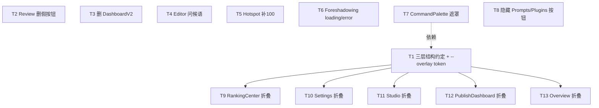

# NovelCraft 前端重设计方案 + 任务拆解

> 架构师：高见远（software-architect）
> 阶段：Phase 2（功能真实性审计之后的「重设计 → 工程师实现 → QA 验证」链路）
> 输入：`docs/frontend-authenticity-audit.md`（许清楚产出，主理人已 grep/Read 复核关键结论）
> 范围：**纯前端**，`frontend/src/**`，不触碰 `backend/` 任何文件。
> 原则：**严禁裸 hex / 裸 rgba，统一 `var(--xxx)`（doc12 双主题 token）**；保持功能真实，仅做缺口补齐与信息层级统一。

---

## 一、实现方案 + 框架选型

### 1.1 沿用技术栈（不引入新框架）
| 维度 | 选型 | 说明 |
|------|------|------|
| 语言/构建 | React 19 + Vite + TypeScript | 现状已用，无需变更 |
| UI 库 | MUI（按需） | 现状已用，本次整改不新增 MUI 依赖 |
| 样式 | Tailwind + 原生 `className` + doc12 token | 业务组件普遍用 `className="card/card-head/card-title"` + 内联 `var(--xxx)` |
| 设计系统 | **doc12 双主题 token**（`frontend/src/design/tokens.css` 为唯一真源，`compat.css` 为旧名别名桥接） | 严禁裸 hex；组件已普遍 `var(--bg-elev)`、`var(--text-2)`、`var(--r-xl)` 等别名 |
| 通用组件 | `frontend/src/components/ui/`（Accordion / Pagination / EmptyState / Spinner / StepTimeline / ConfirmDialog / Button） | 直接复用，不新建 |

### 1.2 是否引入新共享组件 —— **否**
审计已确认 `NovelAnalysisReport.tsx` 的「8 节 Accordion 全部默认折叠、缺失节渲染『暂无数据』占位」是**三层信息结构的优秀范式**。本次重设计**不新建组件**，而是：
- 复用现有 `ui/Accordion`（`defaultOpen` 受控开合）+ `EmptyState` 占位；
- 将 `NovelAnalysisReport` 的「默认折叠 + 缺失即占位不编造」约定**升级为全局三层结构约定**（见第二章），供 RankingCenter / Settings / Studio / PublishDashboard / Overview 直接套用。

### 1.3 核心难点与对策
| 难点 | 对策 |
|------|------|
| 用户原始前提（大量假功能/假数据/层级混乱）与代码实际不符 | 依审计与主理人复核结论：仅补 **2 个 P1 文件 + 数项 P2 + 5 页结构级折叠统一**，不重做 |
| 多页（RankingCenter 1051 行、Settings 728 行等）信息密度高 | 按三层结构「核心默认展开 / 高级默认折叠」收敛，复用 Accordion，不引入新布局库 |
| 全站 token 一致性 | 唯一裸 `rgba` 违规在 `CommandPalette.tsx:27`，改用新增 `--overlay` token（或 `color-mix` 引用 `--bg-base`） |

---

## 二、三层信息结构组件约定（全局统一范式）

### 2.1 三层定义
| 层 | 内容 | 默认可见性 | 实现方式 |
|----|------|-----------|---------|
| **L1 核心信息** | 页面关键指标卡、当前选中对象摘要、主操作结果 | **始终显示** | 页面顶部 `page-head` + 直接平铺的 `.card`（不折叠） |
| **L2 常用操作 / 常用明细** | 高频表单、列表、话题/榜单快照、输入区 | **默认展开** | `Accordion` 项 `defaultOpen: true`，或普通 `.card` |
| **L3 高级信息** | 原始 JSON / 测试日志 / 高级参数 / 来源详情 / 历史结果 | **默认折叠** | `Accordion` 项 `defaultOpen: false` |

### 2.2 Accordion `defaultOpen` 判定范式（可复用代码片段）
复用 `ui/Accordion`（`frontend/src/components/ui/Accordion.tsx`，`AccordionItem` 接口含 `key/title/content/defaultOpen`）。**不新建组件**，遵循以下契约：

```tsx
import { Accordion, EmptyState } from "./ui";
import type { AccordionItem } from "./ui";

/**
 * 三层判定：高频或用户关注 → 默认展开；低频或高复杂 → 默认折叠。
 * 缺失数据用 EmptyState 占位，绝不编造（沿用 NovelAnalysisReport 范式）。
 */
function section(title: string, content: React.ReactNode, isCore: boolean): AccordionItem {
  return { key: title, title, content: content ?? <EmptyState title="暂无数据" />, defaultOpen: isCore };
}

// 用法示例（RankingCenter / Settings / Studio / PublishDashboard / Overview 套用）：
<Accordion items={[
  section("核心指标",      <CoreMetrics />,    true),   // L2 默认展开
  section("高级参数",      <AdvancedForm />,   false),  // L3 默认折叠
  section("原始返回 / 日志", <RawJson />,       false),  // L3 默认折叠
]} />
```

### 2.3 深层报告范式（NovelAnalysisReport 8 节）
对「分析报告 / 聚合分析」类高密度内容，**全部 8 节默认折叠**（`defaultOpen: false`），缺失节渲染 `EmptyState`（"暂无数据"）。RankingCenter 的「聚合分析报告」已复用该组件，**保持不变**。

### 2.4 判定清单（工程师自查）
- [ ] L1 核心卡是否平铺在最顶、无折叠？
- [ ] L2 高频面板 `defaultOpen: true`（或直接 `.card`）？
- [ ] L3 高级面板 `defaultOpen: false`？
- [ ] 任何缺失数据是否用 `EmptyState` 占位而非编造？
- [ ] 是否全程 `var(--xxx)`，无 `#hex` / `rgb()/rgba()` 字面量？

---

## 三、文件列表（相对路径，均在 `frontend/src/components/` 下）

按页面/模块归类。本次整改**仅涉及以下文件**，其余文件不动。

| 模块 | 文件 | 本次改动 |
|------|------|---------|
| 通用约定（文档） | `../docs/frontend-redesign-plan.md`（本文件） | 新增约定说明 |
| 设计 token | `../design/tokens.css` | 新增 `--overlay` token（dark + light 两段） |
| 质量审阅 | `Review.tsx` | 删除 L209 / L212 两枚假按钮（T2） |
| 死代码 | `DashboardV2.tsx` | 整文件删除（T3） |
| 章节编辑器 | `Editor.tsx` | L43-45 问候语改空态引导（T4） |
| 热点追踪 | `HotspotDashboard.tsx` | L473 分页补 100（T5） |
| 伏笔看板 | `ForeshadowingBoard.tsx` | L13/L15-17 补 loading/error（T6） |
| 命令面板 | `CommandPalette.tsx` | L27 遮罩改 `--overlay`（T7） |
| Prompt 管理 | `Prompts.tsx` | L211 隐藏「新建版本」disabled 按钮（T8） |
| 插件管理 | `Plugins.tsx` | L241-252 隐藏「安装/启用/禁用」disabled 按钮（T8） |
| 扫榜选书 | `RankingCenter.tsx` | 按三层结构折叠高级面板（T9） |
| 系统设置 | `Settings.tsx` | 按三层结构折叠高级/原始 JSON/日志（T10） |
| 内容工作室 | `Studio.tsx` | 输入区默认展开、结果/原始折叠（T11） |
| 发布看板 | `PublishDashboard.tsx` | 高级发布/翻译映射/反馈日志折叠（T12） |
| 数据概览 | `Overview.tsx` | 核心指标卡展开、明细/活动可折叠（T13） |
| 报告范式（复用，不改动） | `NovelAnalysisReport.tsx` | 作为全局模板，本次不改 |
| 通用组件（复用，不改动） | `ui/Accordion.tsx` `ui/EmptyState.tsx` `ui/Pagination.tsx` | 直接复用 |

> 说明：T1（三层结构约定）为**约定确立 + 本文件第二章**，不要求新建代码文件；落地通过 T9–T13 在各页应用 `ui/Accordion` 实现。

---

## 四、任务列表（有序、含依赖、按实现顺序）

> 总任务数：**13**（T1 基础约定；T2–T8 单点修复；T9–T13 结构级折叠统一）。
> 依赖关系：**T1 是 T9–T13 的前置**（先确立约定，再在各页套用）；T2–T8 相互独立、可并行；T9–T13 彼此独立、仅依赖 T1。

### T1 —— 确立三层信息结构共享约定（基础 / 模板）
- **文件**：`docs/frontend-redesign-plan.md`（第二章）、`frontend/src/design/tokens.css`（新增 `--overlay`）
- **依赖**：无
- **优先级**：P1（基础）
- **做什么**：
  1. 将本文件第二章「三层定义 + Accordion `defaultOpen` 判定范式 + 缺失即 `EmptyState` 占位」确立为全局约定。
  2. 在 `tokens.css` 的 `:root,[data-theme="dark"]` 与 `[data-theme="light"]` 两段各新增一行：
     ```css
     /* dark 段（接在 --shadow-focus 之后） */
     --overlay: color-mix(in srgb, var(--bg-base) 55%, transparent);
     /* light 段（接在 --shadow-focus 之后） */
     --overlay: color-mix(in srgb, var(--bg-base) 55%, transparent);
     ```
     （`color-mix` 引用 `--bg-base`，双主题自动跟随；若构建目标浏览器不支持 `color-mix`，退化为在 token 内直接写 `rgba(20,22,28,.55)` / `rgba(255,255,255,.55)`，但**该字面量只允许出现在 `tokens.css` 内，组件代码仍只用 `var(--overlay)`**。）
- **验收**：约定文档就绪；`var(--overlay)` 在双主题下均生效。

### T2 ——（P1）Review.tsx 移除两枚假按钮
- **文件**：`frontend/src/components/Review.tsx`
- **依赖**：无
- **优先级**：P1
- **改什么 → 改成什么**：
  - L208-215 的 `<div className="head-actions">` 内两枚静态 `<button>`（L209「重新审查」、L212「导出报告」）**整段删除**。
  - 依据：两按钮无 `onClick`、无处理函数；接真实「重新审查」需后端 `final_consistency_check` 工作流节点 / `runEditorOp("review")`，**超出纯前端范围**，故删除而非接入。
  - 删除后 `head-actions` 容器若为空可一并移除（保留注释说明原文案已被移除以消除假按钮）。
- **验收**：L209/L212 按钮不再渲染；页面无残留空 `head-actions` 容器报错。

### T3 ——（P1）删除 DashboardV2.tsx 死代码
- **文件**：`frontend/src/components/DashboardV2.tsx`（整文件删除）
- **依赖**：无
- **优先级**：P1
- **改什么 → 改成什么**：
  - 经 grep 确认：全仓仅 `DashboardV2.tsx` 自身引用 `DashboardV2`（L17 接口、L233 导出），`App.tsx` 未 import、路由未挂载 → 永不渲染。
  - **直接删除该文件**。含 5 处硬编码假数据数组 `STAT_CARDS / QUICK_ACTIONS / RECENT_PROJECTS / SYSTEM_STATUS / TODO_ITEMS`（L33/78/146/195/208）一并消除。
  - 无需替换页：工作台由 `Overview.tsx`（复用 `analytics/dashboard` 真实数据）承载。
- **验收**：文件不存在；`grep -r "DashboardV2" frontend/src` 无任何引用；构建通过。

### T4 ——（P2）Editor.tsx 聊天问候语改空态引导
- **文件**：`frontend/src/components/Editor.tsx`
- **依赖**：无
- **优先级**：P2
- **改什么 → 改成什么**：
  - L43-45 初始 `aiChatMessages` 中那条伪造「AI 已分析」的 system 消息：
    ```ts
    // 删除（或替换）此条：
    { role: "system", text: "检测到本章情绪偏「治愈收束」…" }
    ```
  - 改为**空态引导**：初始 `aiChatMessages` 置为空数组 `[]`，并在聊天面板渲染时判断 `length === 0` 显示引导文案（如「向 AI 助手提问，或选中文本用浮动工具栏润色 / 续写」），样式用 `var(--text-3)`。
  - `sendAiMessage`（L47）与 `editorAiReview` 回填（L56-59）逻辑保持不变——真实结果仍会追加。
- **验收**：进入编辑器聊天面板不再显示伪造分析；用户发送后正常追加真实 system/user 消息。

### T5 ——（P2）HotspotDashboard 热点分页补 100
- **文件**：`frontend/src/components/HotspotDashboard.tsx`
- **依赖**：无
- **优先级**：P2
- **改什么 → 改成什么**：
  - L473 热点列表分页 `pageSizeOptions={[10, 20, 50]}` → 改为 `[10, 20, 50, 100]`（与全局 `ui/Pagination` 默认 `[10,20,50,100]` 及同页文章列表 L701 保持一致）。
  - 文章列表 L698-702 已正确，**不改**。
- **验收**：热点分页下拉含 100；与文章列表选项一致。

### T6 ——（P2）ForeshadowingBoard 补 loading/error 态
- **文件**：`frontend/src/components/ForeshadowingBoard.tsx`
- **依赖**：无
- **优先级**：P2
- **改什么 → 改成什么**：
  - L13 `const [items, setItems] = useState<Foreshadowing[]>([])` 旁新增 `loading` / `error` 状态：
    ```ts
    const [loading, setLoading] = useState(true);
    const [error, setError] = useState<string | null>(null);
    ```
  - L15-17 `useEffect` 改为：
    ```ts
    useEffect(() => {
      setLoading(true); setError(null);
      api<Foreshadowing[]>(`/api/v1/novels/${novelId}/foreshadowings`)
        .then((resp: any) => setItems(resp.data || []))
        .catch((e) => setError(String(e?.message ?? e) || "加载伏笔失败"))
        .finally(() => setLoading(false));
    }, [novelId]);
    ```
  - 在 `return` 顶部（L25 `<div className="grid grid-2">` 之前）增加 in-page 反馈，**复用本仓库既有 per-page `Banner` 范式**（Billing/Overview/Prompts/Plugins 均各自定义 `Banner`，此处同法本地定义，不新建共享组件）：
    - `loading` → 显示「正在加载伏笔…」（用 `var(--info)` 色调块 + 文字）。
    - `error` → 显示 errorMessage + 「重试」按钮（调用 reload）。
  - 移除原 `catch(() => {})` 静默吞错。
- **验收**：加载中 / 出错均有可见反馈；错误不再被吞；重试可恢复。

### T7 ——（P2）CommandPalette 遮罩改 token
- **文件**：`frontend/src/components/CommandPalette.tsx`、`frontend/src/design/tokens.css`（T1 已加 `--overlay`）
- **依赖**：T1
- **优先级**：P2
- **改什么 → 改成什么**：
  - L27 `background: "rgba(11,15,25,0.55)", // --bg with opacity` → 改为 `background: "var(--overlay)",`
  - 该处为全仓唯一裸 `rgba` 违规；改后双主题遮罩统一跟随 `--bg-base`。`backdropFilter` / `zIndex: 9999` 保持不变（如需更规范可改用 `var(--z-overlay)`，非必须）。
- **验收**：`grep -rn "rgba(" frontend/src/components` 无业务字面量（仅 `tokens.css` 内允许）；深浅主题遮罩观感一致。

### T8 ——（P2）隐藏 Prompts / Plugins 无后端接口的 disabled 按钮
- **文件**：`frontend/src/components/Prompts.tsx`、`frontend/src/components/Plugins.tsx`
- **依赖**：无
- **优先级**：P2
- **改什么 → 改成什么**：
  - **Prompts.tsx L211-214**：删除「新建版本」`<button className="btn-sm btn-ghost" disabled ...>` 整枚（保留 L206「刷新」按钮）。如需保留可读说明，在 `head-actions` 外保留一行 info 文案（如「Prompt 版本由后端注册表管理，前端只读」），用 `var(--text-3)`。
  - **Plugins.tsx L240-253**：删除 `安装 / 启用 / 禁用` 三枚 `disabled` `<button>`（L241-252），保留 L254-256 的 `<p>` info 说明（已诚实标注「后端暂未提供 … 操作按钮仅作展示」）。可选：将三按钮所占空间合并为一行 info 提示，减少版面浪费。
  - 依据：后端无对应写接口，保留 disabled 按钮属冗余展示（审计 P2-5）。
- **验收**：两页不再出现无处理函数的 disabled 按钮；可读/只读说明以 info 文案形式保留。

### T9 ——（结构级）RankingCenter 按三层结构折叠
- **文件**：`frontend/src/components/RankingCenter.tsx`
- **依赖**：T1
- **优先级**：P2（结构级）
- **改造点（文件:锚点 → 默认行为）**：
  - **L389 榜单源 card**（`.card-head`「📡 榜单源」+ L395 `grid grid-3` 平台卡）：**L1/L2 核心，保持平铺展开**（不折叠）。
  - **L404-418 来源详情 Accordion**：已 `defaultOpen: false`（审计确认）→ **保持折叠，不改**。
  - **L439 导入已有榜单文件 section**（导入参数 / 文件类型说明 / 操作区）：包成 `Accordion` 项 **`defaultOpen: false`**（L3 高级，默认折叠）。
  - **L517 / L720 / L914 各 card**（扫描设置 / 话题列表 / 批量操作区等高频面板）：核心快照类（如话题列表）保持展开；**扫描设置、批量操作等高级配置区**包成 `Accordion` **`defaultOpen: false`**。
  - **L765-768 聚合分析报告**（复用 `NovelAnalysisReport` 8 节）：**保持不变**（已全折叠范式）。
  - 实施：对 L439/L517/L720/L914 中识别为「高级/低频」的子区块，用 `section(title, content, false)`（见第二章 2.2）包裹为 `defaultOpen:false` 的 Accordion 项；核心区块维持 `.card` 平铺。
- **验收**：进入页面默认只展开核心榜单/话题；扫描设置/导入参数/批量操作折叠，点击展开正常。

### T10 ——（结构级）Settings 按三层结构折叠
- **文件**：`frontend/src/components/Settings.tsx`
- **依赖**：T1
- **优先级**：P2（结构级）
- **现状**：728 行，多设置区段（Provider / 模型路由 / 预算 / Prompt / 通用 / 平台连接 / 统计 / 知识导入 / 改密）**平铺无折叠**（grep 无 `card-head`/`tab`，为长滚动区段）。
- **改造点（按三层）**：
  - **L1 核心表**（Provider 列表、模型路由、预算表）：保持平铺展开（不折叠）。
  - **L3 高级/低频**（每区段内的「高级参数」「原始 JSON」「测试日志」）：包成 `Accordion` 项 **`defaultOpen: false`**。
    - 具体锚点示例：L354-361「导出 JSON」所在区段、各 `editRoute/editBudget/editSetting` 表单内的高级字段、测试/日志输出区 → 折叠。
  - **改密区段**（L699 附近 `change-password`）：属常用操作，保持展开或 `defaultOpen:true`。
  - 实施：在各设置子区块内，将「高级参数 / 原始 JSON / 测试日志」抽为 `section(..., false)` 折叠项；核心表单字段保持可见。
- **验收**：核心配置表默认可见；高级参数/原始 JSON/测试日志默认折叠，展开正常。

### T11 ——（结构级）Studio 按三层结构折叠
- **文件**：`frontend/src/components/Studio.tsx`
- **依赖**：T1
- **优先级**：P2（结构级）
- **现状**：L80-104 左侧 tab 侧栏（短篇/知识/热点/仿写），L115+ 各 tab 面板内「输入区 + 结果区」混杂。
- **改造点（按三层）**：
  - **输入区（L116-132 短篇创作表单等）**：**L2 默认展开**（用户首要操作）。
  - **结果区（L133-138 `<div className="card">` 生成结果）**：短篇结果保持展开（`defaultOpen:true` 或平铺）；**「历史结果 / 原始返回」**包成 `Accordion` **`defaultOpen: false`**。
  - 知识库 / 热点 / 仿写三个 tab 同法：输入默认展开，原始返回/历史折叠。
  - 实施：为每个 tab 面板的结果部分，将「原始返回」「历史记录」用 `section(title, content, false)` 包裹为折叠项。
- **验收**：进入各 tab 默认见输入区与最新结果；原始返回/历史折叠，展开正常。

### T12 ——（结构级）PublishDashboard 按三层结构折叠
- **文件**：`frontend/src/components/PublishDashboard.tsx`
- **依赖**：T1
- **优先级**：P2（结构级）
- **现状**：L104-128 左侧 tab 侧栏（发布/出海/数据/团队），L137+ 各 tab 面板。
- **改造点（按三层）**：
  - **核心（发布表单 L132-、数据卡片、团队列表）**：**L1/L2 默认展开**。
  - **L3 高级**（「高级发布选项」「翻译映射」「反馈原始日志」）：包成 `Accordion` **`defaultOpen: false`**。
    - 锚点示例：出海 tab 的翻译映射配置、数据 tab 的 AI 反哺原始日志（L42-47 `loadFeedback` 结果区）、发布 tab 的高级选项 → 折叠。
  - 实施：将各 tab 内识别为高级的子区块用 `section(..., false)` 包裹。
- **验收**：发布/数据/团队核心卡片默认展开；高级发布选项/翻译映射/反馈原始日志默认折叠。

### T13 ——（结构级）Overview 按三层结构折叠
- **文件**：`frontend/src/components/Overview.tsx`
- **依赖**：T1
- **优先级**：P2（结构级）
- **现状**：L242 `card`「核心指标卡」（TrendingUp），下方列表/明细平铺；loading/error/empty 态已完备（L207-236）。
- **改造点（按三层）**：
  - **L242 核心指标卡**：**L1 始终平铺展开**（不折叠）。
  - **明细表 / 最近活动 / 话题建议列表**（L184-185 `topPostsPager` / `topicSuggestionsPager` 等）：包成 `Accordion` **`defaultOpen: false`**（L3 下层，默认折叠，点击展开）。
  - 实施：在 L239 `Data view` 区块内，将明细类列表抽为 `section("明细数据", <List/>, false)` 折叠项；核心指标卡维持 `.card` 平铺。
- **验收**：核心指标卡默认可见；明细/活动表默认折叠，展开正常；loading/error/empty 态不受影响。

---

## 五、依赖包列表

**无新增依赖。** 本次所有整改仅用现有 `react` + `ui/*` 组件 + doc12 token；不引入任何新 npm 包、不新增 MUI 模块、不引入新状态库。

---

## 六、共享知识（跨文件约定，供工程师 / QA 复用）

1. **Token 用法（严禁裸 hex / 裸 rgba）**
   - 所有颜色用 `var(--xxx)`；真源为 `frontend/src/design/tokens.css`（doc12），`compat.css` 提供旧名别名（`--bg-elev`、`--text-2`、`--text-3`、`--r-xl`、`--border`、`--primary-dim` 等），两者均可直接在组件内联使用。
   - 遮罩/overlay 统一用 `var(--overlay)`（T1 在 `tokens.css` 双主题段新增）。
   - **唯一例外**：`tokens.css` 内的 token 定义值可含颜色字面量；组件业务代码（`.tsx` / 行内 style）一律禁止 `#hex` / `rgb()` / `rgba()`。

2. **Accordion `defaultOpen` 约定（三层结构核心）**
   - 核心/L2 高频：`defaultOpen: true` 或直接 `.card` 平铺。
   - L3 高级/低频：`defaultOpen: false`（折叠）。
   - 缺失数据：`content` 用 `<EmptyState title="暂无数据" />` 占位，**绝不编造**（沿用 `NovelAnalysisReport` 范式）。
   - 复用 `ui/Accordion`（`AccordionItem` = `{key,title,content,defaultOpen?}`），**不新建折叠组件**。

3. **按钮 loading 态约定（busy / disabled 一致性）**
   - 触发异步操作的按钮在 `busy/loading` 时 `disabled` 并展示 `Loader2 spin`（参考 Wizard/Billing/Prompts/Fanout/Login/BookLibrary 现有写法）。
   - 无后端接口的「写操作」按钮（如 Prompts/Plugins 的 disabled 按钮）**按 T8 直接隐藏**，而非置灰占位。
   - 错误反馈统一用 **in-page Banner**（非 `alert()`）；各页沿用既有 per-page `Banner` 范式（ForeshadowingBoard 按 T6 补本地 Banner）。

4. **列表分页约定**
   - 全局 `ui/Pagination` 默认 `pageSizeOptions={[10,20,50,100]}`；所有列表页统一采用，勿遗漏 100（T5 补全 HotspotDashboard 热点列表）。

---

## 七、任务依赖图



> 说明：T2–T8 相互独立可并行；T9–T13 仅依赖 T1（先定约定再套用）；T7 实际也依赖 T1 新增的 `--overlay`。

---

## 八、待明确事项（如需主理人/PM 拍板）

1. **Review「重新审查 / 导出报告」的最终去向**：本次按「纯前端」约束**选择删除**（T2）。若产品希望保留功能，需后端补 `final_consistency_check` 工作流节点 + 报告导出接口，超出本阶段范围——请 PM 确认是否纳入后续后端迭代。
2. **`--overlay` 实现方式**：优先 `color-mix(in srgb, var(--bg-base) 55%, transparent)`（双主题自动跟随）；若目标浏览器不支持 `color-mix`，退化为 `tokens.css` 内直接字面量。请工程师实现时按构建目标浏览器能力二选一。
3. **T9–T13 折叠粒度的「高级/低频」边界**：本方案已给出每页的默认展开/折叠判定与锚点；若 PM 对某页「哪些算核心、哪些算高级」有更细偏好，可在实现前通过本表微调，不影响任务结构。
4. **DashboardV2 删除后是否需新增「工作台」入口**：当前 `Overview` 已承载工作台职责，故不新增；若产品后续要做差异化工作台，属新需求，不计入本次。

---

*本方案仅设计 + 任务拆解，未对任何源文件做改动。下一步由工程师（寇豆码）按 T1→T13 顺序实现，QA（严过关）按 P1/P2 + 三层结构验收。*
