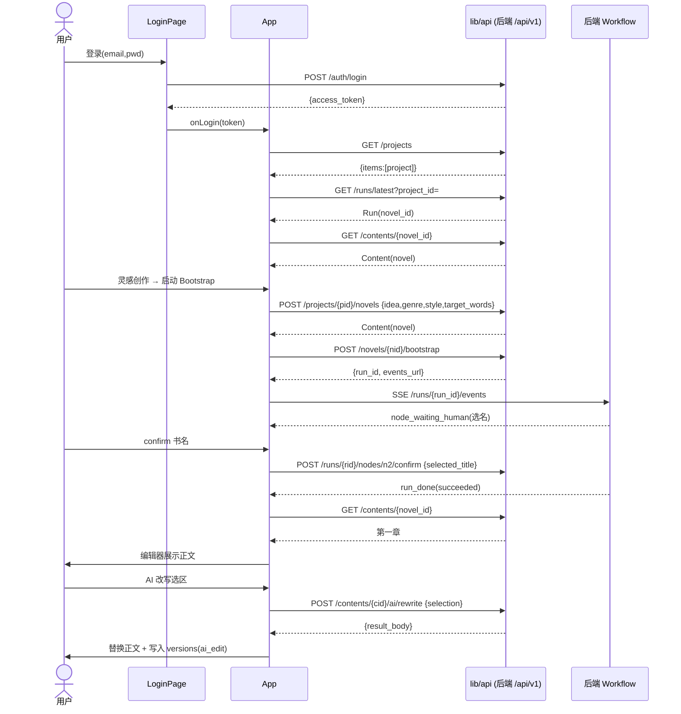

# NovelCraft 前端重写 · 实现方案 + 有序任务分解

> 架构师：software-architect（Bob）｜ 范围：**仅前端**，后端不动、不重新设计
> 决策基线（用户拍板）：保留并完善 `frontend/src/` 真 React 前端；技术栈 = **React + Vite + TypeScript + Tiptap（PWA + 设计系统）**；**不引入 MUI/Tailwind**；全量覆盖 PRD C1~C8；**弃用** `proto.html` + `nc-api.js`/`app.js` 静态原型；改 Dockerfile 为多阶段构建并写 nginx SPA 配置。

> ⚠️ 诚信声明（依据 `23-AI开发边界与交付真实性规范`）：本方案为**设计与分解**，不含实现代码。下文“现状盘点”基于实读 `frontend/src/**`、`docs/10-API接口规范.md`、`docs/NovelCraft-开发文档/05/12` 等，但**端到端字段级核对必须结合真实后端 `/api/v1/openapi.json`**（见 Batch1 头号任务）；凡标注“需核对”者，均不得在未核对前宣称完成。

---

## 1. 现状盘点（对照 PRD C1~C8）

> 读法：**已具备**（接真实后端）/ **部分**（接了但字段/端点有偏差）/ **stub**（硬编码或占位未接）/ **缺失**（无组件或仅内联空壳）。

| 能力 | 现状 | 证据 | 与 PRD/后端契约偏差 |
|---|---|---|---|
| **C1 统一内容模型** | **部分** | `App.tsx` 用 `contents?project_id&parent_id` 取章节；`BookLibrary` 接 `library/books`/`completion`/`generation-batches`/`chapters/batch`/`import-chapters`/`export` | 端点基本对；但 `api<T>` 解包与分页 `{items}` 假设未验证（见 §5-A）；体裁仅长/短篇，全体裁(P2)未做 |
| **C2 工作流引擎** | **部分** | `Progress.tsx` 接 `runs/{id}/nodes/{key}/retry`；`RankingCenter` 接 `generate-book`/`scan-all`；`Wizard`→`bootstrap` | human 确认卡已有骨架但未与 SSE/`confirm` 全闭环；`DagEditor` 端点**错误**（见 §5-G） |
| **C3 AI Gateway + Agent** | **部分** | `Settings` 接 `providers`/`model-routes`/`budgets`/`prompts`；`Costs` 由 prop 驱动；`AgentConsole` 接 `agents/status` | `AgentConsole` 仅状态；Prompt 实验室(lab/ab)未做；成本聚合 `/ai-calls/aggregate` 未接 |
| **C4 Knowledge Hub** | **部分** | `KnowledgeBrowser` 接 `knowledge/search`；`HotspotDashboard` 接 `hotspots`/`articles`/`generate`；`Studio` 接 `imitation`/`daily-briefing`/`short-stories` | 知识**列表/入库**未做（仅检索）；四库/风格学习/相似度闸未接；`Studio` 端点有偏差（见 §5-E） |
| **C5 通用版本系统** | **部分** | `App.tsx` `versions` + `VersionTree`(prop)；`saveChapter` 写 `versions(label=ai_edit)` | **diff 视图未做**（doc10 `/versions/{v1}/diff/{v2}`）；版本树仅展示 |
| **C6 叙事一致性** | **部分** | `Review.tsx` 展示 7 维（来自 `run.nodes`/`narrative`）；`ForeshadowingBoard` 接 `novels/{id}/foreshadows`；`App` 接 `novels/{id}/narrative` | **deai 7 维未接**（见 §5-C）；`Editor` 的 `deaiResult` prop 从未被 `App` 传入；伏笔 CRUD/时间线/弧线展示不全 |
| **C7 发布网关 + 回流** | **部分** | `PublishDashboard` 接 `publish/records`/`analytics/*`/`publish`/`overseas/translate`/`check-sensitive`；`FanoutMatrix` 接 `contents/{id}/fanout` | `FanoutMatrix` 端点未在 doc10 列出（需核对）；ROI/数据回流 UI 弱；全自动开关未做 |
| **C8 追踪与治理** | **部分** | `Costs` 展示 `ai-calls`（由 `App` 取）；`Collaboration` 接 `collaboration/members|logs|invite` | `Collaboration` 端点不在 doc10（见 §5-H，需核对）；审计日志页未做；操作日志视图无 |
| **FR-UI 设计系统** | **不符** | `proto.css`(28KB, indigo 旧 token) + `novelcraft-theme.css`(orange 玻璃 token) **双套互斥**；组件大量 `style={{color:'var(--primary-light)'}}` | 与 doc12 tokens（indigo #5B66DB / `--bg-base` / `--text-primary`）**完全不符**；`ThemeProvider` 是 no-op；`index.html` 无无闪白脚本；仅 `Layout` 本地切主题 |
| **工作台/概览/插件三屏** | **stub** | `App.tsx` `overview`/`workspace`/`plugins` 为“正在建设中”内联空壳；`Overview.tsx` 存在但**未被 App 引用**（孤儿文件，且全硬编码） | 三屏无真实数据 |
| **构建/部署** | **不符** | `Dockerfile` 仅 `COPY proto.html` 到 nginx；`nginx.conf` 已含 SPA fallback + `/api` 代理（可用） | 未用 vite 构建；线上实际跑的是 proto 壳，非 src/ 真前端 |
| **PWA 离线** | **部分** | `public/sw.js` 存在（shell 缓存 + `/api` 离线 503 兜底）；`lib/offlineCache.ts` + `App` 离线队列已实现 | 仅 L1 shell；L2 内容缓存/三方对比 UI、L3 出站队列重放 UI 缺失；`manifest.json` 图标缺文件 |

**结论**：`src/` 不是从零，已有 23 屏编排 + 大量真实后端接线，但呈现“**接线多、契约乱、设计系统缺位、三屏 stub、构建未接**”的状态。核心小说闭环（登录→bootstrap→生成→编辑器→书库）所需组件**已存在**，主要风险在**字段/端点契约不统一**与**设计系统落地**。

---

## 2. 目标模块结构（按 8 大能力重新梳理）

保持现有组件文件，按能力归组到 `frontend/src/` 子目录（**不拆文件到极致，按能力聚类便于维护**）：

```
frontend/src/
├── design/                      # 【新增】设计系统基座
│   ├── tokens.css               # doc12 tokens，[data-theme=dark|light]
│   └── compat.css               # 旧 token 名 → 新 token 别名层（渐进迁移）
├── theme/
│   └── tokens.ts                # TS token 对象（供 inline style / JS 取色）
├── components/
│   ├── common/                  # Layout / ThemeToggle / CommandPalette / EmptyState / DataTable / ErrorBoundary / LoginPage / PrivacyPage
│   ├── novel/                   # Wizard / Progress / Review / Editor / RichEditor / CharacterOutline / ReviewRadar / ForeshadowingBoard / VersionTree  (C1/C2/C5/C6)
│   ├── ranking/                 # RankingCenter / BookLibrary   (C4 榜单 + C1 书库)
│   ├── studio/                  # Studio / HotspotDashboard / KnowledgeBrowser / FanoutMatrix  (C4 热点/知识 + C7 fan-out)
│   ├── publish/                 # PublishDashboard / Collaboration / AgentConsole / DagEditor / Costs / Settings  (C7/C8/C3 配置)
│   ├── analytics/               # DashboardV2(工作台) / Overview(数据概览) / Plugins  (FR-UI)
│   └── editor/                  # （预留）Tiptap AI 浮条/行内批注/版本树面板，本期在 Editor 内演进
├── lib/                         # api.ts（修契约）/ offlineCache.ts（保留）
├── api/                         # 【新增，可选】openapi-ts 生成的客户端（以 openapi.json 为源）
├── hooks/                       # 【新增】useSSE / useProject / useTheme（从 App 提取）
├── App.tsx                      # 编排器（保留，提取 state 到 hooks，补 overview/workspace/plugins 接线）
├── main.tsx                     # 入口（保留，调整样式导入顺序）
└── styles/                      # 逐步废弃 proto.css；保留 novel-prose.css（正文阅读）
```

**保留**：App.tsx 编排思路、Editor/RichEditor、RankingCenter、BookLibrary、Settings、Studio、HotspotDashboard、PublishDashboard、Collaboration、AgentConsole、Progress、Review、ForeshadowingBoard、KnowledgeBrowser、FanoutMatrix、Wizard、Costs、CommandPalette、LoginPage、Layout、VersionTree、CharacterOutline、ReviewRadar、ErrorBoundary、PrivacyPage。

**修改**（详见 §3 / §5）：App.tsx、lib/api.ts、ThemeProvider、Layout、Editor、Review、Studio、DagEditor、Overview、DashboardV2、main.tsx、index.html、Dockerfile、nginx.conf。

**新增**：design/tokens.css、design/compat.css、theme/tokens.ts、components/analytics/Overview(重构) & Plugins(新建)、hooks/*、api/(可选)、Dockerfile 多阶段。

**删除/弃用**：`frontend/proto.html`、`frontend/public/nc-api.js`、`frontend/public/app.js`（从构建与 nginx 移除，移入 `archive/` 或直接删）。

---

## 3. 文件清单（保留 / 修改 / 新增 / 删除）

### 保留（不动架构，仅按 Batch 微调）
`frontend/src/App.tsx`（提取 state）、`src/main.tsx`、`src/lib/offlineCache.ts`、`src/components/*`（除下“修改/删除”项）、`src/styles/novel-prose.css`。

### 修改
| 文件 | 改动要点 | Batch |
|---|---|---|
| `frontend/src/lib/api.ts` | 澄清 `api<T>` 只解包 envelope.data；新增 `listApi<T>` 归一分页 `{items}`；SSE 保持 | B1 |
| `frontend/src/components/ThemeProvider.tsx` | 实现真实主题：读 `localStorage.nc-theme`→系统 `prefers-color-scheme`→`data-theme`；提供 context | B1 |
| `frontend/index.html` | `<head>` 注入无闪白内联脚本（`data-theme` 在首屏前设好）；`theme-color` 用 doc12 主色 | B1 |
| `frontend/src/main.tsx` | 样式导入改为 `design/tokens.css` → `design/compat.css` → `novel-prose.css`；SW 注册保留 | B1 |
| `frontend/src/App.tsx` | 补 `overview`/`workspace`/`plugins` 接线（替换内联 stub）；传 `deaiResult`/`deaiLoading` 给 Editor；提取通用 state 到 hooks | B1/B3/B7 |
| `frontend/src/components/Layout.tsx` | 主题切换改走 `ThemeProvider` context；搜索框接 CommandPalette；删除本地 dark state | B1 |
| `frontend/src/components/Editor.tsx` | 接 `deaiResult`/`deaiLoading`（来自 App 的 deai 调用）；AI op 枚举对齐 doc10 | B3 |
| `frontend/src/components/Review.tsx` | 7 维数据源改接 deai/narrative 真实端点；“重新审查”按钮接 `POST /contents/{id}/deai` | B3 |
| `frontend/src/components/Studio.tsx` | 短篇模板改 `GET /short-stories/templates`；仿写保证 `source_text≥200`；一键改编接 `/hotspots/adapt`（核对） | B4 |
| `frontend/src/components/DagEditor.tsx` | 端点改为 `GET/PUT /api/v1/workflows/{name}` + `PUT /api/v1/admin/workflows/{name}` + `execute` | B5 |
| `frontend/src/components/Overview.tsx` | 由硬编码改为接 `GET /api/v1/analytics/dashboard`；被 App 的 overview tab 引用 | B7 |
| `frontend/src/components/RankingCenter.tsx` `BookLibrary.tsx` `HotspotDashboard.tsx` `PublishDashboard.tsx` `Collaboration.tsx` `FanoutMatrix.tsx` `KnowledgeBrowser.tsx` `Settings.tsx` `AgentConsole.tsx` `Progress.tsx` `Costs.tsx` | 逐端点对照 openapi.json 核对响应字段并修正（详见 §5） | 各对应 Batch |
| `frontend/Dockerfile` | 多阶段：node 构建 vite → nginx 服务 dist | B1 |
| `frontend/nginx.conf` | 已可用；仅确认 SPA fallback + `/api` 代理；可加 `/sw.js`/`/manifest.json` 缓存头 | B1/B8 |

### 新增
| 文件 | 说明 | Batch |
|---|---|---|
| `frontend/src/design/tokens.css` | doc12 全量 tokens（色彩/字号/间距/圆角/阴影/z-index/动效），`[data-theme=dark|light]` 双套 | B1 |
| `frontend/src/design/compat.css` | 旧名别名层：`--primary→--brand-500` 等，使现有 proto.css 组件零改动过渡 | B1 |
| `frontend/src/theme/tokens.ts` | TS 导出 token 对象 + `token(name)` 取值，供 inline style | B1 |
| `frontend/src/components/analytics/Plugins.tsx` | 接 `GET /api/v1/skills/community` 展示技能目录（安装/启用如后端无端点则占位并文档化） | B6/B7 |
| `frontend/src/hooks/useProject.ts` `useTheme.ts` `useSSE.ts` | 从 App 提取通用状态；SSE 封装 `runs/{id}/events`（Last-Event-ID） | B1/B2 |
| `frontend/src/api/`(可选) | `openapi-ts` 生成客户端（若 Batch1 决定采用） | B1 |
| `frontend/src/components/common/ThemeToggle.tsx` | 复用 Layout 的切换 UI，改走 context | B1 |

### 删除 / 弃用
| 文件 | 处理 |
|---|---|
| `frontend/proto.html` | 从 Dockerfile/nginx 移除；移入 `archive/` 或删除（不再服务） |
| `frontend/public/nc-api.js` `frontend/public/app.js` | 同上，弃用（与 src/ 无依赖） |
| `frontend/src/styles/proto.css` | 渐进废弃：B1 引入 compat 层后，新组件不再引用；B8 全量迁移后删除 |
| `frontend/src/styles/global-v2.css` `novelcraft-theme.css` | 核对是否仍被引用，无引用则删（避免双 token 体系） |

---

## 4. 设计系统落地方案（doc12 → src/）

**原则**：doc12 为唯一事实源；新旧并存期间用**兼容别名层**渐进迁移，避免一次性重写 28KB proto.css 引入回归。

1. **`src/design/tokens.css`**（核心）：定义 `:root,[data-theme="dark"]` 与 `[data-theme="light"]` 双套，变量名严格用 doc12（示例）：
   ```css
   :root, [data-theme="dark"] {
     --brand-50:#EEF0FE; --brand-500:#5B66DB; --brand-700:#373FA8;
     --bg-base:#14161C; --bg-subtle:#1C1F26; --bg-elevated:#2C313B;
     --text-primary:#E8EAF0; --text-secondary:#A6ABBA; --text-muted:#797F8E;
     --border-subtle:#363C47; --success:#31B572; --warning:#F2A93B; --danger:#DE4B5E; --info:#2E9BD6;
     --text-base:14px; --space-4:16px; --radius-md:6px;
     --shadow-md:0 4px 12px hsl(0 0% 0% / .45); --z-popover:400; --dur-base:180ms;
   }
   [data-theme="light"] { /* doc12 light 套 */ }
   ```
2. **`src/design/compat.css`**（过渡）：把旧名映射到新 token，使现有组件无需立即改：
   ```css
   :root { --primary:var(--brand-500); --primary-light:var(--brand-300); --primary-dim:var(--brand-50);
           --bg:var(--bg-base); --bg-elev:var(--bg-subtle); --bg-hover:var(--bg-muted);
           --text-1:var(--text-primary); --text-2:var(--text-secondary); --text-3:var(--text-muted);
           --r-md:var(--radius-md); --sp-4:var(--space-4); --border:var(--border-subtle); }
   ```
   > 注：`novelcraft-theme.css` 的 orange `--nc-primary` 与品牌冲突，**不映射**，直接弃用该文件（doc12 品牌为 indigo）。
3. **`src/theme/tokens.ts`**：导出 `tokens` 对象（从 CSS 变量同步的 TS 常量 + `cssVar(name)` 取值函数），供 `style={{ color: token('--brand-500') }}` 等 inline 用法；新代码一律走 token，禁止裸色值（doc12 §8 stylelint 守卫，B8 接）。
4. **`ThemeProvider` 真正实现**（替换 no-op）：挂载时按 `localStorage.nc-theme` → `matchMedia('(prefers-color-scheme: dark)')` 初始化 `data-theme`，切换只改属性 + 写 `localStorage`（无全量 re-render）；提供 `useTheme()`。
5. **`index.html` 无闪白**：`<head>` 顶部注入 `<script>document.documentElement.dataset.theme=localStorage.getItem('nc-theme')||(matchMedia('(prefers-color-scheme:light)').matches?'light':'dark')</script>`。
6. **`Layout` 切换**：删除本地 `dark` state，改消费 `useTheme()`；`main.tsx` 导入顺序 `tokens.css → compat.css → novel-prose.css`。

---

## 5. API 客户端对齐清单（逐屏修正 + 阻断项）

> **头号阻断项（Batch1 必做）**：当前 `lib/api.ts` 的 `api<T>()` 返回 `response.data`（即 envelope 的 `data` 字段），但**多处调用对返回形状假设不一致**，会导致整 app 初始化失败或静默空数据。必须在 Batch1 拉取真实 `/api/v1/openapi.json`，以它为唯一事实源，逐端点固化“envelope.data 是 `{items:[...]}` 还是业务对象”的约定，并在 `lib/api.ts` 之上封装：
> - `api<T>(path)` → 返回 envelope 的 `data`（业务对象或 `{items,...}`）
> - `listApi<T>(path)` → 归一返回 `T[]`（兼容 `{items}` 与裸数组两种后端形状）
> 下文列出**静态可识别**的偏差（无法跑后端，仍需 openapi.json 终审）。

### A. `api<T>` 解包 / 分页契约（阻断，全局）
- `App.tsx` `api<{id,name}[]>("/api/v1/projects").then(p=>p[0])`：若后端按 doc10 返回 `{data:{items:[...]}}`，`api()` 返回 `{items:[...]}`，`p[0]` 为 undefined → **项目为空，全 app 瘫痪**。改 `listApi(...).then(items=>items[0])`。
- `App.tsx` `api<{data:Budget[]}>("/api/v1/admin/budgets?...").then(r=>r.data)` 与 `api<{data:ModelRoute[]}>("/api/v1/admin/model-routes").then(r=>r.data)`：双重解包。需核对后端该端点 envelope.data 究竟是 `Budget[]` 还是 `{data:Budget[]}`——二者只可能其一正确。
- **修复**：统一约定“列表端点 envelope.data = `{items,page,...}`；非列表端点 envelope.data = 业务对象”，由 `listApi` 抽 `{items}`。

### B. 编辑器 AI 操作（C6 / 编辑器）— 端点与 op 不符
- `App.runEditorOp` 调 `POST /api/v1/contents/{id}/ai/{op}`，`op∈{polish,rewrite,rewrite_chapter,deai}`。
- doc10 §4.3.7 合法 `op∈{polish,rewrite,continue,expand,compress,humanize}`，**无 `rewrite_chapter` / `deai`**。
- 团队事实：“续写/润色是 `POST /novels/{id}/completion`”。建议映射：**续写**→`contents/{id}/ai/continue` 或 `novels/{id}/completion`（整书下一章）；**整章重写**→`contents/{id}/ai/rewrite`（或 `novels/{id}/completion`）；**去AI味**→`humanize`；**deai 7维**→独立 `POST /contents/{id}/deai`（见 C）。
- 响应字段：doc10 返回 `{content_id,op,result_body(Tiptap),ai_call_id,cost,similarity}`；App 期望 `{text,review_7dim,next_chapter_plan}`（自造）。**修复**：用 `result_body` 经 `docToText` 替换选区；7 维/next plan 改由 Review/Editor 独立端点获取。

### C. deai / 7 维审阅接线缺失（C6）
- 团队事实：“`loadReview` 用 `POST /contents/{id}/deai/quick-score`”。
- `App` 的 review 数据来自 `run.nodes.find(n8).output` + `novels/{id}/narrative`，**未调 deai**；`Editor` 有 `deaiResult`/`deaiLoading` props 但 **App 从未传**。
- **修复**：`App` 在 review/editor 加载时调 `POST /contents/{id}/deai/quick-score`（或 `GET /narrative/{novel}/reviews/{chapter}`），把 7 维喂给 `Review` 与 `Editor`；“重新审查”按钮接 `POST /contents/{id}/deai`。

### D. plugins 屏从未调 `/skills/community`
- `App.plugins` 是内联 stub；无组件调 `GET /api/v1/skills/community`。
- **修复**：新建/填充 `Plugins.tsx` 调 `/skills/community`（返回 `skills` 列表）展示目录；安装/启用若后端无端点则占位并文档化（同旧 system_design 决策 #6）。

### E. Studio 端点偏差（C4）
- `GET /api/v1/projects/{pid}/short-stories`：团队事实“`short-stories/templates` 返回字典”→ 模板下拉改 `GET /short-stories/templates`。
- 仿写 `POST /api/v1/imitation`：需 `source_text≥200`（T5 验收）；Studio 当前未保证拼接凑够 200 字（待明确 #2 旧方案：灵感+题材+风格拼接）。
- 一键改编：团队事实“走 `POST /hotspots/adapt`”；Studio 当前用 `/imitation`。需核对 `/hotspots/adapt` 后端是否存在，否则按 doc10 `POST /hotspots/scan-and-generate` 或 `material-suggestions`。
- `POST /api/v1/knowledge/daily-briefing?project_id=`（doc10 有，Studio 已接，保留）。

### F. RankingCenter 端点核对（C4 榜单）
- 调用：`/ranking/sources`、`/ranking/snapshots`、`/ranking/topics`、`/ranking/scan-all`、`/ranking/sources/{source}/scan`、`/ranking/capture-import`/`/ranking/import`、`/ranking/analyze`、`/ranking/snapshots/{id}/{retry,validate-metadata,confirm-capture}`、`/ranking/topics/{id}/{generate-book,bookmark,DELETE}`、`/ranking/topics/batch-delete`、`/ranking/topics/bookmarked`。
- 对照 doc10 §V2.2：路径基本匹配（均 `/api/v1/ranking/...`）。**风险点**：`snapshot` 列表仅元数据、书行在 `/snapshots/{id}.items`（字段名 `data.items` vs `items`）；`generate-book` 响应 `{novel_id,run_id}` 需与 `App.onBookCreated` 契约一致；`analyze` 失败时不得伪造候选（doc10 明确 503）。Batch2 逐字段核对。

### G. DagEditor 端点错误（C2）
- 调 `GET/PUT /api/v1/admin/workflows/custom-dag` —— **doc10 无此端点**。
- **修复**：`GET /api/v1/workflows/{name}` 取定义；`PUT /api/v1/admin/workflows/{name}`（body `{project_id,nodes}`，`bootstrap` 只读拒覆盖）；`POST /api/v1/admin/workflows/{name}/execute`（仅 bootstrap 可执行，其余 501 `WORKFLOW_EXECUTOR_NOT_IMPLEMENTED`）。

### H. Publish / Fanout / Collaboration 端点核对（C7/C8）
- `FanoutMatrix` `POST /contents/{id}/fanout?platforms=`：doc10 **未列出**此端点（fan-out 是 C1 概念但无显式 REST）。需核对后端是否真有；否则改为多平台派生用 `contents` 创建 + `derivations` 记录。
- `Collaboration` `/collaboration/members|logs|invite`：doc10 用 `/projects/{project_id}/members`(§4.2.6/7) + `/admin/audit-logs`(§4.13.5)。`/collaboration/*` 不在 doc10——需核对是保留还是改用标准成员接口。
- `PublishDashboard` `/analytics/dashboard`/`/analytics/feedback`：doc10 对应 `GET /api/v1/metrics/roi` 与 `GET /api/v1/metrics/analyze`（非 `analytics` 前缀）。`/publish/records`、`/publish`(POST)、`/overseas/translate`、`/contents/{id}/check-sensitive` 与 doc10 一致，保留。

### 通用约定（工程师必须遵守）
- 所有调用走 `lib/api.ts`（已注入 token/CSRF/SSE/401 刷新），**不**在组件里手加 header。
- 分页默认 `limit=50`；排序用后端白名单 key；错误统一走 `ApiError` + 用户可见 toast，禁 `alert`、禁静默兜底（doc23）。
- `project_id` 为绝大多数端点必需；从 `useProject()` 取当前项目，为空显空态+提示。
- 离线：写操作带 `Idempotency-Key`(uuid)（doc10 §1.6）；冲突走 `sync_status=conflict` + 版本树三方对比（B8）。

---

## 6. 构建与部署方案

### 新 Dockerfile（多阶段，替换现有 proto 版）
```
# ---- build ----
FROM node:20-alpine AS build
WORKDIR /app
COPY package.json package-lock.json ./
RUN npm ci
COPY . .
RUN npm run build            # tsc -b && vite build → dist/

# ---- serve ----
FROM nginx:1.27-alpine
COPY nginx.conf /etc/nginx/conf.d/default.conf
COPY --from=build /app/dist /usr/share/nginx/html
EXPOSE 80
```
> 注：保留 `frontend/public/` 资源（manifest/sw/icons）需在 `vite.config.ts` 配 `publicDir` 照常打入 `dist/`。

### nginx.conf（已基本可用，确认即可）
- 当前已含：`listen 80` + `root /usr/share/nginx/html` + `/api/` 反代 `api:8000`（resolver 127.0.0.11）+ `try_files $uri $uri/ /index.html`（SPA fallback）+ gzip。**结论：本轮回可直接复用**，仅需确认 `dist/` 内含 `sw.js`/`manifest.json` 且路径正确。

### PWA
- `public/manifest.json` 已存在（icons 指向 `/icon-192.png` `/icon-512.png`，**需补这两张图标文件**）。
- `public/sw.js` 已存在（shell 缓存 + `/api` 离线 503 兜底，与 `lib/api.ts` 的 `OFFLINE` 码吻合）。本轮回：保留 shell 缓存；**L1 内容缓存（IndexedDB 章节/知识）+ 三方对比 UI 延至 B8**（见待明确 #2）。
- 注册在 `main.tsx` 已做，保留。

---

## 7. 有序任务列表（8 个 Batch，核心链路先可上线）

> 依赖：B1 为所有后续基础；B2~B6 可并行（均依赖 B1 的契约基座与设计系统）；B7 收尾三屏；B8 全局打磨。每 Batch 含：目标 / 涉及文件 / 依赖 / 验收（对应 PRD 编号）。

### Batch 1 — 基建 + 设计系统基座 + 核心链路可上线（P0）
- **目标**：用 React 真前端替代 proto 上线；打通 登录→工作台→书库→编辑器→进度 核心闭环；落地设计系统基座；**固化 API 契约**。
- **涉及文件**：`Dockerfile`(新)、`nginx.conf`(确认)、`index.html`(无闪白)、`src/design/tokens.css`、`src/design/compat.css`、`src/theme/tokens.ts`、`ThemeProvider.tsx`(实现)、`Layout.tsx`(走 context)、`main.tsx`、`lib/api.ts`(+`listApi`)、`App.tsx`(提取 hooks、补 overview/workspace/plugins 占位接线)、`LoginPage.tsx`、`DashboardV2.tsx`(接真实 stats/projects)、`BookLibrary.tsx`(核对字段)、`Editor.tsx`(核对 AI op)、`Progress.tsx`。
- **依赖**：无。
- **验收**：① `docker build` + `npm run build` 通过；② 拉取真实 `/openapi.json` 并完成 A 类契约修复（envelope.data 形状、分页）；③ 登录→`bootstrap`→生成第一章→编辑器查看/改写→书库可见 全链路 E2E 通过（扩展 `e2e/main-chain.spec.ts`）；④ 明暗主题切换无闪白、持久化；⑤ proto.html 不再被构建/服务。

### Batch 2 — 扫榜成书主轴（C4 榜单 + C1 书库 + C2 启动）（P0）
- **目标**：扫榜→分析→原创立项→自动入书库→过审第一章 全链路；human 确认卡闭环。
- **涉及文件**：`RankingCenter.tsx`(F 类核对)、`BookLibrary.tsx`(详情/连续章节/导出/删除字段)、`Progress.tsx`(SSE 或轮询 run 节点 + `confirm` 卡 + 重试/取消)、`hooks/useSSE.ts`。
- **依赖**：B1。
- **验收**：① 选源→扫描→分析→选题→`generate-book`→书库出现新书且 `source_type` 记录；② human 节点 24h 后仍可确认续跑；③ 对应 PRD M1-1 / M1-2。

### Batch 3 — 审阅 / 叙事一致性 / 版本（C6 + C5 + 编辑器七维）（P1）
- **目标**：章节生成后审阅有真实 7 维；版本可对比/恢复。
- **涉及文件**：`App.tsx`(接 deai/quick-score 并传 `deaiResult` 给 Editor)、`Review.tsx`(C 类接线 + “重新审查”)、`Editor.tsx`(消费 deai)、`ForeshadowingBoard.tsx`(核对 `foreshadows` 字段)、`VersionTree.tsx`(+ `/versions/{v1}/diff/{v2}` diff 视图)、`novels/{id}/narrative`(时间线/弧线展示)。
- **依赖**：B1。
- **验收**：① 章节经审查展示 7 维雷达 + issues；② 版本树可预览 diff、一键恢复（写新 restore 版本非覆盖）；③ PRD M1-4 / M2。

### Batch 4 — 自媒体主轴（C4 热点 + 内容工作室 + 仿写 + C7 fan-out）（P0/P2）
- **目标**：热点→生成多平台草稿；仿写≥200 字；一稿多平台派生。
- **涉及文件**：`HotspotDashboard.tsx`(核对 hotspots/paginated/overview/articles/generate)、`Studio.tsx`(E 类：templates/imitation≥200/adapt)、`FanoutMatrix.tsx`(核对 fanout 端点 + 派生血缘)、`KnowledgeBrowser.tsx`(扩列表 `/knowledge/items` + 入库 `/knowledge/ingest/file`)。
- **依赖**：B1。
- **验收**：① 单源失败不伪造（源状态可见）；② 仿写 <200 字返 422、内网 URL 返 422；③ 一章派生多平台且血缘可查；④ PRD M1-3 / M3。

### Batch 5 — 发布 / 成本 / 追踪 / Agent（C7 + C8 + C3 配置）（P3/P1）
- **目标**：发布记录/ROI/成本面板；协作邀请；Agent 状态；DAG 编辑器修正。
- **涉及文件**：`PublishDashboard.tsx`(H 类核对 + ROI)、`Costs.tsx`(接 `/ai-calls/aggregate`)、`Collaboration.tsx`(H 类核对)、`AgentConsole.tsx`(agents/status)、`DagEditor.tsx`(G 类修正端点)、`Settings.tsx`(核对字段 + 规避 runtime_keys 409)。
- **依赖**：B1。
- **验收**：① 发布记录/数据回流/ROI 面板有真实数据；② 协作邀请写入成员；③ DAG 自定义保存成功（执行仅 bootstrap）；④ PRD M4 / M5。

### Batch 6 — 设置 / 插件 / 知识四库 / Prompt 实验室（C3 + C4）（P2/P3）
- **目标**：设置全可读写；插件目录展示；Prompt 可新建。
- **涉及文件**：`Settings.tsx`(providers/routes/budgets/prompts/settings/platform-connections/knowledge import 字段终审)、`Plugins.tsx`(新增，接 `/skills/community`)、`prompts` 屏(补 `POST /prompts` 新建版本 + lab/ab 若本期做)。
- **依赖**：B1。
- **验收**：① 设置各 Tab 可读写（写避开 runtime_keys）；② 插件列表展示技能目录；③ Prompt 可新建版本；④ PRD M2/M3。

### Batch 7 — 三屏补全 + 数据概览（overview / workspace / plugins + C8 概览）（P0/P1）
- **目标**：三屏均有真实数据，无“正在建设中”。
- **涉及文件**：`Overview.tsx`(重构接 `/analytics/dashboard`，被 App overview tab 引用)、`DashboardV2.tsx`(工作台，接 `/admin/env-check`/`/admin/budgets`/`/admin/settings`)、`App.tsx`(移除 workspace/plugins 内联 stub，接真实组件；明确 overview/workspace/dashboard 三 tab 关系——见待明确 #4)、`Plugins.tsx`(B6 已建，此处接入导航)。
- **依赖**：B1、B6。
- **验收**：① 三屏均有真实数据 + 空/加载/错误三态；② 无“正在建设中”占位；③ PRD FR-UI-01/02。

### Batch 8 — 设计系统对齐 + 响应式 + PWA 离线闭环（FR-UI-07 / FR-OFF / 验收五条）（P3/M5）
- **目标**：全组件去裸色值用 token；移动端可用；离线 L1/L2/L3 闭环。
- **涉及文件**：全量组件（迁移 inline `style` 裸色→token）、`src/styles/proto.css`(废弃删除)、`public/sw.js` + `lib/offlineCache.ts`(扩 L1 内容缓存)、`Editor.tsx`/版本树(三方对比 UI)、`CommandPalette.tsx`(增强)、a11y/焦点环/`prefers-reduced-motion`。
- **依赖**：B1~B7。
- **验收**：① 通过 doc12 §8 UI 验收五条（仅 tokens / 明暗双模截图 / 三态 / 键盘可达 / 对标自评）；② 移动端可完成“审核确认+轻量编辑”；③ 断网可浏览/搜索/编辑并排队 AI，恢复后自动执行、冲突弹三方对比；④ stylelint 无裸色告警。

---

## 8. 待明确事项（需主理人/用户拍板）

1. **真实客户端路由是否引入？** 当前 tab 是 `App` 内部 state，SPA 部署无问题（刷新回 dashboard）。建议本期**不引入 react-router**，保持 internal state（最低风险）；若需深链/刷新定位具体 tab，后续加 hash 路由。请确认。
2. **PWA 离线范围本轮回到哪一级？** 当前 SW 仅 shell。PRD L1/L2/L3 属 M5(P3)。建议本轮回：保留 shell + 已实现的离线编辑/队列（`lib/offlineCache`），但**IndexedDB 内容缓存 + 三方对比 UI 延至 B8**（不阻塞核心上线）。请确认优先级。
3. **移动端响应式优先级？** PRD FR-UI-07 / M5 为 P3。建议本轮回 B8 仅做“基础响应式不破坏桌面”，移动端精简版（审核+轻量编辑）列为 M5 可延后。请确认。
4. **overview / workspace / dashboard 三 tab 关系？** `App` 现有 `dashboard`(DashboardV2)、`overview`(stub)、`workspace`(stub) 三个独立 tab。PRD 只有“工作台”(FR-UI-02) 与“数据概览”。建议：合并为 **工作台(DashboardV2 接真实)** + **数据概览(Overview 接 /analytics/dashboard)**，移除冗余 `workspace` tab 或令其等同工作台。请确认导航结构。
5. **后端 `/openapi.json` 是否反映 T1~T7 最新契约？** Batch1 的头号动作是拉取它作为唯一事实源。请确认部署环境可访问且为最新（否则需本地起后端生成）。
6. **“前端假设但 doc10 未列”的端点是否真实存在？** 包括 `/skills/community`、`/contents/{id}/fanout`、`/collaboration/*`、`/hotspots/adapt`、`/short-stories/templates`、`/novels/{id}/completion`。请对照 openapi.json 确认，决定保留还是改用 doc10 标准端点。
7. **设计系统迁移策略**：接受“兼容别名层(compat.css)渐进迁移”（保留 proto.css 旧名映射，B8 再全量去裸色），还是要求一次性全量改名？前者风险低、后者更干净。请确认（影响 B1/B8 工作量）。
8. **状态管理是否引入 zustand/TanStack Query？** doc05 建议，但“保留并完善”原则下保持 `App` 集中 state 风险最低。建议本期**不引入新状态库**，仅提取 hooks。请确认。

---

## 附：前端架构类图（mermaid）

```mermaid
classDiagram
    class App {
      +tab: Tab
      +token: string
      +project / novel / chapter / run
      +refreshRun() + startBootstrap() + saveChapter() + runEditorOp()
      +loadVersions() + restoreVersion()
    }
    class ApiClient {
      +api~T~(path): T   %% 解包 envelope.data
      +listApi~T~(path): T[]  %% 归一 {items}
      +apiStream(path, onDelta)
      +ApiError
    }
    class ThemeProvider {
      +useTheme(): {theme, toggle}
      +data-theme 持久化 nc-theme
    }
    class DesignTokens {
      <<css>> tokens.css
      +--brand-500 / --bg-base / --text-primary ...
    }
    class Content {
      +id +project_id +parent_id +type +title
      +body: TiptapDoc +meta +status +versions
    }
    class Run {
      +id +project_id +novel_id +status
      +nodes: RunNode[]
    }
    class RunNode {
      +node_key +kind +agent +status +output
    }
    class Version {
      +version_no +reason +author_id
    }
    class KnowledgeItem {
      +id +kind +title +body +similarity
    }
    class AiCall {
      +id +provider +model +cost_cny +latency_ms
    }
    class offlineCache {
      +cacheGet/Set/Delete + enqueueMutation + replay
    }
    App --> ApiClient
    App --> ThemeProvider
    ThemeProvider ..> DesignTokens
    ApiClient ..> Content
    ApiClient ..> Run
    Run "1" *-- "n" RunNode
    Content "1" *-- "n" Version
    App --> offlineCache
    ApiClient ..> KnowledgeItem
    ApiClient ..> AiCall
```

## 附：核心链路时序图（mermaid）


