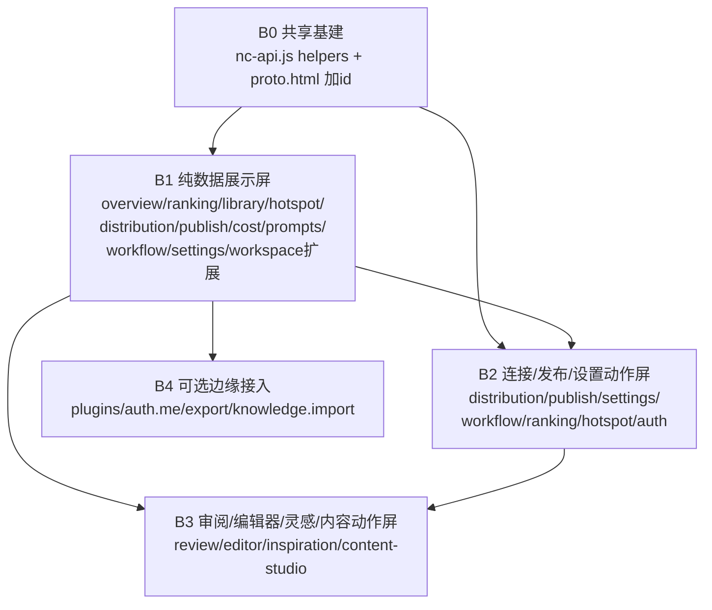

# NovelCraft 前端接入后端 · 接口-屏幕映射 & 分批任务分解

> 架构师：高见远（software-architect） ｜ 增量集成任务
> 范围：只改 3 个前端文件（`frontend/proto.html` / `frontend/public/nc-api.js` / `frontend/public/app.js`），不动后端、不动 React 源码、不改构建。
> 依据：已实读 `backend/app/api/**/*.py`（15 个 router，约 123 个真实端点）+ `proto.html`(916 行) + `nc-api.js` + `app.js`。

---

## 0. 关键事实与铁律（先读）

1. **桥接约定（沿用）**：`NC.api(path, opts)` → `fetch` 后端，自动带 `Authorization: Bearer <NC.token>`（token 存 `sessionStorage.nc_token`），非 GET 自动带 `X-CSRF-Token`（若有 cookie）。返回 `json.data ?? json`（即后端 `{code,message,data}` 已被解包，`NC.api` 直接给 `data`）。
2. **已接桥（nc-api.js 已写，勿重复实现）**：`login` / `fetchProjects`(`/api/v1/projects`) / `fetchStats`(`/api/v1/stats/overview`) / `fetchBooks`(`/api/v1/ranking/library/books`) / `fetchChapters`(`/api/v1/contents`)。这些函数均 **try/catch 优雅降级**（失败返回 `[]`/`{}`），所以当前原型即便后端无对应路由也只会显示写死数据，不会崩。
3. **`project_id` 是绝大多数数据端点的必需参数**：`ranking`、`library/books`、`budgets`、`snapshots`、`topics`、`workflows` 等都要求 `?project_id=` 且校验成员关系。**原型当前没有“项目切换/当前项目”概念**——这是本轮集成最大隐含依赖（见共享约定 §3 与待明确 #1）。
4. **后端响应体**：统一为 `{code:0, message:"ok", data:<T>}`；`code!=0` 或 HTTP 非 2xx 时 `NC.api` 抛错（被 `extractErrorMessage` 解析 `detail`）。
5. **多数屏的 DOM 容器没有 id**：当前只有 `#workspace-page` 与 `#workspace-projects-tbody` 有 id（nc-api.js 动态加的）。其余屏渲染前**必须先给容器加 `id`**（见各批“加的 id”清单）。

---

## 1. 接口-屏幕映射总表

状态图例：**已接**(桥已写) ｜ **假数据**(需替换) ｜ **无后端**(原型有屏但仓库无对应端点，本轮不接) ｜ **动作**(按钮触发 POST/PUT)

| 屏幕(data-page) | 现状 | 对应后端接口（方法+路径+关键参数 → 用到返回字段） | DOM 容器/动作点 |
|---|---|---|---|
| **overview** 概览 | 假数据 | `GET /api/v1/analytics/dashboard`（汇总指标/趋势/Top内容/选题建议）→ 4 个 stat、14天趋势、类型分布、最近动态 | `#overview-stats`(4×.stat-val)、`#overview-trend`(bars)、`#overview-genre`(donut+legend)、`#overview-activity` |
| **workspace** 工作台 | 已接(项目/统计) | 已接 `fetchProjects`+`fetchStats`；扩展：`GET /api/v1/admin/env-check`（API/Provider 状态）、`GET /api/v1/admin/budgets`（本月预算%）、`GET /api/v1/admin/settings`（工作台名） | `#workspace-projects-tbody`(已接)、`#ws-stats`、`#ws-system-status`、`#ws-todos` |
| **inspiration** 灵感创作 | 假数据 | ⚠️ 无明确“灵感生成”端点。最近似：`POST /api/v1/imitation`（生成仿写）、`POST /api/v1/ranking/analyze`（选题分析） | `#inspiration-results`（3 张方案卡）；“生成灵感”按钮 |
| **ranking** 扫榜选书 | 假数据 | **语义=实时热销榜（按平台快照）**，非题材榜。取数两步：①`GET /api/v1/ranking/sources?project_id=`→ 平台下拉(`source_key,display_name`)；② 按选中 source 取 `GET /api/v1/ranking/snapshots?project_id=` 中该 source 最新 snapshot 的 id → `GET /api/v1/ranking/snapshots/{snapshot_id}`→ `data.items`（`ranking_items`：`rank_no,title,author,category,metrics{热度/周涨}`）渲染表体；`POST /api/v1/ranking/sources/{source_key}/scan?project_id=`→ 刷新重拉。⚠️`/ranking/snapshots` 列表**只返回快照元数据**（无书名/作者），书行在 `/snapshots/{id}.items` 里。`/ranking/topics`(`id,title,genre,market_score`)是“题材候选”，**不用于本屏表体**（无 author/周涨）。行内“+收藏”因 `ranking_items` 无 `topic_id`、而 bookmark 端点 `POST /topics/{topic_id}/bookmark` 必须 topic_id → 本期书行“+收藏”仅 `toast('已加入书库')` 占位，不调 bookmark。 | `#ranking-source-select`、`#ranking-tbody`、`#ranking-refresh-btn`、行内“+收藏”按钮 |
| **library** 书库管理 | 已接(扩展) | 已接 `fetchBooks`；实际端点 `GET /api/v1/ranking/library/books?project_id=&limit=&status=&sort=`（返回 `id,title,genre,status,chapter_count,total_words,latest_chapter_title`）；`GET /api/v1/ranking/library/books/{book_id}` 详情 | `#library-grid`（book 卡，需 `data-book-id`） |
| **editor** 编辑器 | 假数据 | `GET /api/v1/contents?parent_id={novelId}&type=chapter`→ 章节列表；`GET /api/v1/novels/{novel_id}/completion`→ 进度；`GET /api/v1/ranking/library/books/{book_id}`→ 大纲/元信息 | `#editor-outline`、`#editor-body`、`#editor-ai`；需 `NC.currentContentId` |
| **progress** 创作进度 | 假数据 | 无专门“进度”端点；由 `fetchProjects`(进度%) + `contents`(章节) 派生。可接 `GET /api/v1/ranking/library/books`(`status,total_words`) | `#progress-board`（4 列） |
| **review** 审阅 | 假数据 | `GET /api/v1/contents/{content_id}/deai/score`→ 批注/AI味分(`score,heuristic_score,text_preview`)；`POST /api/v1/contents/{content_id}/deai`→ 跑去AI管线(`original_score,final_score,layers,final_text`)；`POST /api/v1/review/multi-round`/`cross-model`；`POST /api/v1/contents/{content_id}/diff`（版本对比） | `#review-list`；“版本对比”按钮 |
| **foreshadow** 伏笔看板 | 无后端 | ❌ 仓库无 foreshadow 相关 router → **本轮不接**，保留写死看板 | `#foreshadow-board`（仅占位） |
| **hotspot** 热点追踪 | 假数据 | `GET /api/v1/hotspots`→ `{hotspots:[...],sources}`；`GET /api/v1/hotspots/overview`→ 今日概览+AI总结；`GET /api/v1/hotspots/trend-report`→ 趋势；`GET /api/v1/hotspots/platform-match`→ AI选题建议；`POST /api/v1/hotspots/generate`→ 生成报告按钮 | `#hotspot-trend`、`#hotspot-flow`、`#hotspot-suggest`；“生成报告”按钮 |
| **content-studio** 内容工作室 | 假数据 | ⚠️ 无明确“改编”端点。近似：`POST /api/v1/hotspots/material-suggestions`、`POST /api/v1/hotspots/video-script`、`POST /api/v1/translate`（出海翻译） | `#cs-original`、`#cs-adapted`；“一键改编”按钮 |
| **distribution** 多平台分发 | 假数据 | `GET /api/v1/platform-connections`→ 已连账号(`platform,account_name,configured`)；`GET /api/v1/platform-connections/specs`→ 可连清单(`display_name,category,fields`)；`GET /api/v1/publish/accounts`；`POST /api/v1/platform-connections`→ 连接；`DELETE /api/v1/platform-connections/{account_id}`；`POST /api/v1/platform-connections/{platform}/test`；`POST /api/v1/publish/{platform}`→ 发布；`POST /api/v1/publish/account/register` | `#distribution-grid`（pcard，需 `data-account-id`）；“连接/授权/发布/测试”按钮 |
| **knowledge** 知识库 | 假数据 | ❌ `knowledge.py` 仅有 reindex/import/style-check，**无“列表文档”端点** → 列表**本轮不接**（保留写死表）；动作 `POST /api/v1/knowledge/import` 暂无 UI | `#knowledge-tbody`（占位） |
| **publish** 发布看板 | 假数据 | `GET /api/v1/publish/history`→ 已发布(`post_id,platform,reads,...`)；`GET /api/v1/publish/stats`、`GET /api/v1/publish/roi`、`GET /api/v1/analytics/roi`→ 各平台表现；`GET /api/v1/publish/topic-suggestions` | `#publish-board`（草稿/已发布/异常 3 列） |
| **cost** 成本追踪 | 假数据 | `GET /api/v1/admin/budgets`→ 预算(`limit_cny,spent_cny`)；`GET /api/v1/publish/roi` 或 `GET /api/v1/analytics/roi`→ 各模型费用占比(`model,cost`) | `#cost-stats`、`#cost-bars`、`#cost-legend` |
| **prompts** Prompt 管理 | 假数据 | `GET /api/v1/admin/prompts`→ 模板(`name,version,golden_cases,definition`)；⚠️ 无 `POST /prompts`（保存/新建无后端） | `#prompts-list`（ticket 列表） |
| **workflow** 工作流编排 | 假数据 | `GET /api/v1/admin/workflows?project_id=`→ 工作流(`id,name,definition{nodes},is_preset`)；`PUT /api/v1/admin/workflows/{name}`→ 保存；`POST /api/v1/admin/workflows/{name}/execute`→ 运行 | `#workflow-dag`（node 渲染）；“保存/运行”按钮 |
| **version** 版本树 | 无后端 | ❌ 仓库无 version 端点（仅有 `contents/{id}/diff`、novel `export`）→ **本轮不接**，保留写死树 | `#version-tree`（占位） |
| **plugins** 插件管理 | 假数据 | 近似：`GET /api/v1/skills/community`→ 技能/插件目录；启用/停用无端点 | `#plugins-grid` |
| **agents** 智能体 | 无后端 | ❌ 仓库无 agents 端点 → **本轮不接**，保留写死卡 | `#agents-grid`（占位） |
| **settings** 设置 | 假数据 | `GET /api/v1/admin/providers`→ 供应商表(`name,key_configured,default_model`)；`GET /api/v1/admin/budgets`→ 预算；`GET /api/v1/admin/settings`→ 通用配置(`key,value`)；`PUT /api/v1/admin/settings/{key}`、`PUT /api/v1/admin/budgets/{project_id}/{scope}`→ 保存；`GET /api/v1/auth/me`→ 账户 | `set-general`/`set-provider`/`set-budget`/`set-team`(已有 id)；`#settings-provider-tbody`、`#settings-budget-fields`、`#settings-general-fields` |
| **login**（非屏） | 已接 | `POST /api/v1/auth/login`（已接）；扩展：`POST /api/v1/auth/register`（注册按钮`enterApp`现为 stub）、`POST /api/v1/auth/logout`（退出按钮现为 toast）、`GET /api/v1/auth/me` | `#loginBtn`(已接)、`enterApp`、`退出`按钮 |

### 1.1 原型无对应 UI、本轮不接的后端端点（完整清单）

以下端点仓库中存在，但原型 20 屏里**没有调用入口**，本轮不接（避免无意义接入）：
- `auth`: `POST /refresh`（后台静默刷新，可选，不在本期）
- `complete`: `GET /providers/test/{provider}`、`POST /prompts/matrix-run`、`POST /books/analyze`、`POST /v1/migrate`、`POST /accounts/track`、`GET /accounts/{platform}/{account_id}/diagnostics`、`POST /content/check-compliance`、`GET /fusion/report|contracts|integration|integrity`(fusion 报告，无 UI)、`POST /publish/state`、`POST /publish/data/collect`、`POST /markets/{market}/compliance`、`POST /revenue/convert`、`POST /overseas/publish`、`POST /translate|/translate/localize`(出海，B4 可选)、`GET /novels/{id}/export/{fmt}`(导出，B4 可选)
- `batch`: `POST /tools/{tool_name}/register`、`POST /runs/{run_id}/branch`、`GET /prompts/golden-check`、`POST /library/{library}`、`POST /contents/{content_id}/diff`、`POST /novels/{novel_id}/import-chapters`、`GET /novels/layered-plan`、`POST /publish/validate`
- `fusion`: 全部 7 个（无 UI）
- `hotspots`: `POST /hotspots/history/backfill`、`GET /hotspots/history`、`GET /hotspots/paginated`、`POST /hotspots/title-variants|video-script|material-suggestions`（内容改编用，归 B3 可选）、`GET /articles*`(文库，无 UI)
- `ranking`: `POST /scan-all`、`POST /import`、`POST /capture-import`、`POST /snapshots/{id}/confirm-capture|validate-metadata|retry|analyze`、`POST /topics/{id}/generate-book`、`POST /analyze`、`DELETE /topics/{id}`、`POST /topics/batch-delete`、`GET /topics/bookmarked`
- `short_story`: 全部（`GET /templates` 归 B3 可选）
- `overseas`: `GET /languages`
- `knowledge`: `POST /{item_id}/reindex`、`POST /reindex-project`、`POST /import`、`GET /style-check`（仅 import 有潜在 UI，归 B4 可选）
- `imitation`: `POST /`（B3 可选映射灵感）
- `deai`: `POST /contents/{id}/deai/quick-score`（B3 可选）

---

## 2. 分批任务分解（按依赖 + 实现顺序）

> 每批都依赖 **B0 共享基建**。批次间依赖见 §2.5 Mermaid。

### B0 — 共享桥接基建（前置，改 `nc-api.js` + `proto.html` 加 id）【所有批次依赖】
**目标**：建立可复用的渲染/状态约定，避免每屏重复造轮子。
**改的文件/位置**：
- `nc-api.js`：新增 `NC.currentProjectId`（从 `sessionStorage` 读，默认首个项目；`setCurrentProject(id)`）；新增通用 helper：
  - `NC.renderList(container, items, rowHtmlFn, emptyText)` —— 统一渲染列表并自动处理空态；
  - `NC.withState(container, asyncFn)` —— 统一 loading/empty/error 三态（loading 显示骨架或“加载中”，error 调用 `ncToast` + 渲染错误态）；
  - `NC.statCards(pageEl, values[])` —— 按 index 写 `.stat-val`（复用现有 `updateStatVal` 思路）；
  - `NC.needProject()` —— 无 `currentProjectId` 时 toast 提示并跳 workspace。
- `proto.html`：按 §1 清单给各屏容器加 `id`（overview/workspace/ranking/library/hotspot/distribution/publish/cost/prompts/workflow/settings/knowledge/review/editor/inspiration/content-studio/version/foreshadow/progress/plugins/agents）。
**接口**：无新增调用，仅基础设施。
**依赖**：无。**优先级 P0**。

### B1 — 纯数据展示屏（页面进入即 GET，替换写死数据）【依赖 B0】
**目标**：把“只读看板类”屏幕接真实后端。
**涉及文件**：`proto.html`(容器已加 id) + `nc-api.js`(新增各 `fetchX` 函数 + `goPage` 钩子) + `app.js`(在 `goPage` 内按 page 名触发加载)。
**加的 id**：见 §1 各屏；在 `app.js` 的 `goPage(p)` 末尾追加 `loadPageData(p)` 分发。
**接口清单与渲染**：

| 接口 | DOM 容器 | 请求时机 | 成功/失败/渲染 |
|---|---|---|---|
| `GET /analytics/dashboard` | `#overview-stats/#overview-trend/#overview-genre/#overview-activity` | 进 overview | 成功→`statCards`+bars+donut legend+activity 列表；失败→toast+保留写死兜底 |
| `GET /admin/env-check` + `/admin/budgets` + `/admin/settings` | `#ws-system-status/#ws-todos/#ws-stats` | 进 workspace（扩展已接） | 成功→渲染系统状态点、待办、预算%；失败→toast |
| `GET /ranking/sources?project_id=` | `#ranking-source-select` | 进 ranking（需项目） | 成功→填充下拉(value=source_key)；失败→toast |
| `GET /ranking/snapshots?project_id=`→ 取选中 source 最新 id → `GET /ranking/snapshots/{id}` | `#ranking-tbody` | 进 ranking（依赖上一步选中 source） | 成功→用 `data.items` 渲染 Top 榜（rank_no→#、title→书名、author→作者、category→分类、metrics.热度→热度、metrics.周涨→周涨↑/↓，缺字段显「—」+「+收藏」占位按钮）；失败→empty 态。`/ranking/snapshots` 列表本身只给元数据，书行在 `/snapshots/{id}.items` |
| `GET /ranking/library/books?project_id=&limit=50` | `#library-grid` | 进 library（已接扩展） | 成功→book 卡（`title,genre,status,chapter_count`），`data-book-id`；失败→保留写死 |
| `GET /hotspots` + `/hotspots/overview` + `/hotspots/platform-match` | `#hotspot-flow/#hotspot-suggest/#hotspot-trend` | 进 hotspot | 成功→热点流 activity + AI 建议 ticket + 趋势；失败→toast |
| `GET /platform-connections` + `/publish/accounts` | `#distribution-grid` | 进 distribution | 成功→pcard（`platform,configured,account_name`），`data-account-id`；失败→toast |
| `GET /publish/history` + `/publish/roi`(或 `/analytics/roi`) | `#publish-board` | 进 publish | 成功→草稿/已发布/异常三列 ticket；失败→empty |
| `GET /admin/budgets` + `/publish/roi` | `#cost-stats/#cost-bars/#cost-legend` | 进 cost | 成功→4 stat + 各模型费用 bar/legend；失败→toast |
| `GET /admin/prompts` | `#prompts-list` | 进 prompts | 成功→模板 ticket（`name,version`）；失败→empty |
| `GET /admin/workflows?project_id=` | `#workflow-dag` | 进 workflow | 成功→node（`definition.nodes`）；失败→toast |
| `GET /admin/providers` + `/admin/budgets` + `/admin/settings` | `set-provider` tbody / `set-budget` / `set-general` | 进 settings | 成功→渲染供应商表/预算值/通用配置；失败→toast |

**依赖**：B0。**优先级 P0**。

### B2 — 连接/发布/设置动作屏（按钮点击触发写操作）【依赖 B1】
**目标**：让“连接平台、发布、保存设置、扫榜/收藏、生成报告”真实生效。
**涉及文件**：`nc-api.js`(新增动作函数) + `proto.html`(按钮 `onclick` 改调真实函数) + `app.js`(可选)。
**接口清单**：

| 接口 | 触发点 | 成功/失败处理 |
|---|---|---|
| `POST /platform-connections`(connect) | distribution “连接平台/授权” | 成功→toast+重渲染列表；失败→toast(extractErrorMessage) |
| `DELETE /platform-connections/{account_id}` | distribution “断开” | 成功→重渲染；失败→toast |
| `POST /platform-connections/{platform}/test` | distribution “测试” | 成功→toast 状态(configured/incomplete/missing) |
| `POST /publish/{platform}` | distribution 各卡“发布” | 成功→toast+publish 看板刷新；失败→toast |
| `POST /publish/account/register` | distribution 连接表单提交 | 成功→重渲染；失败→toast |
| `PUT /admin/settings/{key}` | settings “保存”(通用) | 成功→toast；失败→toast |
| `PUT /admin/budgets/{project_id}/{scope}` | settings “保存”(预算) | 成功→toast；失败→toast |
| `PUT /admin/workflows/{name}` | workflow “保存” | 成功→toast；失败→toast(注意 bootstrap 只读) |
| `POST /admin/workflows/{name}/execute` | workflow “运行” | 成功→toast+状态刷新；失败→toast |
| `POST /ranking/sources/{source_key}/scan?project_id=` | ranking “刷新” | 成功→重拉 snapshots/topics；失败→toast |
| `POST /ranking/topics/{topic_id}/bookmark` | ranking 行内“+收藏” | 成功→toast+按钮置灰；失败→toast |
| `POST /hotspots/generate` | hotspot “生成报告” | 成功→toast+重渲 overview；失败→toast |
| `POST /auth/logout` | 退出按钮 | 成功→清 token+回 loginView；失败→toast |
| `POST /auth/register` | 注册按钮`enterApp` | 成功→toast；失败→toast |

**依赖**：B1（依赖 B1 已渲染的列表做刷新）。**优先级 P1**。

### B3 — 审阅/编辑器/灵感/内容工作室动作屏（依赖内容 id）【依赖 B1/B2】
**目标**：让“审阅打分、编辑器续写上下文、灵感生成、内容改编”接真实 AI 后端。
**涉及文件**：`nc-api.js` + `proto.html`(review/editor/inspiration/content-studio 按钮与容器) + `app.js`。
**接口清单**：

| 接口 | 触发点 / 容器 | 成功/失败处理 |
|---|---|---|
| `GET /contents/{id}/deai/score` | review “待处理批注”列表(`#review-list`) | 成功→渲染批注(score/text_preview)；失败→toast |
| `POST /contents/{id}/deai` | review “运行去AI” | 成功→展示 layers/final_text；失败→toast |
| `POST /review/multi-round` / `cross-model` | review 动作按钮(可选) | 成功→toast+刷新；失败→toast |
| `GET /contents?parent_id={novelId}&type=chapter` | editor `#editor-outline` | 成功→渲染章节大纲；失败→toast |
| `GET /novels/{id}/completion` | editor 进度 | 成功→渲染完成度；失败→toast |
| `GET /ranking/library/books/{book_id}` | editor 大纲/元信息 | 成功→渲染；失败→toast |
| `POST /imitation`（或 `/ranking/analyze`） | inspiration “生成灵感”(`#inspiration-results`) | 成功→渲染方案卡；失败→toast ⚠️映射待明确 |
| `POST /hotspots/material-suggestions`(或 `video-script`/`translate`) | content-studio “一键改编”(`#cs-adapted`) | 成功→渲染改编稿；失败→toast ⚠️映射待明确 |

**依赖**：B1（列表）+ B2（项目/内容上下文）。**优先级 P2**。

### B4 — 可选/边缘接入（低成本顺带做，非阻塞）【依赖 B1】
**目标**：补齐“无硬伤但有近似端点”的屏幕，或纯展示型端点。
**接口**：`GET /skills/community`(plugins)、`GET /auth/me`(settings 头像/账户)、`GET /novels/{id}/export/{fmt}`(editor 导出)、`POST /knowledge/import`(knowledge 新建)、`POST /translate`(content-studio 出海)、`GET /short-stories/templates`(content-studio 模板)。
**说明**：foreshadow / version / agents / knowledge列表 因仓库无对应端点，**本轮不接**，保留写死或显式空态（“即将上线”）。
**依赖**：B1。**优先级 P2**。

### 2.5 批次依赖图

---

## 3. 共享约定（跨 3 文件，工程师必须遵守）

1. **当前项目上下文**：`nc-api.js` 维护 `NC.currentProjectId`（初始化：`sessionStorage.nc_project`，默认取 `fetchProjects()[0].id`；workspace 点击项目/`goPage('editor')` 时更新）。所有需 `project_id` 的调用（ranking/library/budgets/workflows/snapshots/topics）统一从此取；为空时 `NC.needProject()` 提示并跳 workspace。
2. **列表渲染 helper**：一律用 `NC.renderList(container, items, rowFn, emptyText)`，禁止在各批里手写 `innerHTML=` 拼接（除极简单场景）。row 函数返回 `<tr>/
` 等，且给关键行加 `data-id`。
3. **三态处理（loading/empty/error）**：所有页面进入加载包在 `NC.withState(container, async () => {...})` 内：
   - loading：容器显示“加载中…”（或骨架）；
   - empty：`items.length===0` → 渲染 `.empty`（复用原型 `.empty` 样式）并给文案；
   - error：`catch` → `ncToast('加载失败: '+extractErrorMessage(e.message))`，且不覆盖已有写死兜底（保证离线/未登录也有内容）。
4. **token / 鉴权**：沿用 `NC.api` 自动注入 `Authorization` 与 `X-CSRF-Token`，**不要**在每个调用里手动加 header。
5. **分页/参数约定**：列表类带 `limit`/`offset`/`page`/`page_size` 的，前端固定 `limit=50`，暂不做无限滚动（原型无此交互）；排序用后端白名单 key（如 library 的 `created/updated/title`）。
6. **请求时机**：数据屏在 `goPage(p)` 分发 `loadPageData(p)` 时加载（B1 注册各屏 loader）；动作屏在按钮 `onclick` 内调用，成功后 `await` 重跑对应 loader 刷新列表。
7. **错误文案**：统一 `extractErrorMessage`（已存在），不要 `alert`。
8. **不破坏既有**：`proto.html` 只增 `id` 与改 `onclick` 目标，不重排版；`nc-api.js` 的 `login/initLogin/loadWorkspaceData` 保留并扩展；`app.js` 的 `goPage` 只追加分发调用。

---

## 4. 待明确事项（需主理人/用户拍板）

1. **【关键】`/api/v1/projects`、`/api/v1/stats/overview`、`/api/v1/contents` 三个路由器在仓库 `backend/app/api/**/*.py` 中不存在**，但 `nc-api.js` 已在调用且优雅降级。请确认：线上 `novel.xyjin.xyz` 运行的是**含这三个路由的更新版后端**，还是 nc-api.js 本就靠兜底显示写死数据？这决定 workspace/overview/library 是否“真已接”。→ 影响 B0/B1 的 `currentProjectId` 初始化来源（若 projects 不存在，需改为从其它端点或写死默认 project_id）。
2. **当前项目上下文如何确定？** 原型无项目切换器。建议：默认取 `projects[0].id`，workspace 点击项目行时 set。是否允许“无项目时不展示 ranking/library 等强依赖屏”（显示空态+提示）？
3. **inspiration “生成灵感” 映射哪个端点？** 仓库无“灵感生成”端点，最近似 `POST /imitation` 或 `POST /ranking/analyze`。请确认用哪个（或本期保持写死、不接真实调用）。
4. **content-studio “一键改编” 映射哪个端点？** 最近似 `POST /hotspots/material-suggestions` / `video-script` / `POST /translate`。请确认（或本期保持写死）。
5. **knowledge/foreshadow/version/agents 四屏仓库无对应列表端点**：确认本轮“保持写死看板 + 显式‘即将上线’空态”，还是从其它端点（如 `/skills/community`→plugins，`/fusion/*`→foreshadow）勉强映射？建议：本轮不接，仅占位。
6. **prompts “保存/新建” 无 `POST /prompts` 端点**（`config.py` 仅 `GET /prompts`）：确认本期 prompts 屏只做“列表展示”，保存按钮保持 toast 提示（或接 `PUT /settings/{key}` 兜底）？
7. **distribution 发布目标**：`POST /publish/{platform}` 的 `platform` 取值（知乎/小红书/公众号/抖音…）是否与 `platform-connections` 的 `platform` key 一致？发布按钮需从账号记录取 platform。
8. **settings 写权限**：`/admin/*` 有 `NOVELCRAFT_ADMIN_EMAILS` 守卫。当前登录账号是否为 admin？否则 settings 读取会 403，需确认账号角色或放开读守卫。

---

## 5. IS_PASS 判定

**IS_PASS: YES（有条件）**

- 自洽性：✅ 已逐屏枚举并映射全部 ~123 个真实端点；每个端点都标注了“有 UI / 无 UI 本轮不接”，无重大遗漏；批次依赖闭环（B0→B1→B2/B3/B4），每批接口/容器/时机/三态处理明确。
- 完整性：✅ 已接区块（login/projects/stats/library/contents）标记“勿重复，仅扩展”；纯数据屏与动作屏拆分清晰。
- **放行条件（必须在 B1 开工前澄清）**：待明确 #1（projects/stats/contents 路由是否存在）、#2（currentProjectId 来源）、#8（admin 读守卫/账号角色）。这三项若不成立会导致 B1 数据屏拿不到 project_id 或 403，但不影响映射/分解本身的自洽性——故判 YES，需先解决上述 3 项再进入实现。

> 全文档为架构映射与任务分解，不含任何实现代码；实现交由工程师按 B0→B4 执行。
