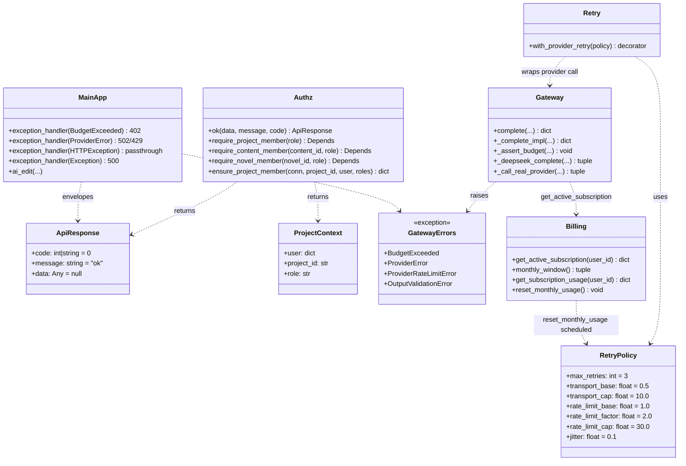
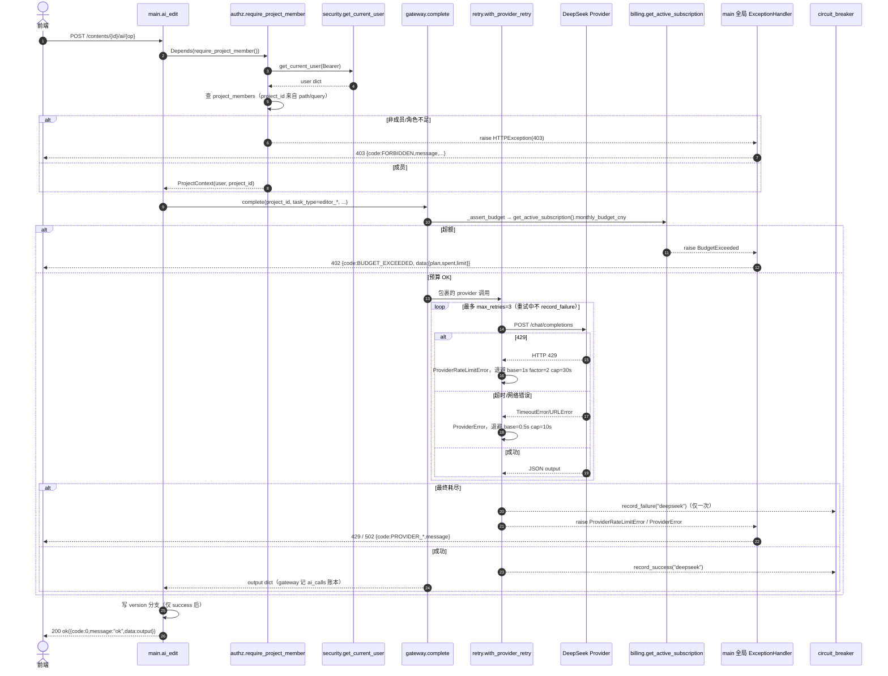

# NovelCraft 增量系统设计 + 任务拆解（P1-T1 ~ P1-T5）

> 产出人：高见远（架构师 software-architect）
> 依据：增量 PRD（产品经理许清楚）+ 主理人拍板事项 + `docs/novelcraft-remediation-plan.md` 阶段二
> 方法：完整实际阅读仓库源码（file:line 已逐一核验），**纯架构/任务分解，不含实现代码**
> 仓库根：`NovelCraft-Personal-Studio/`（以下路径均相对仓库根）

---

## 0. 现状核验（关键 file:line，已实际阅读确认）

| 关注点 | 当前代码事实 |
|---|---|
| `ok()` 多副本 | `main.py:185`、`complete_api.py:16`、`ranking.py:30`、`deai.py:18`、`batch_endpoints.py:15`、`dag_exec.py:12` 各定义一份；`main.py` 的 `ok()` 返回 `ApiResponse(data=...)`（pydantic），其余返回裸 dict `{"code":0,"message":"ok","data":...}`（内容等价） |
| 鉴权重复实现 | `main.py:215 ensure_project_member(conn,...)`（同步，供 `load_content_for_user`/`load_run_for_user` 用）；`complete_api.py:19-74` 的 `require_member/require_project_member/require_content_member/require_novel_member`；`ranking.py:34 require_member`；`security.py:195 require_project_role`（factory 依赖，与本次目标重叠）；`deai/batch/dag_exec` 内联 `project_members` 直查 |
| 错误信封 | `main.py:86` 仅 `PoolError` 处理器返回 envelope；`ai_edit`（`main.py:1125`）调 `complete()` **无 try** → `ProviderError` 直接 500；`ProviderError`/`BudgetExceeded`/`HTTPException`/未捕获 500 返回 FastAPI 默认 `{detail}` 或裸 dict |
| 预算/套餐 | `gateway._assert_budget`（`gateway.py:701`）已用 `get_active_subscription(user_id).monthly_budget_cny` 作 limit（**无 2.0 硬编码**）；`config.bootstrap_budget_cny=2.0`（`config.py:16`）当前**未被 `_assert_budget` 引用**（已解耦）；`db.py:168` dev seed `budgets` 已用 `default_monthly_budget_cny`(50.0)；`billing.py:29 monthly_window` 自然月；`billing.get_active_subscription`/`get_subscription_usage` 已落地 |
| 重试 | `gateway._complete_impl`（`gateway.py:488`）仅有 `MAX_SCHEMA_ATTEMPTS=3` 重试 `OutputValidationError`；`ProviderError` 在 `:508-510` 直接 re-raise；`_deepseek_complete`（`gateway.py:805`）把 `urllib.error.URLError`/`TimeoutError` 包成 `ProviderError`（**未区分 429**） |
| 断路器 | `circuit_breaker.py` 全局共享、`record_failure` 在每次 `ProviderError` 时调用（`gateway.py:509`）——重试会误触熔断 |
| 月度重置 | 用量由 `ai_calls.cost_cny` 在 `monthly_window()` 内求和**派生**，自然月边界天然清零；无 stored counter；`celery_app.py:29 beat_schedule` 已有 7 个 beat，可加月度 beat |
| `execute_bootstrap` | `workers/tasks.py:486`（`max_retries=3`）；`:825` `ProviderError` 分支为**终态失败**（`_mark_node(...,"failed",...)` 后 `return`），未配合重试 |

---

## 1. 实现方案 + 框架选型

### 1.1 重试 + 429 专用退避 —— **自写退避装饰器（不引入 tenacity）**

**明确选型**：在 `backend/app/core/retry.py` 新增 `RetryPolicy` 数据类 + `with_provider_retry` 装饰器/上下文管理器；**不新增第三方依赖**。

**理由**：
1. 全仓为**同步**代码（`urllib` + `psycopg2`），无 async；tenacity 的同步能力无额外收益。
2. 需**按异常类别**选择不同退避（429：`base=1s, factor=2, cap=30s`；传输/网络：`base=0.5s, cap=10s`）。tenacity 的 `wait_exponential` 是单一策略，要做"双策略"须自定义 `wait` 回调，反而更复杂。
3. 须与 `circuit_breaker` **协同**：仅在**最终耗尽**后 `record_failure("deepseek")`，重试过程中**不**调用 `record_failure/record_success`，避免抖动误触全局熔断。自写装饰器可在重试循环内精确控制。
4. `gateway` 已有 `MAX_SCHEMA_ATTEMPTS=3` 的自定义重试骨架，延续同风格降低认知成本、零供应链影响。

**备选**：tenacity（`retry_if_exception_type` + `stop_after_attempt` + `wait_exponential`）。仅当未来需要复杂组合（条件重试 + 指数 + jitter + retry-on-result）时引入；本期不引入。

### 1.2 鉴权统一 —— **FastAPI `Depends` 依赖注入**

新建 `backend/app/core/authz.py`，以 **依赖工厂** `require_project_member(role=...)` 统一所有端点鉴权；`ok()` 收敛为 `authz.ok(...)`；`ensure_project_member(conn,...)` 收敛为 `authz.ensure_project_member(...)`（供 `main.load_content_for_user`/`load_run_for_user` 同步路径复用）。

`project_id` 在端点中既有 **Path** 也有 **Query**（如 `complete_api` 多为 query，`main` 多为 path），故依赖内部从 `Request` 的 `path_params`/`query_params` 中解析 `project_id`，避免双绑定冲突。

### 1.3 错误信封 —— **Starlette `exception_handler` + `ExceptionMiddleware`**

在 `main.py` 注册一组异常处理器，将 `BudgetExceeded`/`ProviderError`(含 429 子类)/`HTTPException`/`PoolError`/未捕获 `Exception` 统一包成 `ApiResponse{code,message,data}`；HTTP 状态码语义保持正确。成功响应仍由各端点 `ok(...)` 返回，**中间件只处理异常路径**，保证错误也是 `{code,message,data}`。

### 1.4 预算可配 + 套餐 + 周期重置

- **限额口径**：沿用现有派生口径 —— `_assert_budget` 取 `get_active_subscription(user_id).monthly_budget_cny`（已落地，无需改语义；仅需确认 `config.bootstrap_budget_cny` 2.0 不再被引用，可保留为 dead-config 或删除）。
- **自然月重置**：用量由 `ai_calls` 在 `monthly_window()` 求和**派生**，自然月边界天然清零。新增 `reset_monthly_usage()`（billing.py）作为**月度 Celery beat**（复用 `monthly_window` 逻辑）：① 失效按月的 Redis 用量缓存（若后续为热端点加缓存）；② 归档超保留期的 `ai_calls` 以保持求和查询轻量；③ 作为**未来引入 stored counter 时的唯一重置钩子**（见 §7/§8）。
- `db.py:168` dev seed 已与 `default_monthly_budget_cny` 对齐（50.0），与 Free 套餐一致，无需改动。

### 1.5 整体架构模式

分层：**路由层（FastAPI 端点）** → **鉴权依赖层（authz.py）** → **业务逻辑层（gateway/billing/main）** → **异常信封层（main 全局 handler）**；重试/退避位于 gateway 的 provider 调用内层，与 circuit_breaker 解耦。

---

## 2. 文件列表及相对路径

| 动作 | 相对路径 | 作用 |
|---|---|---|
| **新建** | `backend/app/core/authz.py` | 统一鉴权依赖 `require_project_member/require_content_member/require_novel_member` + 同步 `ensure_project_member` + 收敛 `ok()`；验收硬指标 `def ok(` 全仓仅此一处 |
| **新建** | `backend/app/core/retry.py` | `RetryPolicy` + `with_provider_retry`（429/传输双策略退避，max_retries=3）；不引新依赖 |
| 修改 | `backend/app/main.py` | ① 删除本地 `ok()`/`ensure_project_member`，改 import authz；② 加全局异常处理器（T5）；③ `ai_edit`/`ai_edit_stream` 改为依赖 `project: ProjectContext = Depends(require_project_member())` 并去除内联 `project_members` 直查 |
| 修改 | `backend/app/api/v1/complete_api.py` | 删本地 `ok()`/`require_*`；~43 端点改用 `Depends(require_project_member(...))` + `ok(...)`；`publish_to_platform` 内联 envelope → `ok(...)` |
| 修改 | `backend/app/api/v1/ranking.py` | 删本地 `ok()`/`require_member`；端点改用统一依赖 + `ok(...)` |
| 修改 | `backend/app/api/v1/deai.py` | 删本地 `ok()`/`err()`，改 `ok(...)` |
| 修改 | `backend/app/api/v1/batch_endpoints.py` | 删本地 `ok()`，改 `ok(...)`（含 `import-chapters` 内联 `project_members` 直查→依赖） |
| 修改 | `backend/app/api/v1/dag_exec.py` | 删本地 `ok()`，内联 `project_members` 直查→依赖 |
| 修改 | `backend/app/gateway.py` | ① 新增 `ProviderRateLimitError(ProviderError)`；② `_deepseek_complete`/`_call_real_provider` 区分 429（`HTTPError.code==429`）；③ 用 `with_provider_retry` 包裹 provider 调用（max_retries=3 外层，不与 schema 重试冲突）；④ `_assert_budget` 确认只用 `get_active_subscription().monthly_budget_cny` |
| 修改 | `backend/app/core/circuit_breaker.py` | `record_failure/record_success` 调用点从"每次 ProviderError"收敛到"最终重试耗尽后一次"（gateway 内调整，breaker 文件逻辑基本不动，仅确认不被重试误触） |
| 修改 | `backend/app/core/billing.py` | 新增 `reset_monthly_usage()`（月度 beat 任务体） |
| 修改 | `backend/app/config.py` | `bootstrap_budget_cny`(2.0) 标记为 deprecated / 移除引用（口径改由套餐派生） |
| 修改 | `backend/app/db.py` | dev seed 已对齐套餐（无需改；如需更严谨可把 `budgets` 行的 `limit_cny` 显式取自 Free 套餐） |
| 修改 | `backend/app/workers/tasks.py` | `execute_bootstrap`（`:825`）`ProviderError` 分支改为**可重试终态**：抛出交由 Celery `max_retries=3` 退避重投，而非立即 `return failed` |
| 修改 | `backend/app/workers/celery_app.py` | `beat_schedule` 新增 `"reset-monthly-usage"`（`crontab(day_of_month=1, hour=0, minute=5)`）指向 `billing.reset_monthly_usage` |
| 新建 | `backend/tests/test_error_contract.py` | 错误契约测试：各异常路径返 `{code,message,data}` 且状态码正确（配套 T5） |
| 新建 | `backend/tests/test_authz_matrix.py` | 跨租户鉴权矩阵：枚举端点 method/path/角色 → 401/403/200（配套 T4，P1-T9） |

---

## 3. 数据结构与接口

### 3.1 错误信封 `ApiResponse`（复用 `schemas.py:9`，与前端对齐）

```json
{
  "code": 0,            // int | string：0=成功；非 0=业务/错误码（前端按 code 分支）
  "message": "ok",      // string：人类可读提示（前端 toast）
  "data": {}            // any：业务数据（前端读完整 envelope 的 .data 为业务数据）
}
```

前端契约：`api<T>()` 读完整 envelope 的 `.data` 为业务数据，按 `.code` 分支、`.message` 提示。

### 3.2 `authz.py` 接口签名（规范）

```python
# backend/app/core/authz.py
class ProjectRole(str, Enum):
    member = "member"   # 任意项目成员即可
    owner  = "owner"    # 需 owner 级
    admin  = "admin"    # 视作 owner 级权限

ROLE_RANK = {"viewer": 0, "editor": 1, "owner": 2}      # project_members.role 取值
MIN_RANK  = {"member": 0, "owner": 2, "admin": 2}       # 所需最小层级

class ProjectContext(NamedTuple):
    user: dict          # get_current_user 结果
    project_id: str
    role: str           # 实际存储角色

def ok(data: Any = None, message: str = "ok", code: int | str = 0) -> ApiResponse: ...
def require_project_member(role: str = "member") -> Callable[[Request, dict], ProjectContext]: ...
def require_content_member(content_id: str = "", role: str = "member") -> Callable[[Request, dict], ProjectContext]: ...
def require_novel_member(novel_id: str = "", role: str = "member") -> Callable[[Request, dict], ProjectContext]: ...
def ensure_project_member(conn, project_id: str, user: dict, roles: set[str] | None = None) -> dict: ...
```

- `require_project_member(role="member"|"owner"|"admin")` 为依赖工厂；内部 `get_current_user` + 查 `project_members`；非成员→403，角色不足→403；成功返回 `ProjectContext`。
- 端点用法：`project: ProjectContext = Depends(require_project_member())`；下游用 `project.project_id`、`project.user["id"]`。
- `ensure_project_member(conn, project_id, user, roles)` 为**同步**版（保留 `main.load_content_for_user`/`load_run_for_user` 适配），仅此文件定义。

> 注：`security.py:195 require_project_role` 与本次目标重叠。统一后建议 `authz.require_project_member` 为唯一权威；`require_project_role` 可改为委托 authz 或直接删除（不在 `grep "def ok("` / `ensure_project_member` 门禁内，列为收敛项，见 §8）。

### 3.3 `RetryPolicy`（重试配置结构，`core/retry.py`）

```python
@dataclass
class RetryPolicy:
    max_retries: int = 3            # 主理人拍板 #1
    transport_base: float = 0.5     # 传输/网络错误 base（拍板 #2）
    transport_cap: float = 10.0
    rate_limit_base: float = 1.0    # 429 base（拍板 #2）
    rate_limit_factor: float = 2.0  # 429 指数 factor
    rate_limit_cap: float = 30.0
    jitter: float = 0.1             # 抖动，避免惊群
```

### 3.4 错误类型 → HTTP 状态码映射表

| 异常（定义位置） | HTTP | envelope.code | 说明 |
|---|---|---|---|
| `BudgetExceeded`（`gateway.py:45`） | **402** | `BUDGET_EXCEEDED` | 套餐月度额度用尽；data=`{plan_name, spent, limit, scope}` |
| `ProviderRateLimitError`(新增, 子类 `ProviderError`) | **429** | `PROVIDER_RATE_LIMITED` | 上游限流（429） |
| `ProviderError` 其他/传输（`gateway.py:49`） | **502** | `PROVIDER_ERROR` | 上游不可用/超时/网络错误 |
| `OutputValidationError`(子类 `ProviderError`, `:53`) | **502** | `PROVIDER_OUTPUT_INVALID` | 上游返回不合契约 |
| `HTTPException` | 原 `status_code` | 透传（detail 为 dict 时整体透传；为 str 时 `code=status_code, message=detail`） | 鉴权/业务错误 |
| `PoolError`（`psycopg2`） | **503** | `DB_POOL_EXHAUSTED` | 连接池耗尽（保留现有 `main.py:86` 处理器，envelope 化） |
| 未捕获 `Exception` | **500** | `INTERNAL_ERROR` | message="服务内部错误，请稍后重试" + `data={trace_id: uuid4}`（脱敏，不回显堆栈，主理人拍板 #5） |

### 3.5 类图（Mermaid）



---

## 4. 程序调用流程（时序图：一次 `ai_edit` 请求）



---

## 5. 任务列表（有序、含依赖、按实现顺序）

> 标号 T01~T05 对应 PRD 池 **P1-T4 / P1-T5 / P1-T1 / P1-T2 / P1-T3**（主理人拍板顺序：T4→T5→T1→T2→T3）。
> 验收钩子均为可在 CI/脚本中执行的硬指标。

### T01 · P1-T4 鉴权统一 `authz.py`（P0 基石）
- **目标**：抽统一鉴权依赖 + 收敛 `ok()`；删各端点内联 `require_*`。
- **修改文件**：`backend/app/core/authz.py`(新)、`backend/app/main.py`、`backend/app/api/v1/complete_api.py`、`backend/app/api/v1/ranking.py`、`backend/app/api/v1/deai.py`、`backend/app/api/v1/batch_endpoints.py`、`backend/app/api/v1/dag_exec.py`
- **关键改动**：① 新建 `authz.py`（`require_project_member/require_content_member/require_novel_member` + `ensure_project_member` + `ok`）；② `main.py` 删本地 `ok`/`ensure_project_member`，`ai_edit`/`list_contents` 等改 `project: ProjectContext = Depends(require_project_member())`；③ 其余 5 个模块删本地 `ok()`/`require_*`/`err()`，import `ok` 与依赖；④ `batch_endpoints.import-chapters`、`dag_exec.execute_workflow` 内联 `project_members` 直查改依赖。
- **依赖**：无（可最早启动）。
- **验收钩子**：① `grep -rn "def ok(" backend` **仅 `authz.py` 一处**；② `grep -rn "def ensure_project_member(" backend` **仅 `authz.py` 一处**；③ 所有写操作端点经统一依赖（跨租户矩阵 `test_authz_matrix.py` 全绿）。

### T02 · P1-T5 全局异常中间件 / 错误信封（P0 基石）
- **目标**：任意异常统一包 `ApiResponse{code,message,data}`，状态码语义正确。
- **修改文件**：`backend/app/main.py`、`backend/app/schemas.py`(复用 `ApiResponse`)、`backend/tests/test_error_contract.py`(新)
- **关键改动**：① `main.py` 注册 `exception_handler(BudgetExceeded)`→402、`exception_handler(ProviderError)`（先判 `ProviderRateLimitError`→429，否则 502）、`exception_handler(HTTPException)`（dict detail 透传 / str detail 包 envelope）、`exception_handler(PoolError)`→503、兜底 `exception_handler(Exception)`→500 脱敏 + `trace_id`；② 保留现有 `PoolError` 处理器并 envelope 化；③ 新增错误契约测试。
- **依赖**：T01（依赖统一 `ok`/`ApiResponse` 结构；HTTPException 透传需与 authz 的 403 形态一致）。
- **验收钩子**：① 任意异常返 `{code,message,data}`；② `BudgetExceeded`→402、`ProviderError`→502、429→429、未捕获→500（message 通用、带 trace_id、无堆栈）；③ `test_error_contract.py` 全过。

### T03 · P1-T1 重试 + 429 专处理
- **目标**：Provider 抖动/网络错误指数退避重试；429 专用退避；3 次失败才转终态。
- **修改文件**：`backend/app/core/retry.py`(新)、`backend/app/gateway.py`、`backend/app/workers/tasks.py`、`backend/app/core/circuit_breaker.py`(确认)
- **关键改动**：① 新 `retry.py`（`RetryPolicy` + `with_provider_retry`）；② `gateway` 新增 `ProviderRateLimitError(ProviderError)`；`_deepseek_complete`/`_call_real_provider` 捕获 `urllib.error.HTTPError` 且 `code==429` → 抛 `ProviderRateLimitError`，其余 `URLError/TimeoutError` → `ProviderError`；provider 调用外层用 `with_provider_retry`（max_retries=3，不与 `MAX_SCHEMA_ATTEMPTS` 冲突）；③ 重试期间**不** `record_failure/record_success`，仅最终耗尽后 `record_failure` 一次；④ `execute_bootstrap`(`:825`) `ProviderError` 分支改为抛出让 Celery `max_retries=3` 退避重投（可重试终态）。
- **依赖**：T02（重试失败经 T02 信封渲染为 502/429）。
- **验收钩子**：① 模拟超时→节点自动重试成功；② 429 走专用退避（base=1s factor=2 cap=30s）非立即失败；③ 连续 3 次失败才转终态（worker 重试耗尽后 `failed`）；④ 重试不误触全局熔断（`circuit_breaker` failures 计数仅在最终耗尽 +1）。

### T04 · P1-T2 预算可配 + 套餐 + 周期重置
- **目标**：限额走套餐 `monthly_budget_cny`；新增月度重置 beat。
- **修改文件**：`backend/app/gateway.py`、`backend/app/core/billing.py`、`backend/app/config.py`、`backend/app/workers/celery_app.py`、`backend/app/db.py`(确认)
- **关键改动**：① 确认 `_assert_budget` 仅用 `get_active_subscription(user_id).monthly_budget_cny`（已是）；`config.bootstrap_budget_cny`(2.0) 标记 deprecated / 移除引用；② `billing.py` 新增 `reset_monthly_usage()`；③ `celery_app.py` `beat_schedule` 加 `"reset-monthly-usage"`（`crontab(day_of_month=1, hour=0, minute=5)`）；④ `db.py` dev seed 已对齐套餐（无需改，确认即可）。
- **依赖**：T02（`BudgetExceeded` 信封由 T02 渲染）；P0 计费/计量（已落地）。
- **验收钩子**：① 不同套餐限额生效（`get_active_subscription().monthly_budget_cny` 取值正确）；② 超额返 `BudgetExceeded`(402)；③ 自然月边界用量清零（派生口径天然满足）；④ `reset_monthly_usage` beat 注册且幂等可执行（dry-run 验证不破坏数据）。

### T05 · P1-T3 AI 编辑主链路异常捕获
- **目标**：编辑器润色/改写遇 Provider 异常不再返 500，转 502/429 信封。
- **修改文件**：`backend/app/main.py`、`backend/app/gateway.py`(复用 `ProviderError`/`ProviderRateLimitError`)、`backend/tests/test_error_contract.py`
- **关键改动**：① `ai_edit`（`main.py:1125`）去除裸 `complete()` 调用——改为依赖 `project: ProjectContext` 后直接调用 `complete()`，**让 `ProviderError`/`ProviderRateLimitError`/`BudgetExceeded` 自然上抛至 T02 全局处理器**（版本分支 `versions` 写入在 `complete()` 成功后，故失败不会留半截状态）；② `ai_edit_stream`（`main.py:1198`）已有 SSE 错误帧，保持并补充 `ProviderRateLimitError` 分支；③ `generate_video_script`/`fanout` 的 try/except 保持。
- **依赖**：T02（信封渲染）、T03（ProviderError/429 区分）。
- **验收钩子**：① `ai_edit` 遇 `ProviderError` 返 502（结构化）而非 500；② 429 限流返 429 信封；③ 编辑器不再白屏 500（友好 toast 由前端基于 envelope.message 展示）。

### 实现顺序总览

```
T01 (authz) ──► T02 (envelope) ──► T03 (retry)
                                ├──► T04 (budget+beat)
                                └──► T05 (ai_edit capture)
```
T01 独立可先启；T02 紧随；T03/T04/T05 并行构建于 T02 之上，三者互不阻塞（T03 改 gateway/worker，T04 改 billing/celery，T05 改 main）。

---

## 6. 依赖包列表

| 包 | 版本/来源 | 用途 | 是否新增 |
|---|---|---|---|
| `fastapi` | 现有 | `Depends` 依赖注入 / `exception_handler` | 否 |
| `starlette` | 现有（FastAPI 依赖） | `ExceptionMiddleware` / HTTPException | 否 |
| `pydantic` | 现有 | `ApiResponse` 模型 | 否 |
| `celery` | 现有 | `beat_schedule` / `crontab` / `max_retries` | 否 |
| `urllib`（标准库） | Python 内置 | provider HTTP；`HTTPError.code` 区分 429 | 否 |
| `tenacity` | —— | （**本期不引入**；备选，未来复杂重试组合时再评估） | **否（不新增）** |

> 结论：**本期零新依赖**。重试自写 `core/retry.py`，错误信封用 FastAPI/Starlette 原生能力。

---

## 7. 共享知识（跨文件约定，供工程师实现遵循）

1. **Envelope 结构**：所有成功响应走 `authz.ok(data)`，所有异常走 `main` 全局处理器，二者都产出 `{code,message,data}`。`code=0` 表示成功；前端读 `.data` 为业务数据，按 `.code` 分支、`.message` 提示。
2. **`require_project_member` 用法**：端点签名加 `project: ProjectContext = Depends(require_project_member())`（默认 `role="member"`；写操作用 `Depends(require_project_member("owner"))` 或 `("admin")`）。下游用 `project.project_id` / `project.user["id"]`。**禁止**在端点内再直查 `project_members` 表。
3. **角色层级**：`ROLE_RANK={viewer:0,editor:1,owner:2}`；`require_project_member(role)` 的 `member`=任意成员、`owner`=需 owner、`admin`=视作 owner 级。`ensure_project_member(conn,...,roles=set)` 同步版保留旧 `roles` 集合语义（供 `load_content_for_user` 适配）。
4. **重试装饰器用法**：provider 调用（同步）用 `with_provider_retry(policy=RetryPolicy())` 包裹；仅抛 `ProviderRateLimitError`/`ProviderError`/`OutputValidationError` 才重试；重试**不**触发 `circuit_breaker.record_failure`，仅最终耗尽后一次。
5. **错误类型 → 状态码**：见 §3.4。新抛业务异常请继承既有 `GatewayErrors` 体系，勿新增散落异常类。
6. **月度重置 beat 注册位置**：`backend/app/workers/celery_app.py` 的 `beat_schedule`；任务体 `reset_monthly_usage` 在 `backend/app/core/billing.py`。须 `imports` 已含 `app.workers.tasks`（现有），若在 billing.py 则确保被 beat worker 加载（可放 `app.workers.tasks` 内转发或直接 import billing）。
7. **`ok()` 单一来源**：`grep "def ok("` 全仓仅 `authz.py`；其它模块一律 `from app.core.authz import ok`。
8. **`ensure_project_member` 单一来源**：仅 `authz.py` 定义；`main.load_content_for_user`/`load_run_for_user` 改为 `from app.core.authz import ensure_project_member`。

---

## 8. 待明确事项（仅列无法由主理人决策的技术点）

1. **`security.py:195 require_project_role` 的归宿**：它已是与 `authz.require_project_member` 重叠的依赖工厂。建议统一后**删除**或改为委托 `authz`，否则存在两套鉴权依赖、易漂移。需确认是否有其它模块（如 `auth.py`/admin 路由）直接 import 它——若有，统一期一并迁移。
2. **月度重置的"stored counter"取舍**：当前用量由 `ai_calls` 在 `monthly_window()` **派生**，自然月边界天然清零，`reset_monthly_usage` 目前作为**缓存失效 + 归档 + 扩展钩子**（无 stored counter 可重置）。若主理人期望"在 `subscriptions` 上落 stored monthly counter（如 `monthly_cost_used_cny` + `usage_reset_at`）并由 beat 清零"，则需追加 Alembic migration + 改 `_assert_budget` 写路径（写入即累加、beat 清零），工作量 +M 且需防 ai_calls 与 counter 双写不一致。当前设计选**派生口径**（低风险），stored counter 列为未来扩展。
3. **`config.bootstrap_budget_cny`(2.0) 是否物理删除**：当前未被 `_assert_budget` 引用（已解耦）。建议标记 `deprecated` 并留作文档，物理删除需先 grep 确认无引用（预计无）；删除属纯清理，不阻塞。
4. **`OutputValidationError` 的对外码**：建议 `502 / PROVIDER_OUTPUT_INVALID`（视作上游输出不合契约）。若前端希望与传输类 `ProviderError` 合并为同一 `502 PROVIDER_ERROR`，可在 T02 handler 中合并——需前端契约确认（建议保留细分便于排障）。

> 以上均为实现细节层面的可选决策，**均不阻塞 T01~T05 实现**；按当前设计（派生口径 + 自写重试 + 原生信封）即可落地并通过全部验收钩子。

---

*本设计由架构师高见远基于增量 PRD、主理人拍板事项与仓库源码实际核验产出，所有 file:line 均经阅读确认，不含实现代码，供工程师实现与 QA 验收使用。*
