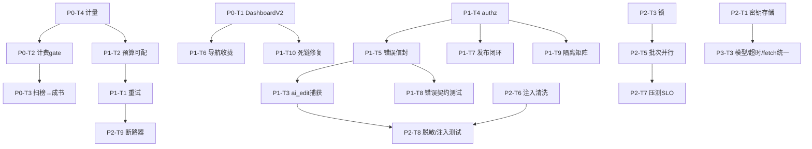

# NovelCraft 审计报告全量问题修复 — 可执行任务清单（按优先级分阶段）

> 产出人：高见远（架构师）｜依据：`novelcraft-audit-report-2026-07-20.md`
> 方法：完整阅读审计报告 + 实际核验仓库源码（file:line 已逐一核对，见各任务「涉及文件」列）
> 性质：纯架构 / 任务分解，**不含实现代码**；仅给最小可行方向与端点/表/文件清单
> 仓库根：`NovelCraft-Personal-Studio/`（以下路径均相对仓库根）

---

## 〇、阶段总览表

| 阶段 | 主题 | 对应问题 | 任务数 | 上线意义 |
|---|---|---|---|---|
| **阶段一 · 可信且可收费** | 下线假数据、打通扫榜→成书、落地计费与成本计量 | P0-1 ~ P0-4 | 4 | 产品"真"且"能赚钱"（商业化地基） |
| **阶段二 · 可用且稳定** | AI 弹性、鉴权/错误统一、导航收拢、测试门禁 | P1-1 ~ P1-11 | 11 | 达到"可交给真实用户用"的可靠度 |
| **阶段三 · 弹性与安全** | 密钥/令牌安全、JSONB 提列、批次并行、注入清洗、压测 SLO、SAST | P2-1 ~ P2-10 | 10 | 支撑多租户规模与合规 |
| **阶段四 · 体验与规模化** | 命令面板、设置多页、统一设计细节、空态/可达性 | P3-1 ~ P3-4 | 4 | 对标 Notion/Linear 的商业级体验 |

> **最小可上线裁剪**：完成 **阶段一 + 阶段二** 即达「运营门槛」。其中 P1-8/P1-9（测试门禁）须作为 CI 门禁在阶段二末合入，否则无上线信心。阶段三/四决定能否规模化与体验纵深（详见第十节）。

> **📌 执行进度（截至 2026-07-20）**：
> - ✅ **阶段一（P0）**：已上线（commit `db473e9`，VPS 已部署：计量 + 计费 gate）。
> - ✅ **阶段二 P1 增量 A（P1-T1~T5：重试/429、预算套餐、ai_edit 捕获、authz.py 统一鉴权、全局错误信封）**：已实现（commit `aedd621`），33 测试全过（QA 路由 NoOne）；随本批改动 push GitHub 并经 VPS 部署（详见交付总结）。设计见 `docs/system_design.md`、类图/时序图 `docs/*.mermaid`。
> - ⏳ **阶段二 P1 增量 B（P1-T6~T11：导航收拢/发布闭环/前端单测/跨租户测试/死链/扫榜归一）**：待排期。
> - ✅ 前端真实性整改（T1-T13）：已独立上线（commit `ea4d654` + 文档 `dcdee03`）。

---

## 一、阶段一 · 可信且可收费（P0）

### P0-T1 — DashboardV2 假数据接真或下线（P0-1）

- **目标**：消除"无 mock"承诺破功的硬编码假数据页。
- **涉及文件**：
  - 修改 `frontend/src/components/DashboardV2.tsx`（现有 `STAT_CARDS` 常量 `:33-66` 为硬编码"12,580/847/¥23.5"；`QUICK_ACTIONS` 中 `tab:"inspiration"` `:81` 为死链）
  - 复用 `frontend/src/components/Overview.tsx`（已接真实数据 `/analytics/dashboard`）
  - 修改 `frontend/src/App.tsx`（`dashboard` 路由：保留则接真实聚合，或移除入口统一到 `overview`）
- **依赖**：无（但若保留页需接 P0-T4 的用量数据）。
- **验收**：① 工作台页无任何字面常量数值（grep `DashboardV2.tsx` 无 `"12,580"`/`"847"`/`"¥23.5"`）；② 若保留，所有卡片数据来自 `/analytics/dashboard` 真实聚合；③ README「无 mock」承诺成立（可脚本化断言）。
- **工作量**：S

### P0-T2 — 套餐/计费 gate 落地（P0-2）

- **目标**：把已 seed 的 Free/Pro/Enterprise 套餐变成"真强制"——订阅状态校验 + 套餐级配额（项目数/月字数/可用模型）。
- **涉及文件**：
  - 新建 `backend/app/core/billing.py`（订阅查询 + 配额校验，见第五节草案）
  - 新建 `backend/app/api/v1/billing.py`（`GET /billing/plans`、`GET /billing/subscription`、`POST /billing/subscription/upgrade`）
  - 修改 `backend/app/main.py`（建项目端点加 `enforce_quota(max_projects)`）
  - 修改 `backend/app/api/v1/auth.py`（注册/登录后 lazy 创建 `subscriptions` 行，默认 `plan_free`）
  - 新建 `frontend/src/components/Billing.tsx` 或扩展 `Settings.tsx`（套餐页/用量条）
  - 可选 `backend/alembic/versions/nc_billing_quota.py`（若需 `usage_snapshots` 等新表）
- **依赖**：P0-T4（配额需用量计量底座）
- **验收**：① 非 Free 套餐用户建第 N+1 个项目返 403；② `max_words_per_month` 超限新建/续写返 402；③ 所选模型不在 `plans.ai_models` 返 403；④ 过期订阅按 `expires_at` 降级 Free。
- **工作量**：L

### P0-T3 — 扫榜→选题→成书 入口接通（P0-3）

- **目标**：让核心卖点链路在 UI 层真正闭合：快照级分析产出 `topic_candidates` → 选题卡片 → 一键生成小说并起工作流。
- **涉及文件**：
  - 修改 `frontend/src/components/RankingCenter.tsx`（`analyze()` `:157-192` 与 `analyzeMultiPlatform()` `:194-212` 当前调 `/api/v1/ranking/analyze` → 改调 `/api/v1/ranking/snapshots/{id}/analyze`；新增"选题卡片"渲染 `candidates` + "生成小说"按钮）
  - 修改 `frontend/src/components/RankingCenter.tsx` 新增调用 `POST /api/v1/ranking/topics/{topic_id}/generate-book`（body `{style,target_words,auto_start:true}`）→ 成功后跳 `Progress`/`Editor`
  - 修改 `backend/app/api/v1/ranking.py`（`generate_book` `:749` 已可建 novel + `create_run`，需补计费/配额 gate 与返回前端所需字段）
  - 修改 `frontend/src/components/Progress.tsx` / `Editor.tsx`（接收 `{novel_id,run_id}` 跳转）
- **依赖**：P0-T2（generate-book 触发 AI 消耗须受套餐/预算约束）
- **验收**：① 点"分析"→ 返回 `topic_candidates`（含 `market_score`）；② 点"生成小说"→ 建 `novel` 且 `workflow_runs` 出现 `run_id`；③ 端到端无 500。
- **工作量**：M

### P0-T4 — AI 成本按用户 Token 计量/账单（P0-4）

- **目标**：在 `gateway` 的 `ai_calls` 账本基础上落"按用户 Token 计量 + 月度账单"。
- **涉及文件**：
  - 新建 `backend/alembic/versions/nc_ai_calls_user.py`（`ai_calls` 加 `user_id` 列 + 索引）
  - 修改 `backend/app/gateway.py`（`complete()` `:584` / `complete_stream()` 写入时带 `user_id`——需把 `user_id` 透传进 `complete`，当前 `complete` 无 user 上下文）
  - 新建/扩展 `backend/app/api/v1/analytics.py`（或并入 `billing.py`）：`GET /analytics/usage?scope=user|project` 返回按用户/项目/模型/月的 Token 与花费聚合
  - 修改 `frontend/src/components/Costs.tsx`（现有 `AiCall` 类型 `:5` 仅项目级；新增"我的 Token 账单"视图，按月/模型聚合）
- **依赖**：无（P0-T2 在其上建配额）
- **验收**：① `ai_calls` 每条带 `user_id`；② 可按 `user_id` 聚合 Token/花费；③ 前端"我的账单"展示月度 Token 与花费明细。
- **工作量**：M

---

## 二、阶段二 · 可用且稳定（P1）

### P1-T1 — AI 失败重试 + 429 专处理（P1-1 / Q1） · ✅ 已完成（2026-07-20）

- **目标**：Provider 抖动/网络错误不再让整 run 终态失败；指数退避重试，区分可重试/不可重试。
- **涉及文件**：
  - 修改 `backend/app/gateway.py`（`complete()` `:584` 当前仅重试 `OutputValidationError`，`ProviderError` 在 `:505-507` 直接 re-raise；新增传输/网络层指数退避，429 专用退避）
  - 修改 `backend/app/workers/tasks.py`（`execute_bootstrap` 节点 `:795-801` 的 `ProviderError` 分支改为可重试终态，配合 Celery `max_retries`）
  - 修改 `backend/app/core/circuit_breaker.py`（与 P2-T9 协同，先保证重试不误触全局熔断）
- **依赖**：建议与 P1-T5 并行（重试失败需结构化错误）
- **验收**：① 模拟超时→节点自动重试成功；② 429 走专用退避而非立即失败；③ 3 次失败才转终态。
- **工作量**：M

### P1-T2 — 预算可配 + 套餐分层 + 周期重置（P1-2 / Q2） · ✅ 已完成（2026-07-20）

- **目标**：预算不再硬编码 `2.0`/`scope='bootstrap'`；按套餐限额、可配上限、周期（自然月）重置。
- **涉及文件**：
  - 修改 `backend/app/gateway.py`（`_assert_budget` `:702` scope 区分；`:571-576` 写 `budgets` 去掉硬编码 `2.0`；接入 P0-T2 套餐限额）
  - 修改 `backend/app/config.py`（`:16` `bootstrap_budget_cny` 改为从套餐派生，非全局常量）
  - 修改 `backend/app/db.py`（`:168-169` dev seed `50.0` 改为与套餐一致）
  - 新建 `backend/app/core/billing.py` 的月度重置 beat 任务（或复用现有 beat）
- **依赖**：P0-T2、P0-T4
- **验收**：① 不同套餐限额生效；② 超额返 `BudgetExceeded`(402)；③ 自然月边界用量清零/滚动窗口可配。
- **工作量**：M

### P1-T3 — AI 编辑主链路异常捕获（P1-3 / Q3） · ✅ 已完成（2026-07-20）

- **目标**：编辑器润色/改写遇 Provider 异常不再返 500，转 502/429 信封。
- **涉及文件**：
  - 修改 `backend/app/main.py`（`ai_edit` `:1093-1141` 的 `complete(...)` 调用包 try/except；`generate_video_script` `:827-850`、`fanout` `:806` 已捕获，保持）
- **依赖**：P1-T5（错误信封）
- **验收**：① `ai_edit` 遇 `ProviderError` 返 502（结构化）而非 500；② 429 限流返 429 信封。
- **工作量**：S

### P1-T4 — 双轨鉴权统一为 `authz.py`（P1-4 / Q4 / Q16） · ✅ 已完成（2026-07-20）

- **目标**：抽 `app/core/authz.py` 统一 `require_project_member(role=...)` 依赖；删 `complete_api.py` / `ranking.py` 重复 `ok()`/`require_*`。
- **涉及文件**：
  - 新建 `backend/app/core/authz.py`（统一依赖 + `respond()` 包装，见第五节草案）
  - 修改 `backend/app/main.py`（`:186` `ensure_project_member` 收敛为依赖；保留 `load_content_for_user` 适配）
  - 修改 `backend/app/api/v1/complete_api.py`（**约 43 个端点** `:77-439`，各自 `require_member` 直接 DB → 改用统一依赖；删 `:16` `ok()` 与 `:19-74` `require_*`）
  - 修改 `backend/app/api/v1/ranking.py`（`:30` `ok()`、`:34` `require_member` → 统一依赖）
  - 涉及 `deai.py:18` / `batch_endpoints.py:15` / `dag_exec.py:12` 的 `ok()` 也统一
- **依赖**：无（可最早启动）
- **验收**：① 全仓 `grep "def ok("` 仅 `authz.py` 一处；② 所有写操作端点经统一依赖校验；③ `ensure_project_member` 仅 `authz.py` 定义。
- **工作量**：L

### P1-T5 — 全局异常中间件统一错误信封（P1-5 / Q6 / G1） · ✅ 已完成（2026-07-20）

- **目标**：HTTPException / BudgetExceeded / ProviderError / 未捕获 500 统一包 `ApiResponse{code,message,data}`。
- **涉及文件**：
  - 修改 `backend/app/main.py`（`:84` 仅 `PoolError` 处理器 → 加全局异常中间件/处理器，见第五节草案）
  - 可选 `backend/app/schemas.py`（`ErrorResponse` 复用 `ApiResponse`）
- **依赖**：P1-T4（`respond` 统一结构）
- **验收**：① 任意异常返 `{code,message,data}`（状态码正确）；② `BudgetExceeded`→402、`ProviderError`→502/429、未捕获→500（脱敏）；③ 与 P1-T8/G1 错误契约测试同步。
- **工作量**：M

### P1-T6 — 导航收拢（≤8 核心入口 + 实验室）（P1-6）

- **目标**：23 个一级 Tab 认知过载；合并双首页、低频项降级。
- **涉及文件**：
  - 修改 `frontend/src/components/Layout.tsx`（`:5` `Tab` 类型 23 项；`:52-57` 双首页"概览/工作台"；`:90` 工具服务组含 agents/plugins/collaboration）
  - 修改 `frontend/src/App.tsx`（路由映射；新增"实验室"分组页）
  - 可选新建 `frontend/src/components/Lab.tsx`（聚合 agents/plugins/collaboration）
- **依赖**：P0-T1（工作台去留先定）
- **验收**：① 首屏核心入口 ≤8；② agents/plugins/collaboration 入"实验室"二级；③ 无功能丢失（所有旧 tab 仍可达）。
- **工作量**：M

### P1-T7 — 发布闭环（Key 校验 + 状态回流）（P1-7）

- **目标**：发布手动易错 → 必填 connection 校验 + 平台状态回流。
- **涉及文件**：
  - 修改 `backend/app/api/v1/complete_api.py`（`publish_to_platform` `:95` 缺 connection 强校验）
  - 修改 `backend/app/services/publish_hub.py` / `publish_gateway.py`（状态机 + 状态回流端点）
  - 新建 `backend/app/api/v1/publish_schedule.py` 或扩展现有发布状态查询
- **依赖**：P1-T4（鉴权统一后接入）
- **验收**：① 缺平台 Key 禁止发布（422/403）；② 发布成功/失败状态回写并可查；③ 无静默失败。
- **工作量**：M

### P1-T8 — 前端 Vitest 单测 + 覆盖率门禁（P1-8 / G3）

- **目标**：引入组件/逻辑单测，CI 加覆盖率阈值。
- **涉及文件**：
  - 新建 `frontend/vitest.config.ts`、`frontend/package.json`（加 `vitest` + `@testing-library/react` + `scripts.test`）
  - 新建 `frontend/src/**/__tests__/*.test.tsx`（首批：`lib/api.ts` 请求头/错误归一、`ThemeProvider`、`components/ui/Pagination`、`Accordion`、`ConfirmDialog`、`EmptyState`、`LoginPage` 校验）
  - 修改 `.github/workflows/test.yml`（frontend job 加 `vitest run --coverage`）
- **依赖**：P1-T5（API 契约稳定）
- **验收**：① 核心组件/hook 单测通过；② 覆盖率阈值达成（建议 `components/ui` ≥60%）；③ CI frontend job 跑逻辑测试。
- **工作量**：M

### P1-T9 — 跨租户隔离矩阵测试（P1-9 / G4）

- **目标**：建 authorization matrix，新端点漏鉴权即被 CI 捕获。
- **涉及文件**：
  - 新建 `backend/tests/test_authz_matrix.py`（数据驱动：枚举端点 method/path/角色 → 断言 401/403/200）
  - 依赖 `backend/app/core/authz.py`（P1-T4 统一后单点覆盖）
- **依赖**：P1-T4
- **验收**：① 矩阵用例全过；② 任一端点移除鉴权 → 矩阵测试失败；③ 覆盖所有写操作端点。
- **工作量**：M

### P1-T10 — DashboardV2 "灵感创作" 死链修复（P1-10）

- **目标**：点击无反应的死链改跳 `wizard`。
- **涉及文件**：
  - 修改 `frontend/src/components/DashboardV2.tsx`（`:81` `tab:"inspiration"` → `tab:"wizard"`；`QUICK_ACTIONS` 其余 `tab` 值核对 `Layout.tsx:5` 的 `Tab` 联合类型）
- **依赖**：P0-T1（去留决策）
- **验收**：① 点击"灵感创作"跳转 wizard 生效；② 无控制台路由报错。
- **工作量**：S

### P1-T11 — 扫榜指标归一 + 时序快照（P1-11）

- **目标**：选题可信度低 → 跨平台指标归一 + 快照历史对比/趋势。
- **涉及文件**：
  - 修改 `backend/app/services/ranking_adapter.py`（统一指标 Schema：收录/追读/留存/完读率跨平台归一）
  - 修改 `backend/app/api/v1/ranking.py`（`/snapshots` `:519` 加历史对比；`market_score` 加时序趋势维度）
  - 修改 `frontend/src/components/RankingCenter.tsx`（热度排序、标签筛选、来源折叠）
- **依赖**：P0-T3
- **验收**：① 跨平台指标归一可比；② 快照可历史对比/涨跌趋势；③ 选题含趋势分。
- **工作量**：L

---

## 三、阶段三 · 弹性与安全（P2）

### P2-T1 — BYOK / 访问令牌安全存储（P2-1 / Q7 + P2-2 / Q8 / G8）

- **目标**：密钥/令牌不再存 `sessionStorage`、不再明文落 Redis broker。
- **涉及文件**：
  - 修改 `frontend/src/lib/api.ts`（`:21-22` `getApiKey/setApiKey`、`:76` `nc_token` 改 httpOnly cookie 或内存 + 短时 token；删 `sessionStorage.setItem("nc_api_key"/"nc_token")`）
  - 修改 `backend/app/main.py`（`:129-153` 从请求头取 key → 改服务端引用 token；`tasks.py` 经 Celery 传 key 明文处 `:1004` `.delay(api_key=...)` → 仅传引用）
  - 修改 `backend/app/core/security.py`（令牌发放走 httpOnly cookie，`config.py:20-21` 已支持 `cookie_secure`/`samesite`）
- **依赖**：无
- **验收**：① 源码无 `sessionStorage.setItem("nc_api_key"` / `"nc_token"`；② Redis broker 无明文 key；③ XSS 不可读密钥。
- **工作量**：M

### P2-T2 — bootstrap 上下文 token 预算（P2-3 / Q9）

- **目标**：百万字大纲 prompt 无上限 → 写作阶段复用带预算装配器。
- **涉及文件**：
  - 修改 `backend/app/services/assembler.py`（`ContextAssembler` MAX_TOKENS=5400 预算复用）
  - 修改 `backend/app/workers/tasks.py`（`:660-688` bootstrap 写作直接装配完整 planning 上下文无上限 → 接入 assembler token 预算）
- **依赖**：P1-T1（assembler 稳定）
- **验收**：① chapter1 prompt token 有上限且可观测；② 长 prompt 不失控（日志/指标可见）。
- **工作量**：M

### P2-T3 — 锁 fail-closed + 批次 skipped 重排（P2-4 / Q10）

- **目标**：Redis 宕机不再 fail-open；批次与单章并发不再整批崩溃。
- **涉及文件**：
  - 修改 `backend/app/workers/lock.py`（`:23-24` fail-open → fail-closed/排队）
  - 修改 `backend/app/workers/tasks.py`（`:1859` `raise RuntimeError` on skipped → 改为"稍后重排"而非整批失败）
- **依赖**：无
- **验收**：① 锁失效时任务排队不丢；② 并发不同 novel 不整批失败；③ 单 novel 串行仍成立。
- **工作量**：S

### P2-T4 — JSONB 热字段提独立列 + 索引（P2-5 / Q11）

- **目标**：长篇/多 novel 下 `meta->>'seq'` 线性变慢 → 提列 + 索引。
- **涉及文件**：
  - 新建 `backend/alembic/versions/nc_hotfields_columns.py`（`contents` 加 `seq INT`/`batch_id`/`auto_serial BOOL` 独立列 + 索引；`auto_serial` 表达式索引）
  - 修改 `backend/app/workers/tasks.py`（`:1484` `meta->>'seq'`、`:1947` `meta->>'auto_serial'` 改用新列）
- **依赖**：无
- **验收**：① 新章序号走索引（`EXPLAIN` 验证）；② 多 novel 下列表/排序不再全表扫描。
- **工作量**：M

### P2-T5 — 批次并行 + 全局并发信号量 + beat 节流（P2-6 / Q12）

- **目标**：单 worker 被一篇小说 50 章独占 → 槽位异步 + 信号量；定时突发节流。
- **涉及文件**：
  - 修改 `backend/app/workers/tasks.py`（`batch_generate_chapters_task` `:1848` for 串行 → 槽位 `.delay()` 异步 + 全局 AI 并发信号量；`auto_serial_check` beat `:1943` 加节流）
  - 修改 `backend/app/workers/celery_app.py`（prod worker `concurrency` 提升）
  - 配合 `backend/app/core/rate_limit.py`（全局 AI 并发信号量）
- **依赖**：P2-T3（锁稳定）
- **验收**：① 单批 N 路并行不过载；② worker 不被单批独占；③ beat 高峰有节流。
- **工作量**：L

### P2-T6 — 用户字段注入兜底清洗（P2-7 / Q13）

- **目标**：用户 `idea/selection/instruction` 直拼 prompt → 全量过 `sanitize_untrusted`。
- **涉及文件**：
  - 修改 `backend/app/prompt_registry.py`（`:1022-1024` `render_prompt` 的 `_stringify` 输出过 `sanitize_untrusted`；现有 `INJECTION_PATTERNS` 已用于外部热点数据）
- **依赖**：无
- **验收**：① 注入模式在用户字段被过滤；② 正常文本不受影响（测试用例）。
- **工作量**：S

### P2-T7 — 真实负载压测 + SLO（P2-8 / Q5(G5) / G10）

- **目标**：上线无 SLO 证据 → Locust/k6 基线压测 + SLO 定义。
- **涉及文件**：
  - 新建 `backend/tests/perf/locustfile.py` / `k6` 脚本
  - 新建 `docs/slo.md`（延迟/并发/错误率目标）
- **依赖**：P2-T5（并发可控）
- **验收**：① 基线压测报告产出；② SLO 文档化并被监控引用。
- **工作量**：M

### P2-T8 — 提示注入测试 + 错误回显脱敏（P2-9 / G7 + P2-10 / G9）

- **目标**：补注入安全测试；对外错误不回显内部细节。
- **涉及文件**：
  - 新建 `backend/tests/test_prompt_injection.py`（用户文本直拼 prompt 注入用例，配合 P2-T6）
  - 修改 `backend/app/api/v1/overseas.py`（`:1495`）、`publish`（`:1419`）、`url_security`（`:142`）：`str(exc)` 脱敏
  - 修改 `backend/app/core/logging_config.py`（`:11` 加敏感字段过滤器，密钥不落日志）
- **依赖**：P2-T6、P1-T5
- **验收**：① 注入用例通过；② 对外错误无内部堆栈/路径；③ 日志无明文密钥。
- **工作量**：M

### P2-T9 — 断路器半开 + provider 令牌桶（Q5 / 5.3④）

- **目标**：单租户突发 429 熔断全站 → 加租户/队列维度 + 半开探测 + provider 令牌桶前置。
- **涉及文件**：
  - 修改 `backend/app/core/circuit_breaker.py`（`:21-22` 全局共享、无半开 → 加租户/队列维度 + 半开态）
  - 修改 `backend/app/ai/providers.py` / `gateway.py`（provider 令牌桶前置）
- **依赖**：P1-T1（重试机制先行）
- **验收**：① 单项目风暴不波及他项目；② 半开态可自动恢复；③ 令牌桶限流生效。
- **工作量**：M

### P2-T10 — 长文本/流式资源测试 + 入参校验补齐（G2 / G6）

- **目标**：补 `request.json()` 裸入参校验；SSE 流式资源占用测试。
- **涉及文件**：
  - 修改 `backend/app/main.py`（`bootstrap_novel` `:453`、`style_learn` `:1345`、`check_similarity` `:1358` 的 `request.json()` → Pydantic 模型）
  - 新建 `backend/tests/test_input_validation.py`（边界用例）
  - 新建 `backend/tests/test_stream_resources.py`（`ai_edit_stream` SSE 超长/分片/背压断言）
- **依赖**：P1-T5
- **验收**：① 三个裸入参端点有 Schema 校验；② 流式超长/分片有断言；③ 边界用例全过。
- **工作量**：M

---

## 四、阶段四 · 体验与规模化（P3）

### P3-T1 — 顶栏搜索命令面板（P3-1）

- **目标**：装饰搜索框 → Ctrl+K 命令面板（搜小说/章节/设置）。
- **涉及文件**：
  - 修改 `frontend/src/components/Layout.tsx`（`:138` `<input placeholder="搜索…(Ctrl+K)">` 无 onInput → 接 `CommandPalette.tsx` 已存在文件）
  - 修改 `frontend/src/components/CommandPalette.tsx`（补全搜索源 + 快捷键）
- **依赖**：无
- **验收**：① Ctrl+K 打开面板；② 可搜小说/章节/设置并跳转；③ 有快捷键提示。
- **工作量**：M

### P3-T2 — Settings 多页路由（P3-2）

- **目标**：728 行单巨页 → 多页路由（账户/模型/连接/知识库/统计）。
- **涉及文件**：
  - 重构 `frontend/src/components/Settings.tsx`（按 `design/` 设计系统拆子页）
  - 修改 `frontend/src/App.tsx`（设置子路由）
- **依赖**：无
- **验收**：① Settings 拆为多页且每页可独立访问；② 功能不丢失；③ 单文件行数显著下降。
- **工作量**：M

### P3-T3 — 模型/超时/fetch/日志统一（P3-3 / Q14-Q15-Q17-Q18）

- **目标**：前端模型硬编码、provider 超时不一致、fetch 无超时、日志未脱敏统一。
- **涉及文件**：
  - 修改 `frontend/src/lib/api.ts`（`:27-33` 模型白名单/默认路由改后端下发；`:83` fetch 加 `AbortController`/超时）
  - 修改 `backend/app/ai/providers.py`（`:49/79/104` 60s、`deepseek` 180s 不一致 → 按 task 类型可配统一超时）
  - 修改 `backend/app/core/logging_config.py`（`:11` 敏感字段脱敏，与 P2-T8 合并）
- **依赖**：P2-T1（密钥治理）、P2-T8（日志脱敏）
- **验收**：① 前端无特定模型名硬编码；② 各 provider 超时一致可配；③ fetch 超时中断并提示；④ 日志无明文密钥。
- **工作量**：M

### P3-T4 — SAST / 密钥扫描流水线 + 空态/可达性（P3-4 / G11）

- **目标**：CI 加 bandit/semgrep；统一空态插画与键盘可达性。
- **涉及文件**：
  - 修改 `.github/workflows/test.yml`（加 `bandit` / `semgrep` job；已有 `pip-audit`/`npm audit`）
  - 修改 `frontend/src/design/components.css` + `components/ui/EmptyState.tsx`（统一空态插画）
  - 修改 `frontend/src/components/Layout.tsx` + 全局（焦点可见、快捷键可达性）
- **依赖**：无
- **验收**：① CI 跑 SAST 无高危；② 空态统一插画；③ 键盘可达性基础覆盖。
- **工作量**：M

---

## 五、关键架构决策草案（最小可行方向，不含实现代码）

### 5.1 P0-2 套餐/计费落地

**现状（已核验）**：`nc_commerce_plans.py` 建 `plans`/`subscriptions` 表并 seed Free/Pro/Enterprise（`max_projects`/`max_words_per_month`/`ai_models`），但全仓 `grep "FROM subscriptions"` **零命中** → 无任何端点读取，零强制。`budgets` 表按 `project` 维度、`scope='bootstrap'` 硬编码 `2.0`（gateway.py:572），dev seed `50.0`（db.py:169）。

**最小可行落地**：
1. **`backend/app/core/billing.py`（新建）**
   - `get_active_subscription(user_id)` → 读 `subscriptions`（`status='active'` 且 `expires_at` 未过期），否则返回 Free。
   - `enforce_quota(user_id, project_id, kind)` → 校验：建项目时 `max_projects`；续写/生成时 `max_words_per_month`（按 `ai_calls` 当月聚合字数）；所选 `model ∈ plans.ai_models`。
   - `monthly_window()` → 自然月窗口（可配为滚动 30 天）。
2. **`backend/app/api/v1/billing.py`（新建）**
   - `GET /api/v1/billing/plans`（公开套餐列表，供前端套餐页）
   - `GET /api/v1/billing/subscription`（当前套餐/用量/限额）
   - `POST /api/v1/billing/subscription/upgrade`（MVP 仅改 `subscriptions.plan_id`，**不接真实支付**）
3. **接入点**：
   - `auth.py` 注册/登录后 lazy 创建 `subscriptions`（默认 `plan_free`）。
   - `main.py` 建项目端点加 `enforce_quota(max_projects)`。
   - `gateway._assert_budget`（见 P1-T2）改为按 `user + plan` 限额。
4. **前端**：`Billing.tsx`（套餐页 + 用量进度条），接 `/billing/*`。
5. **不接真实支付网关**（待明确项 1），MVP 仅"套餐限额 + 用量展示 + 手动升级"。

### 5.2 P0-3 扫榜→选题→成书入口

**现状（已核验）**：`RankingCenter.tsx:161/200` 调 `/api/v1/ranking/analyze`（十层 HeatMap/KeywordCloud）；真正产 `topic_candidates` 的是 `/snapshots/{id}/analyze`（ranking.py:560，已落地，写 `topic_candidates` 表）；`topic→generate` 是 `/topics/{topic_id}/generate-book`（ranking.py:749，已可建 novel + `create_run`，但前端从未接）。

**最小可行落地**：
- **前端**：`analyze(snapshot)` 改调 `/api/v1/ranking/snapshots/{id}/analyze`，渲染返回 `candidates`（含 `market_score`）；新增"选题卡片" + "生成小说"按钮 → `POST /api/v1/ranking/topics/{topic_id}/generate-book`（`{style,target_words,auto_start:true}`）；成功拿 `{novel_id,run_id}` 跳 `Progress`/`Editor`。
- **后端**：`generate_book`（ranking.py:749）已具备核心逻辑，需补：① 调用 P0-T2 的 `enforce_quota` + gateway 预算（AI 消耗受约束）；② 返回前端所需字段（已返回 `novel_id/run_id`）。`X-Api-Key` 从请求头取（与 P2-T1 协同，MVP 暂保留）。
- **依赖**：P0-T2（generate-book 触发 AI 消耗须受套餐/预算约束）。

### 5.3 P0-4 AI 成本按用户 Token 计量/账单

**现状（已核验）**：`gateway` 写 `ai_calls`（`project_id, prompt_tokens, completion_tokens, cost_cny...`，**无 `user_id`**）；`Costs.tsx:5` 已展示项目级按 call 的 token/花费，但无按用户聚合、无月度账单。

**最小可行落地**：
- **表**：`ai_calls` 加 `user_id` 列（migration）；新增 `token_bills(user_id, period_month, input_tokens, output_tokens, cost_cny, model_breakdown JSONB)` 由月任务/物化视图汇总（或查询时按 `user_id` 聚合 `ai_calls`）。
- **gateway**：`complete()` / `complete_stream()` 写入时带 `user_id`——需把 `user_id` 透传进 `complete`（当前 `complete` 签名无 user 上下文，建议加 `user_id` 参数或从 `get_current_user` 上下文取）。
- **端点**：`GET /api/v1/analytics/usage?scope=user|project` 返回按用户/项目/模型/月的 Token 与花费聚合。
- **前端**：`Costs.tsx` 增加"我的 Token 账单"视图（按月/模型），接 `/analytics/usage`。

### 5.4 P1-4 双轨鉴权统一 `authz.py`

**现状（已核验）**：三套平行实现——`main.py:156 ok()` + `:186 ensure_project_member`；`complete_api.py:16 ok()` + `:19-74 require_*`（`complete_api` 约 43 端点各自 `require_member` 直接 DB）；`ranking.py:30 ok()` + `:34 require_member`。另 `deai.py:18`/`batch_endpoints.py:15`/`dag_exec.py:12` 各有 `ok()`。**无 `app/core/authz.py`**。

**最小可行落地**：
- **新建 `backend/app/core/authz.py`**：
  - `require_project_member(role: set[str]|None=None)` → FastAPI `Depends`，内部 `security.get_current_user` + 查 `project_members`，返回 `user`（统一 `main.ensure_project_member` 逻辑为 async dependency）。
  - 同构 `require_content_member(content_id, role=...)`、`require_novel_member(...)`。
  - `respond(data)` 包装 `ApiResponse`（替代各 `ok()`）。
- **迁移**（分批，避免回归）：
  - `main.py`：`@router` 用 `deps=[Depends(require_project_member(...))]`；删本地 `ensure_project_member`（保留 `load_content_for_user` 适配）。
  - `complete_api.py`：43 端点逐步改用统一依赖；删本地 `ok()`/`require_*`（import `respond`）。建议顺序：providers/publish/review → analytics/revenue/translate → 其余。
  - `ranking.py`：用统一依赖替换本地 `require_member`/`ok`。
- **验收（grep 门禁）**：全仓 `def ok(` 仅 `authz.py` 一处；所有写操作端点经统一依赖。

### 5.5 P1-5 / G1 错误信封统一

**现状（已核验）**：`main.py:84` 仅 `PoolError` 处理器；`ai_edit`（:1093）调 `complete()` 无 try → `ProviderError` 返 500；`HTTPException`/`BudgetExceeded`/`ProviderError`/未捕获 500 返 FastAPI 默认 `{detail}` 或裸 dict。

**最小可行落地**：
- `main.py` 加全局异常中间件/处理器：
  - `HTTPException` → `ApiResponse{code: status_code, message: detail, data: null}`
  - `BudgetExceeded` → 402 `{code:"BUDGET_EXCEEDED", message, data:{scope,spent,limit}}`
  - `ProviderError` → 502（传输）/429（限流）`{code:"PROVIDER_ERROR",...}`
  - 未捕获 `Exception` → 500 `{code:"INTERNAL_ERROR", message:"服务异常"}`（**脱敏**，不回显堆栈，见 P2-T8）
  - 成功响应已由各 `ok()`/`respond()` 包；中间件只处理异常路径，保证错误也是 `{code,message,data}`。
- 依赖 P1-T4 的 `respond` 统一结构；与 P1-T8/G1 错误契约测试同步。

### 5.6 测试门禁（P1-8 G3 / P1-9 G4 / P1-5 G1）

**现状（已核验）**：后端 `backend/tests/` 82 文件 ~10.7k 行、CI `pytest`；前端仅 1 个 Playwright e2e，零单元/组件（G3）；无跨租户矩阵（G4）；错误契约不统一（G1）。

**最小可行落地**：
- **前端 Vitest（G3）**：`frontend/package.json` 加 `vitest` + `@testing-library/react`；新建 `src/**/__tests__/*.test.tsx`；首批：`lib/api.ts`（请求头组装/错误归一）、`ThemeProvider`、`components/ui/Pagination`、`Accordion`、`ConfirmDialog`、`EmptyState`、`LoginPage` 校验。CI frontend job 加 `vitest run --coverage`，阈值（如 `components/ui` ≥60%）。
- **跨租户矩阵（G4）**：新建 `backend/tests/test_authz_matrix.py`，数据驱动枚举各端点（method, path, 角色）→ 断言 401/403/200。依赖 P1-T4 统一 authz 后单点覆盖。
- **错误契约（G1）**：新建 `backend/tests/test_error_contract.py`，断言各异常路径返 `{code,message,data}` 且状态码正确；与 P1-T5 同步。
- **入参校验（G2）**：把 `bootstrap_novel`/`style_learn`/`check_similarity` 的 `request.json()` 改为 Pydantic 模型；`tests` 加边界用例（并入 P2-T10）。

---

## 六、跨阶段依赖与执行顺序

### 6.1 依赖要点
- **P0-T4（计量）→ P0-T2（配额 gate）**：配额 enforcement 依赖按用户用量统计。
- **P0-T2 → P0-T3（generate-book）**：生成小说触发 AI 消耗须受套餐/预算约束。
- **P1-T4（authz）→ P1-T9（隔离矩阵）**：统一鉴权后单点覆盖全部端点。
- **P1-T4 → P1-T5（错误信封）→ P1-T3（ai_edit 捕获）**：重试/捕获失败需结构化错误。
- **P1-T5 → P1-T8（错误契约测试）/ P2-T8（脱敏）**：契约稳定后测试与脱敏。
- **P1-T1（重试）→ P2-T9（断路器半开）**：重试机制先行，再增强熔断。
- **P2-T3（锁）→ P2-T5（批次并行）**：锁 fail-closed 后再放开并行。
- **P2-T6（注入清洗）→ P2-T8（注入测试）**：清洗落地后补测试。

### 6.2 跨阶段依赖图（Mermaid）

### 6.3 推荐执行顺序（并行建议）
- **阶段一**：P0-T1、P0-T4 可并行启动；P0-T2 依赖 P0-T4；P0-T3 依赖 P0-T2。
- **阶段二**：P1-T4（authz）最早启动且独立；P1-T5 紧随；P1-T1/P1-T2 可在 P0 完成后并行；P1-T6/P1-T10 与 P0-T1 协同；P1-T8/P1-T9 在 P1-T4/P1-T5 后。
- **阶段三/四**：按依赖链推进；P2-T1（密钥）建议尽早（安全），可跨阶段提前。

---

## 七、最小可上线裁剪建议

> 报告结论：**阶段一 + 阶段二完成即达运营门槛**。据此给出裁剪：

**必须上线（阶段一 + 阶段二全量）**：P0-1~P0-4 + P1-1~P1-11。其中 P1-8/P1-9（测试门禁）须作为 **CI 强制门禁**在阶段二末合入，否则无上线信心。

**可裁剪为"快速跟进项"（阶段二内非阻塞）**：若上线窗口极紧，可先发 P0 全量 + 阶段二核心（P1-T4 authz、P1-T5 错误信封、P1-T1 重试、P1-T3 ai_edit 捕获、P1-T6 导航、P1-T10 死链），将 P1-T7（发布闭环）、P1-T8/P1-T9（测试门禁）、P1-T11（扫榜指标归一）列为上线后 1 周内 hotfix——**但 P1-T8/P1-T9 缺失会显著降低上线信心，不推荐切**。

**阶段三/四（规模化与体验，上线后迭代）**：P2-1~P2-10、P3-1~P3-4。其中 **P2-T1（密钥/令牌安全存储）建议提前到阶段二**，因属安全合规硬项。

---

## 八、工作量汇总

| 阶段 | S | M | L | 小计 |
|---|---|---|---|---|
| 阶段一 (P0) | 1 (P0-T1) | 2 (P0-T3,P0-T4) | 1 (P0-T2) | 4 |
| 阶段二 (P1) | 3 (P1-T3,P1-T10,?) | 6 | 2 (P1-T4,P1-T11) | 11 |
| 阶段三 (P2) | 2 (P2-T3,P2-T6) | 7 | 1 (P2-T5) | 10 |
| 阶段四 (P3) | 0 | 4 | 0 | 4 |
| **合计** | **6** | **19** | **4** | **29 主任务** |

---

## 九、覆盖矩阵（报告问题 → 任务 ID）

> 覆盖报告第九节「当前问题列表」P0-1~P3-4（29 项）+ 第七/六节测试与代码质量缺口 G1-G11 / Q1-Q18，合计 40 项映射。

| 报告问题 | 任务 ID | 报告问题 | 任务 ID |
|---|---|---|---|
| P0-1 | P0-T1 | P2-1 | P2-T1 |
| P0-2 | P0-T2 | P2-2 | P2-T1 |
| P0-3 | P0-T3 | P2-3 | P2-T2 |
| P0-4 | P0-T4 | P2-4 | P2-T3 |
| P1-1 / Q1 | P1-T1 | P2-5 | P2-T4 |
| P1-2 / Q2 | P1-T2 | P2-6 | P2-T5 |
| P1-3 / Q3 | P1-T3 | P2-7 | P2-T6 |
| P1-4 / Q4 / Q16 | P1-T4 | P2-8 / G5 / G10 | P2-T7 |
| P1-5 / Q6 / G1 | P1-T5 | P2-9 / G7 | P2-T8 |
| P1-6 | P1-T6 | P2-10 / G9 | P2-T8 |
| P1-7 | P1-T7 | Q5 / 5.3④ | P2-T9 |
| P1-8 / G3 | P1-T8 | G2 / G6 | P2-T10 |
| P1-9 / G4 | P1-T9 | P3-1 | P3-T1 |
| P1-10 | P1-T10 | P3-2 | P3-T2 |
| P1-11 | P1-T11 | P3-3 / Q14-Q15-Q17-Q18 | P3-T3 |
| | | P3-4 / G11 | P3-T4 |

**结论**：报告全部 40 项问题均有对应任务覆盖，无遗漏。

---

## 十、待明确事项（需主理人/用户拍板）

1. **计费是否真接支付网关？**（影响 P0-T2 范围）
   - 推荐默认：**首阶段仅"套餐限额 + 用量展示 + 手动升级"，不接 Stripe/微信支付**。理由：支付涉及合规（ICP/支付牌照/退款）、对账，成本高；MVP 先验证"能限制消耗 + 能展示账单"，支付作为阶段三后续。
   - 备选：接支付（需额外合规与 webhook 开发，工作量 +L）。

2. **VIP / 增值功能范围？**（影响 P0-T2 套餐设计）
   - 推荐默认：首阶段 VIP = "Pro 解锁全部 AI 模型 + 更高配额 + 优先支持"；协作/SSO/API 接入等 Enterprise 增值延后。
   - 需确认 Enterprise 的 `ai_models`/`max_projects` 是否即当前 seed 值，或需调整。

3. **DashboardV2 真接数据还是整页下线？**（影响 P0-T1 / P1-T10）
   - 推荐默认：**下线 DashboardV2 入口，统一到 Overview 真实数据页**（两者功能重叠，且假数据风险高；Overview 已接 `/analytics/dashboard` 真实聚合）。
   - 备选：保留页并接真实聚合（需额外前端工作，且仍与 Overview 重叠）。

4. **complete_api 双轨是否一次性删除？**（影响 P1-T4 风险）
   - 推荐默认：**分阶段迁移**（先抽 `authz.py`，端点按批迁 main 风格），不一次性删，避免 43 端点回归。
   - 需确认是否有外部调用方依赖 `complete_api` 的返回结构（与 main 风格差异）。

5. **扫榜平台数：维持 7 还是补第 8？**（影响 P1-T11）
   - 推荐默认：维持现有 7 平台（七猫/飞卢/17K 已被替换），P1-T11 只做指标归一与时序，不补第 8 源。
   - 理由：爬虫维护成本高（报告 P1 风险），补源收益低。

6. **用量重置周期：自然月 vs 滚动 30 天？**（影响 P0-T2 / P1-T2）
   - 推荐默认：**自然月**（与 SaaS 惯例一致，可配）。
   - 需确认 Free 套餐是否给"试用额度"及额度值。

7. **真实负载压测 SLO 目标？**（影响 P2-T7）
   - 需主理人给运营预期：目标并发用户数、P95 延迟、AI 调用峰值 QPS——用于定 SLO 与 worker concurrency。

8. **错误脱敏粒度？**（影响 P1-T5 / P2-T8）
   - 推荐默认：对外仅返 `code + 通用 message`，内部 `detail` 仅落日志（带 request_id）；需确认是否向前端暴露 `request_id` 便于排障。

---

*本清单由架构师高见远基于审计报告与仓库源码核验产出，所有 file:line 均经实际阅读确认。任务分解供工程师实现、QA 验证使用，不含实现代码。*
