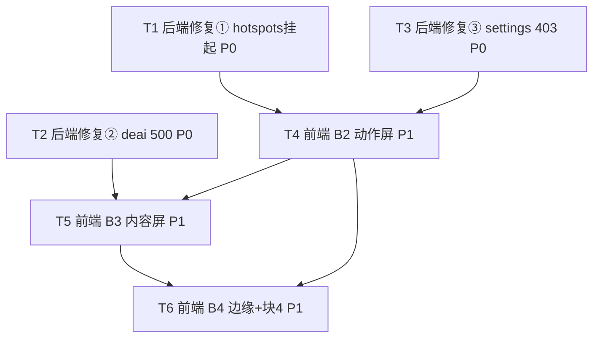

# NovelCraft 增量设计 + 任务分解（架构师：高见远）

> 范围：基于已上线 B0+B1（11 屏读已通）的收尾增量。
> 三大块：**B2 动作屏接线** · **B3 内容屏接线** · **块3 修复 3 个真·后端 Bug** · **块4 前端有/后端无 → 复用或占位**。
> 约束：只改 3 个前端文件（`frontend/proto.html` / `frontend/public/nc-api.js` / `frontend/public/app.js`）+ 少数后端文件；不重写 React、不动构建、不写实现代码（仅设计+任务分解）。

---

## 1. 实现方案 + 框架选型

**后端**：FastAPI（Python）不变。仅修改 3 个现有文件、新增 1 个文件（`app/services/deai_pipeline.py`），不新增第三方依赖。
**前端**：静态原型（`proto.html` + `nc-api.js` + `app.js`）不变动架构，沿用既有 `NC.api` 桥与 `NC.withState/renderList/statCards/ncToast/showToast` helper；仅新增动作函数、改按钮 `onclick`、补少量容器 `id`。

**三处后端真 Bug 的根因与方案**（已读源码确认）：

| Bug | 根因（读源码确认） | 修复方案 | 改动文件 |
|---|---|---|---|
| ① `GET /hotspots` 线上挂起 ~10s | `hotspot_collector.fetch_hotspots` 对 10 个中文源**同步串行**抓取，每源 `timeout=10s`；海外 VPS 直连 zhihu/weibo 常超时，单源即可拖到 10s | 加**全局 deadline**（默认 8s）逐源前检查 `time.monotonic()` 超额即 `break`；每源超时降到 5s。保证 `GET /hotspots` ≤ ~8s 返回 200（空或错误对象）。前端 12s 超时已兜底，不再永久卡死 | `backend/app/services/hotspot_collector.py` |
| ② `GET/POST /contents/{cid}/deai(/score)` 返回 500 | `deai.py` 模块顶层 `from app.services.deai_pipeline import DeaiPipeline, deai_score, quick_deai_score`；**仓库缺失该模块**，部署版存在但运行时异常（`DeaiPipeline.run` 或 `deai_score` 未捕获异常 → 500）。`deai.py` 仅对 `pipeline.run`/`deai_score` 部分 try，构造与 body 解析未包 | **新建 `backend/app/services/deai_pipeline.py`**（纯启发式 + LLM 回退，且 `DeaiPipeline.run` 内部永不抛）；并**加固 `deai.py` 两个端点整体 try/except**，异常返回 `ok({warning})` 而非 500 | 新增 `backend/app/services/deai_pipeline.py`；改 `backend/app/api/v1/deai.py` |
| ③ `PUT /admin/settings/{key}` 返回 403 | `config.require_admin` 在 `NOVELCRAFT_ADMIN_EMAILS` 未配置时 `raise 403`；而 GET 用的 `require_admin_reads` 未配置时放行 → 读 200 / 写 403 | 将 `require_admin` 改为与 `require_admin_reads` 一致：**未配置 env 时放行**，配置时仍校验白名单 | `backend/app/api/v1/config.py` |

**关键事实**（来自 `integration-map.md` / `novelcraft-integration-inventory.md` + 源码核对）：
- `deai_router` 已在 `main.py` 注册（line 79），故部署版确有 `deai_pipeline` 模块；本仓库缺，新建即可覆盖修复。
- `POST /ranking/topics/{topic_id}/bookmark` **仓库已存在**（ranking.py:1032），但仅作用于 `topic_candidates`（市场分析后的题材），**与 ranking 表行（snapshot `ranking_items`，无 `topic_id`）无映射** → ranking 表「+收藏」仍只能占位。
- 块4 引用但看似无后端的功能，经核对均有近似/真实端点可复用（见 §8 决策记录），**不新增后端文件**。

---

## 2. 文件列表及相对路径

### 仅改前端（3 文件）
- `frontend/public/nc-api.js` — 新增动作函数（B2/B3/B4）+ `loadPageData` 分发扩展
- `frontend/public/app.js` — `enterApp()` 改调 `NC.register()`；`loadPageData` 增加 inspiration/editor/review 分发
- `frontend/proto.html` — 按钮 `onclick` 改调真实函数；补少量容器 `id`

### 仅改后端（3 文件）
- `backend/app/services/hotspot_collector.py` — `fetch_hotspots` 加全局 deadline + 每源超时（Bug①）
- `backend/app/api/v1/deai.py` — 两个端点整体 try/except 加固（Bug②）
- `backend/app/api/v1/config.py` — `require_admin` 放开未配置放行（Bug③）

### 新增后端（1 文件）
- `backend/app/services/deai_pipeline.py` — 导出 `DeaiPipeline` / `deai_score` / `quick_deai_score`，健壮实现（Bug②）

> 无需改动 `main.py`（router 已注册）；无需 alembic 迁移（本次不动表结构）；无新增 Python 依赖。

---

## 3. 数据结构与接口

### 3.1 新增前端桥动作函数签名（`nc-api.js`，均经 `NC.api` 调后端，12s 超时 + `json.data` 解包）
```
NC.generateInspiration(projectId, idea)        → POST /imitation
NC.adaptContent(projectId, topic, content, platform) → POST /hotspots/material-suggestions
NC.publishTo(platform, contentId?)             → POST /publish/{platform}
NC.connectPlatform(payload)                     → POST /platform-connections
NC.testPlatform(platform)                       → POST /platform-connections/{platform}/test
NC.registerAccount(payload)                     → POST /publish/account/register
NC.saveBudget(pid, scope, limit)                → PUT  /admin/budgets/{pid}/{scope}
NC.saveSetting(key, value)                       → PUT  /admin/settings/{key}
NC.saveWorkflow(name, projectId, nodes)         → PUT  /admin/workflows/{name}
NC.runWorkflow(name, projectId)                  → POST /admin/workflows/{name}/execute
NC.generateHotspotReport(payload)               → POST /hotspots/generate
NC.logout()                                      → POST /auth/logout
NC.register(email, password, name)              → POST /auth/register
NC.loadReview(contentId) / NC.runDeai(contentId) → GET/POST /contents/{id}/deai(/score)
NC.exportNovel(novelId, fmt)                    → GET  /novels/{id}/export/{fmt}   (fmt∈txt|markdown|epub)
NC.newKnowledge(projectId, file)                → POST /knowledge/import  (multipart file)
NC.loadPlugins()                                 → GET  /skills/community
NC.loadShortStoryTemplates()                    → GET  /short-stories/templates
```

### 3.2 关键请求/响应 Schema（仅列本次新增/修复相关）
**POST /imitation**（inspiration → Decision A）
- Request `ImitationRequest`：`{project_id:str, source_text:str(≥200字), source_url:str?, instruction:str?}`
- Response data：`{content_id, text, title, style_profile, similarity:{verdict,score}, copyright_risk, copyright_warning, ...}`
- 注意：`source_text` 不足 200 字后端 422；前端用「核心灵感/想法」文本框内容（proto.html:534），不足时提示或拼接题材/风格说明（见 §9）。

**POST /hotspots/material-suggestions**（content-studio 改编 → Decision B）
- Request `HmTopicRequest`：`{project_id:str, topic:str, count:int=5, platform:str='douyin', content:str}`
- Response data：`result`（封面/图表/数据源等改编素材 dict）。

**PUT /admin/settings/{key}**（settings 写，修复 403）
- Request `SettingUpdateRequest`：`{value:str(≤4000)}`
- Response data：`{key, value, description, updated_at}`（若 key 含 api_key 则 value 脱敏）
- 注意：runtime_keys（`deepseek_api_key` 等、`request_timeout_seconds`、`bootstrap_budget_cny`）仍 409——前端避开这些 key。

**POST /auth/register**（register，块4 复用）
- Request `RegisterRequest`：`{email:str, password:str(≥8), display_name:str?}`
- Response data：`{user:{id,email,display_name}, access_token}`；限流 5/min；邮箱已存在→400 通用文案。

**POST /knowledge/import**（knowledge 新建，块4 复用）
- Content-Type `multipart/form-data`：`file:UploadFile` + query `project_id`
- Response：导入结果 dict。

**GET /novels/{novel_id}/export/{fmt}**（editor 导出，块4 复用；fmt∈txt|markdown|epub）
- Response：txt/markdown 返回文本；epub 返回文件流（前端用 `window.open` 直接下载，非 JSON）。

**GET/POST /contents/{id}/deai(/score)**（review 去AI，修复 500）
- Response `DeaiRunResponse`：`{original_score:int, final_score:int, layers:list, final_text:str}`
- Response `DeaiScoreResponse`：`{score:int, heuristic_score:int, text_preview:str}`

**POST /ranking/topics/{topic_id}/bookmark**（已存在，但本期不用）
- `TopicBookmarkRequest`：`{bookmark:bool}`；仅作用于 `topic_candidates`，ranking 表行无 `topic_id` → 占位。

### 3.3 后端新增模块接口（`deai_pipeline.py`，Bug②）
```
def quick_deai_score(text:str) -> int          # 纯启发式（不联网），0–100
def deai_score(project_id:str, text:str) -> int # 先 LLM(gateway.complete)，失败回退 quick_deai_score+30
class DeaiPipeline:
    def __init__(self, project_id, content_id, chapter_title="")
    def run(self, text:str) -> dict             # 内部 try/except，返回 {original_score,final_score,layers,final_text}，绝不抛
```

---

## 4. 程序调用流程（关键动作）

完整 mermaid 见 `docs/sequence-diagram.mermaid`。要点：

1. **发布**：点「发布」→ `NC.publishTo(platform)` → `POST /publish/{platform}`（后端 `publish_gateway`）→ 200 → toast + 重渲 `#distribution-grid`。
2. **生成灵感**：输入灵感 → 点「生成灵感」→ `NC.generateInspiration(projectId, idea)` → `POST /imitation`（携带 `source_text≥200`）→ `gateway.complete(style_imitation)` → 200 `{text,style_profile,similarity}` → 渲染 `#inspiration-results` 3 卡。
3. **保存设置**：点「保存」→ `NC.saveSetting(key,value)` → `PUT /admin/settings/{key}` → 现 `require_admin` 未配 env 时**放行** → 200 → toast。
4. **审阅去AI**：选章节 → 点「运行去AI」→ `NC.runDeai(contentId)` → `POST /contents/{id}/deai` → `DeaiPipeline.run()`（安全不抛）→ 200 `{layers,final_text}` → 渲染。**不再 500**。
5. **热点流**：进 hotspot → `GET /hotspots` → `fetch_hotspots()`（全局 deadline 8s，超源即 break）→ ≤8s 返回 200（空或错误对象）→ 渲染 `#hotspot-flow` 或空态。**不再挂起**。
6. **一键改编**：原文 + 平台 → 点「一键改编」→ `NC.adaptContent(projectId, topic, content, platform)` → `POST /hotspots/material-suggestions` → 200 `{result}` → 渲染 `#cs-adapted`。
7. **注册**：登录页「没有账号？注册」→ `app.js enterApp()` 改调 `NC.register()` → `POST /auth/register` → 200 `{access_token}` → 存 token + 进后台。

---

## 5. 任务列表（有序、含依赖、按实现顺序）

> 优先级：P0=后端修复（阻塞 B2 设置写 / B3 审阅）；P1=前端接线。
> 归属标注：后端修复 / B2 / B3 / B4。

### T1 · P0 · 后端修复①：hotspots 抓取挂起
- **文件**：`backend/app/services/hotspot_collector.py`（`fetch_hotspots`）
- **改动**：加 `import time`；新增 env `HOTSPOT_FETCH_DEADLINE`（默认 8）、`HOTSPOT_FETCH_SOURCE_TIMEOUT`（默认 5，替换原硬编码 10）；`fetch_hotspots` 开头记 `start=time.monotonic()`，遍历每源前 `if time.monotonic()-start > deadline: source_status[key]='skipped: deadline'; break`；`_fetch_source_items` 用新超时。
- **验收**：`GET /hotspots` 在 ~8s 内返回 200（即便全部源失败也返回 `{hotspots:[], sources:{...error}}`）；不再挂起。
- **依赖**：无。

### T2 · P0 · 后端修复②：deai 500
- **新增**：`backend/app/services/deai_pipeline.py`（导出 `DeaiPipeline`/`deai_score`/`quick_deai_score`，行为见 §3.3；`DeaiPipeline.run` 内部 try/except 返回降级 dict，绝不抛）。
- **改**：`backend/app/api/v1/deai.py` —— `run_deai_pipeline` 与 `get_deai_score` 整体包 `try/except Exception`，异常时 `return ok({warning, ...})` 而非 500（保留现有 404 语义）。
- **验收**：`GET/POST /contents/{任意id}/deai(/score)` 返回 200（成功或降级），不再 500；空内容返回 `{original_score:0,...}`。
- **依赖**：无。

### T3 · P0 · 后端修复③：settings 写 403
- **文件**：`backend/app/api/v1/config.py`（`require_admin`）
- **改动**：`require_admin` 逻辑改为——`allowed` 为空（未配 `NOVELCRAFT_ADMIN_EMAILS`）时 `return user`；否则校验白名单（与 `require_admin_reads` 一致）。
- **验收**：`PUT /admin/settings/{key}` 在单用户实例（未配 admin env）返回 200；配了 env 仍按白名单校验。
- **依赖**：无。

### T4 · P1 · 前端 B2 动作屏接线
- **文件**：`frontend/public/nc-api.js`（新增 §3.1 中 distribution/settings/workflow/hotspot/auth 动作函数）、`frontend/public/app.js`（`enterApp()` 改调 `NC.register`）、`frontend/proto.html`（改按钮 `onclick`）
- **接线点**：distribution 连接(`connectPlatform`)/授权(`testPlatform`)/发布(`publishTo`)/注册账号(`registerAccount`)；settings 保存预算(`saveBudget`→`PUT /admin/budgets/{pid}/{scope}`)/保存通用(`saveSetting`→`PUT /admin/settings/{key}`)；workflow 保存(`saveWorkflow`)/运行(`runWorkflow`)；hotspot 生成报告(`generateHotspotReport`)；auth 退出(`logout`)/注册(`enterApp`→`NC.register`)。
- **规则**：成功 `ncToast('已…')` + 重跑对应 loader（如 `NC.loadDistribution()` / `NC.loadSettings()`）；失败 `ncToast('…失败: '+extractErrorMessage(e.message))`。
- **依赖**：T3（saveSetting 需 403 修复）。

### T5 · P1 · 前端 B3 内容屏接线
- **文件**：`frontend/public/nc-api.js`（§3.1 中 inspiration/content-studio/editor/review/knowledge 函数）、`frontend/public/app.js`（`loadPageData` 增加 inspiration/editor/review）、`frontend/proto.html`（改按钮 + 补 `id`）
- **接线点**：
  - inspiration：原型已有 `#inspiration-results`(540)；把「生成灵感」按钮(538) `onclick` 改 `NC.generateInspiration(NC.currentProjectId, 文本框值)` → 渲染 3 卡（Decision A）。
  - content-studio：原文本 `#cs-original`(720)、改编稿 `#cs-adapted`(721) 已存在；「一键改编」(717) 改 `NC.adaptContent(projectId, 平台下拉值, 原文, 平台)` → 渲染 `#cs-adapted`（Decision B）。
  - editor：补「大纲/AI续写/AI润色」按钮动作 → `GET /ranking/library/books/{book_id}`（大纲）、`GET /novels/{id}/completion`（进度）、导出按钮 → `NC.exportNovel(id, fmt)`；进入 editor 时设 `NC.currentContentId`。
  - review：补「版本对比」+「运行去AI」动作 → `NC.loadReview`/`NC.runDeai`（用 `NC.currentContentId`，默认取项目首个 chapter）；渲染 `#review-list`。
  - knowledge：「+ 新建」(742) 改 `NC.newKnowledge(projectId, file)`（隐藏 `<input type=file>`）。
- **依赖**：T2（review deai 修复）、T4（NC 基础动作函数已就位）。

### T6 · P1 · 前端 B4 边缘 + 块4 复用/占位
- **文件**：`frontend/public/nc-api.js`（`loadPlugins`/`loadShortStoryTemplates`）、`frontend/proto.html`
- **接线点**：plugins 列表 `#plugins-grid`(854)→`GET /skills/community`；content-studio 模板下拉可选接 `GET /short-stories/templates`；ranking 表「+收藏」、plugin 安装/启用 **保持 `showToast` 占位**（理由见 §8）。
- **依赖**：T4。

> 注：块4 经核查**不新增后端文件**——register/import/export/skills/templates 均复用现有端点；收藏/安装因数据模型或范围原因占位（见 §8、§9）。

---

## 6. 依赖包列表
- **无新增 Python 依赖**。`deai_pipeline.py` 仅用现有 `app.gateway.complete`（已存在）；`hotspot_collector` 仅用标准库 `urllib`/`time`。
- 前端无新增依赖，沿用既有 `NC` helper。

---

## 7. 共享知识（跨文件约定，工程师必须遵守）

1. **`NC.api` 调用约定**（沿用）：自动注入 `Authorization: Bearer <token>` 与 `X-CSRF-Token`（有 cookie 时）；非 GET 自动带；12s `AbortController` 超时；返回 `json.data ?? json`（已解包）。**不要**在每个调用里手动加 header。
2. **错误兜底**：所有新增动作函数统一 `try { ... } catch(e){ ncToast('操作失败: '+extractErrorMessage(e.message)); }`；成功 `ncToast('已…')` + 重跑对应 loader 刷新列表。禁止 `alert`。
3. **三态/渲染 helper**：列表用 `NC.renderList`；进入屏加载用 `NC.withState`；统计用 `NC.statCards`；轻提示用 `ncToast`/`showToast`（二者等价，原型内 `showToast` 为全局）。
4. **当前项目/内容上下文**：`NC.currentProjectId`（B1 已 `ensureCurrentProject` 初始化）；review/editor 用 `NC.currentContentId`（进入 editor/library 时设置，review 默认取项目首个 chapter）。
5. **project_id 必需**：distribution/settings/workflow/hotspot-generate/imitation/material-suggestions/knowledge-import 均带 `NC.currentProjectId`；为空时 `NC.needProject()` 提示并跳 workspace。
6. **不破坏既有**：`proto.html` 仅改 `onclick` 目标 / 补 `id`；`nc-api.js` 的 `login/initLogin/loadWorkspaceData` 保留并扩展；`app.js` 的 `goPage` 仅追加分发。
7. **后端鉴权照搬现有写法**：新增/修改后端写接口沿用 `get_current_user` + `require_*` 守卫 + `ensure_project_member`（本项目已存在）；写操作带 `project_id` 校验角色。
8. **settings 写避坑**：runtime_keys（`*_api_key`/`*_base_url`/`*_model`/`request_timeout_seconds`/`bootstrap_budget_cny`）后端 409，前端「保存通用」只提交非 runtime key。
9. **部署**：后端改完 `git push` 后重启 systemd `api` service（worker/beat 不动）；前端 3 文件随前端容器发布；不动 nginx、不动构建。

---

## 8. 决策记录（拍板项）

1. **inspiration「生成灵感」→ `POST /imitation`**（而非 `/ranking/analyze`）。理由：`/imitation` 输入 seed 文本生成创意仿写方案，最贴合「灵感创作」产出 3 张方案卡；`/ranking/analyze` 需 `snapshot_id` 且是市场/题材分析，过重且与「灵感」语义不符。源文本取原型「核心灵感/想法」文本框（proto.html:534）。
2. **content-studio「一键改编」→ `POST /hotspots/material-suggestions`**（而非 `video-script`/`translate`）。理由：`material-suggestions` 接收原文 `content` + `topic` 返回改编素材，最贴合「把小说改编为多平台文稿」；`video-script` 仅取 topic 无原文；`translate` 仅出海翻译。原文取自 `#cs-original`，平台取自 #717 下拉。
3. **settings 写 403 → 放开后端 admin 写守卫**。理由：用户明确要求修后端；将 `require_admin` 改为未配 `NOVELCRAFT_ADMIN_EMAILS` 时放行，与读守卫 `require_admin_reads` 一致，单用户实例可写，配置后仍按白名单。
4. **块4 各功能映射（复用现有端点）**：register→`/auth/register`；knowledge 新建→`/knowledge/import`（multipart）；editor 导出→`/novels/{id}/export/{fmt}`；plugins 列表→`/skills/community`；content-studio 模板→`/short-stories/templates`。均后端已存在（已 grep 确认路径）。
5. **ranking 表「+收藏」→ 保持 toast 占位**。理由：ranking 表行是 snapshot `ranking_items`，**无 `topic_id`**；现有 `POST /ranking/topics/{topic_id}/bookmark` 仅作用于 `topic_candidates`（市场分析后题材），与表行无映射；要真正收藏需新增 `snapshot_bookmarks` 表 + 迁移 + 前端传 `snapshot_id/rank_no`，超出「可用版」最小变更。列入 §9 待明确。
6. **plugin 安装/启用 → 保持 toast 占位**。理由：仅有 `GET /skills/community` 列表端点，无安装/启用端点；保持占位，不新增大后端。
7. **Bug② deai 500 → 新建 `deai_pipeline.py` + 加固 `deai.py`**。理由：仓库缺失该模块（部署版存在但运行时异常致 500）；新建健壮实现并整体 try/except，确保不再 500，且无需新增依赖。
8. **Bug① hotspots 挂起 → 仅加全局 deadline**。理由：不动抓取逻辑与源配置；靠全局 8s deadline + 每源 5s 超时保证后端 ≤~8s 返回 200；前端 12s 超时已兜底，屏不空死。

---

## 9. 待明确事项（仅确实无法自行决定项）

1. **ranking 收藏是否真要做后端**：本期占位。若要做，需新增 `POST /ranking/snapshots/{snapshot_id}/items/{rank_no}/bookmark` + `snapshot_bookmarks(user_id, snapshot_id, rank_no, title)` 表 + 迁移，并在 `loadRankingTable` 行内传 `snapshot_id/rank_no`。待用户后续拍板。
2. **inspiration 源文本不足 200 字**：`/imitation` 要求 `source_text≥200`，否则 422。建议前端把「核心灵感/想法」+ 题材 + 风格基调 拼接凑够；或不足时提示用户补充。采用拼接方案（默认）。
3. **editor 导出 epub**：返回文件流，前端用 `window.open('/api/v1/novels/{id}/export/epub')` 直接下载（非 JSON 解析），txt/markdown 同理可用 fetch 取文本预览。
4. **review 的 content_id 上下文**：默认取当前项目首个 chapter（`NC.currentContentId`）；后续可从章节进入 review 以绑定具体章节。本期 review 接入以「首个 chapter」演示去AI/打分即可。
5. **部署账号角色**：`require_admin` 放开后，单用户实例（admin env 未配）即可写设置；若生产配了 `NOVELCRAFT_ADMIN_EMAILS`，需把 `jxianyang@gmail.com` 等账号加入白名单（运维侧，非代码改动）。

---

## 附：任务依赖图


